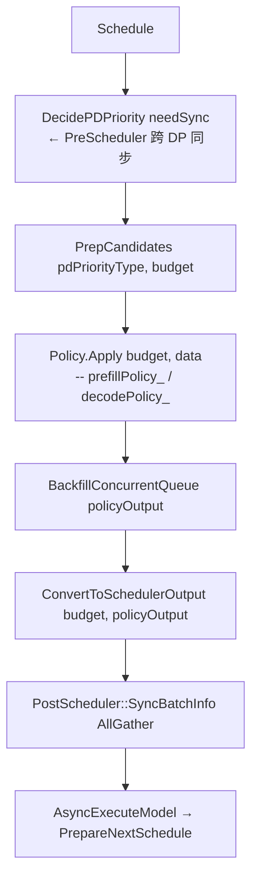

# 调度器与 Continuous Batching
> 覆盖 9 个知识点 | 来源 3 个文件 | 更新于 2026-07-11

## 1. 一句话总结
大模型推理通过 **PagedAttention** 将 KV Cache 切为固定块并按需映射，在 **Continuous Batching** 调度下，每步动态混合 prefill 与 decode 请求；调度器在 token/seq 预算、KV 容量和水位线约束下，使用抢占、chunked prefill、PD 分离等方法，实现高吞吐与低延迟。MindIE 进一步加入了可插拔 Stage Policy、多 DP 协同、Placeholder 异步流水线及边云层状调度等工程化扩展。

## 2. 核心原理
### 2.1 问题背景
- **碎片与浪费**：传统按最大长度预留 KV 空间，短请求浪费巨大。
- **动态批次难**：请求长度不一，每次 forward 需对齐形状，难以高效组批。
- **长 prompt 延迟**：整段 prefill 阻塞其他请求，导致 decode 饥饿，TPOT P99 恶化。
- **多机协同**：多 DP/PD 分离场景下，各 rank 的批次决策需要一致，否则会造成空计算或资源倾斜。
- **异构调度**：昇腾 NPU 与边云场景需要感知 Block 布局、支持层级切分和延迟下发。

### 2.2 方案概述
将并发请求的 KV Cache 划为固定大小的 block，通过 block table 做逻辑到物理的映射（PagedAttention）。调度器维护等待/运行/换出等多条队列，每步根据 token 预算、并发度上限、KV 水位等约束，从队列中选取请求组成 batch，推进其 `num_computed_tokens`，无需区分固定的 prefill/decode 阶段。当内存不足时触发抢占（重算或换出），并通过 chunked prefill 将长 prompt 分块与 decode 混批，避免饥饿。在 PD 分离架构下，通过异步拉取远端 KV 实现无缝衔接。

**MindIE Scheduler 架构概览**
```mermaid
flowchart TB
    subgraph ENGINE_LAYER[ENGINE LAYER]
        direction TB
        IScheduler[IScheduler 接口]
        PrePost[PreScheduler / PostScheduler<br/>跨 DP 同步模块]
    end

    subgraph POLICY_LAYER[POLICY LAYER]
        Policies[StagePolicy | FcfsPolicy | PDDSPolicy | LayerwiseFcfs<br/>KVTransferPolicy]
    end

    subgraph QUEUE_MODEL[QUEUE MODEL]
        Queues[waiting_ | running_ | swapped_ | transferringMap_]
    end

    subgraph BLOCK_MGMT[Block Space Management]
        BlockSpaceManager[BlockSpaceManager<br/>NPU + CPU Blocks]
    end

    IScheduler --> Policies
    PrePost --> Policies
    Policies --> Queues
    Queues --> BlockSpaceManager
```

## 3. 实现细节
### 3.1 PagedAttention 内存管理
- **三层结构**（vLLM v1）：
  - **物理池** `BlockPool`：管理所有 `KVCacheBlock`（`block_id` / `ref_cnt` / 哈希链 / 空闲链表）。
  - **KV 分配接口** `KVCacheManager`：`allocate_slots()` 失败触发抢占；`get_computed_blocks()` 做前缀匹配。
  - **Worker 映射** `BlockTable`：每请求一行，`block_table[req_row, logical_block_idx] = physical_block_id`；通过 kernel 计算 slot = `block_id * block_size + offset`。
- **MindIE**：C++ 层 `BlockSpaceManager` 直接管理 NPU + CPU 块，支持 Prefix Cache computed blocks 和 Layerwise 双 BlockManager。

**前缀共享链式 hash**：  
`block_hash = H(parent_hash, tokens_in_block, extra_keys)`，命中后可共享同一物理块，引入 `ref_cnt` 管理生命周期，未引用时方可 LRU 驱逐。

### 3.2 队列模型与请求状态机
#### vLLM v1 状态 (`vllm/v1/request.py`)
`WAITING → WAITING_FOR_REMOTE_KVS → RUNNING / PREEMPTED → FINISHED_*`  
队列：`waiting` / `skipped_waiting` / `running`（无 swapped，仅 recompute 抢占）。

#### MindIE 三队列 + transferringMap
| 队列 | 用途 |
|------|------|
| `waiting_` | 无 KV Block；新 Prefill 或 PD 分离 D 节点首次 Pull KV 前 |
| `running_` | 已分配 Block；Decode 或 Chunked Prefill 进行中 |
| `swapped_` | KV 已 Swap 至 CPU；内存不足时暂存 |
| `transferringMap_` | PD 分离：P 完成 Prefill 待 Publish / D Pull KV 中 |

MindIE 使用 `ConcurrentDeque`，调度线程通过 `Dequeue` 拷贝到 Policy 专属 `SeqGroupCollection`（非并发 deque），Policy 输出后由 `BackfillConcurrentQueue` 写回。

### 3.3 调度流程与预算控制
#### vLLM v1 `schedule()` 核心路径 (`vllm/v1/core/sched/scheduler.py`)
1. `token_budget = max_num_scheduled_tokens`，受 `max_num_seqs` 约束。
2. 先扫 `running` 队列：扣预算，`allocate_slots()` 失败 → 抢占队尾/低优先级请求。
3. 再扫 `waiting` 队列：分配 block，确保 `watermark` 保留空闲块。
4. 输出 `SchedulerOutput`：`num_scheduled_tokens`、`block_ids`、被抢占请求列表。
   - 无独立 prefill/decode 阶段，仅维护 `num_computed_tokens` 追赶 `num_tokens_with_spec`。  
   - `chunked_prefill` 关闭时，waiting 请求若所需 `num_new_tokens > budget` 则整段跳过。

#### MindIE `Scheduler::Schedule()` 流程 (`src/scheduler/scheduler.cpp:282`)

- `DecidePDPriority`：PnD 场景综合 Chunked Prefill、Layerwise、空闲 Block 比例等，选择 `PREFILL_FIRST` / `DECODE_FIRST` / `MIX`。  
- `SchedulingBudget`：受 `maxPrefillTokens`、`maxSeqLen`、`maxPrefillBatchSize`、`maxBatchSize` 等限制。  
- Policy 输出分 `prefillPolicy_` 与 `decodePolicy_`，按优先级执行。

**关键预算旋钮对比**
| 参数 | vLLM v1 | MindIE |
|------|---------|--------|
| Token 总量 | `max_num_batched_tokens` | `maxPrefillTokens` / `maxSeqLen` |
| 并发序列数 | `max_num_seqs` | `maxPrefillBatchSize` / `maxBatchSize` |
| Chunked 开启 | `enable_chunked_prefill` | `enableChunkedPrefill`（MIX 模式） |
| 空闲块水位 | `watermark` | 空闲 Block 低于 5% 总量保留 → Decode |

### 3.4 抢占与回退机制
| 模式 | vLLM v1 | MindIE |
|------|---------|--------|
| RECOMPUTE | 将 request 置为 `PREEMPTED`，`num_computed_tokens=0`，加回 waiting 队首 | `PreemptionMode::RECOMPUTE` 退回 waiting，Parallel Sampling 不支持 |
| SWAP | **无**，仅 recompute | `SWAP` 将 KV 换出至 CPU，需 CPU 内存预算；可配置 `maxPreemptCount` 限制 swap 次数 |

- vLLM v1 设计选择：纯 recompute 避免 PCIe 搬运，简化实现；代价是长 prompt 重算开销大。
- MindIE：优先 Swap，配置允许则 Recompute；Swap 失败后可继续 Recompute。

### 3.5 Chunked Prefill 与混批调度
**目的**：避免长 prompt 独占一步全部 token 预算，导致 decode 饥饿。

**vLLM v1 实现**：  
- `request.is_prefill_chunk = True` 当 `num_computed_tokens < num_tokens`。  
- 同一步中，running 可同时包含 chunked-prefill 与 decode 请求。  
- Attention kernel (`chunked_prefill_paged_decode.py`) 根据 `query_len` 分流。
- 关闭 chunked 时，waiting 请求被视为不可拆分原子任务。

**MindIE 实现**：  
- `enableChunkedPrefill` 时，PnD 角色返回 `PDPriorityType::MIX`，Policy 同时从三队列取数。  
- `isLastChunk_` 控制是否加入 placeholder / 输出 token。  
- 边云 Layerwise 场景下，`LayerwiseDecidePDelay()` 可返回 `PREFILL_TO_DECODE` 或 `PREFILL_SKIP` 以延迟下发 P batch。

### 3.6 Prefix Caching 与调度交互
- **命中后为何仍需重算 1 token**：`max_cache_hit_length = num_tokens - 1`，因为采样需要最后一个 token 的 logits；且 block 对齐可能导致尾块整体重算。
- vLLM：`BlockPool` 通过 `cached_block_hash_to_block` 查找，`ref_cnt==0` 才可回收，块 ID 保持稳定。
- MindIE：C++ `BlockSpaceManager` 利用 `computedLens` / `remoteComputedLens` 感知前缀命中，调度层在分配 Block 时直接从缓存复用。

### 3.7 PD 分离与 KV 传输
#### vLLM v1 (`vllm/v1/` connectors)
```
waiting → connector.get_num_new_matched_tokens()
  load_kv_async=True → 仅分块，status=WAITING_FOR_REMOTE_KVS
  Worker 异步 pull → finished_recving → _update_waiting_for_remote_kv()
  → 回到 WAITING → 下步 forward
```
防死锁：`_inflight_prefill_reserved_blocks` 预留块不可抢占。

#### MindIE PDDS 内置调度
| 节点 | `Schedule()` | `ScheduleTransfer()` |
|------|-------------|---------------------|
| P | `SchedulePrefill` → `transferringMap_` | `ReleaseKvPulledBlocks()` 回收已 Pull 的 KV |
| D | `ScheduleDecode`（running + swapped） | `KVTransferSchedulePolicy::PickPullSeqGroup` → `transferringMap_` |
| PnD | 标准 FCFS / Chunked | 不调用 Transfer 调度 |

D 节点 Pull 完成后，`KVPulledReqEnterRunningQueue` 将请求从 `transferringMap_` 移入 `running_`。

### 3.8 多 DP 协调与异步调度（MindIE 特色）
#### PreScheduler / PostScheduler 跨 DP 同步
- **PreScheduler**：在 P/D 决策前使用 `ThreadGroupCC::AllGather`（集中式）或 `ProcessGroup::AllGather`（分布式）交换各 DP 的 `pdPriority_`、`waitingSeqGroupNum_`、`runningSeqGroupNum_`。多数票决策：PREFILL_FIRST 节点数 ≥ 半数 → PREFILL。
- **PostScheduler**：下发前对齐 `maxBatchSize` / `maxSeqLen`（取全局 max），`SyncSeqLenList` 补齐 -1 后 AllGather，再按 batchSizeList 裁剪，保证各 DP batch 一致。
- 「陪跑」节点（三队列全空）不参与 PD 决策，避免空 rank 影响全局优先级。

#### Placeholder Token 异步流水
开启 `activateAsyncInference` 后允许 2+ outstanding batch：调度器使用占位 token（-1）预写 `outputTokenIds` 并预占 KV slot，Response 线程异步回填真实 token。`CalculatePlaceHolderNum` 在 MTP 场景限制最大占位数，防止持续不命中导致 KV 浪费。

#### Stage Policy 可插拔策略
| 策略 | 决策逻辑 |
|------|----------|
| Prefill‑First | 固定返回 `PREFILL_FIRST` |
| TPT (吞吐优先) | 基于 decode 浪费时间窗口动态切换 P/D |
| Latency‑First | 松弛度 + `LatencyPredictor` 回归预测 |
| Edge‑Cloud | 边云 Layerwise：跟踪 P/D batch 计数，配合延迟下发 |
| Flex 时分 | FlexP/FlexD/FlexPnD 单实例多角色时分复用 |

## 4. 框架对比
### 4.1 vLLM vs MindIE
| 维度 | vLLM v1 | MindIE |
|------|---------|--------|
| 语言 | Python (`vllm/v1/core/sched/`) | C++ (`src/scheduler/`) |
| 接口 | 单一 `Scheduler` 类 | `IScheduler` 多态 + `MakeScheduler` 工厂 |
| 队列模型 | waiting / running（无 swapped） | waiting_ / running_ / swapped_ / transferringMap_ |
| 调度阶段 | 无独立 prefill/decode，纯 `num_computed_tokens` 追赶 | 通过 `DecidePDPriority` + StagePolicy 显式决策 |
| 抢占 | 仅 RECOMPUTE | RECOMPUTE / SWAP，可限制 swap 次数 |
| Chunked Prefill | 基于 token budget 流式 partial prefill | `MIX` 模式 + `isLastChunk_` |
| Prefix Cache | 链式 hash + `BlockPool` LRU 驱逐 | C++ `BlockSpaceManager` 直接支持 computed blocks |
| PD 分离 | `WAITING_FOR_REMOTE_KVS` + connector 异步拉取 | 内置 `PDDSPolicy` + `KVTransferSchedulePolicy` + 跨 DP 同步 |
| 多 DP 协调 | 依赖 Data Parallel 广播或 Ray | Pre/Post Scheduler 通过 AllGather 显式同步 |
| 异步调度 | 默认同步，Pipeline Parallel 另有机制 | Placeholder Token（-1）预占 KV，支持 outstanding batch |
| 边云/层状 | 无内置能力 | `LayerwiseFcfsPolicy` + P 延迟下发 + 双 BlockManager |
| 工程扩展 | Python 生态迭代快，V1 统一核心 | C++ 低开销，昇腾原生 Block 管理，华为分布式推理一站式 |

**结论**：vLLM 优势在于 Python 层快速演进和社区丰富的 PD 方案集成；MindIE 则针对昇腾 NPU、多机多 DP 和边云场景，提供了更厚重的工程化扩展。

## 5. 面试要点
### 5.1 常见追问
#### Q: Block table 存什么？
- 每请求一行，行内存储「逻辑块索引 → 物理块 ID」的映射。
- 物理 slot = `physical_block_id × block_size + offset`。
- vLLM 默认 `block_size=16`，MindIE 可配置（生产常 128）。

#### Q: 为什么 vLLM v1 没有 SWAPPED 状态？
- 设计简化为纯 recompute 抢占，避免 PCIe 换入换出开销。
- 代价：长 prompt 重算成本高；MindIE/v0 保留 SWAP 用于 CPU 暂存。

#### Q: `max_num_batched_tokens` 与 `max_num_seqs` 分别控制什么？
- 前者限制单步 token 总量（可同时包含 128×1 decode 或 1×2048 prefill）。
- 后者限制并发序列数量，防止 batch 过大导致调度抖动。

#### Q: Chunked Prefill 如何与 decode 混批？
- 调度器不区分阶段，先扫 running（含未完成的 prefill chunk），再扫 waiting。
- Attention kernel 根据 `query_len` 分别走 prefill 或 decode 路径。
- TTFT 会因分块而增加，但 TPOT 更稳定，整体吞吐更高。

#### Q: 前缀命中后为何还要重算末 token？
- 采样需要最后一个 token 的 logits，`max_cache_hit_length = num_tokens - 1`。
- block 对齐时，尾块可能需整块重算；该设计保证 logits 正确且逻辑简单。

#### Q: PD 分离中 wating 请求如何转换为 RUNNING？
- vLLM：进入 `WAITING_FOR_REMOTE_KVS`，Worker 异步 pull 完成后 promote。
- MindIE：D 节点通过 `KVTransferSchedulePolicy::PickPullSeqGroup` 将请求放入 `transferringMap_`，Pull 完成调用 `KVPulledReqEnterRunningQueue` 移入 `running_`。

#### Q: MindIE 的 Placeholder Token 机制有什么用？
- 开启异步推理时，用 -1 预写 token 和预占 KV slot，使 NPU 不必等待 response 线程。
- 可保持多 batch outstanding，提升硬件利用率，但需限制占位数避免 KV 浪费。

#### Q: 多 DP 场景下如何保证批次一致？
- MindIE 使用 PreScheduler 同步优先级和队列长度，多数票决定 P/D 模式。
- PostScheduler 通过 AllGather 对齐 maxBatchSize、seqLenList 并补齐，确保各 DP 输入 shape 完全一致。

### 5.2 口述话术
“大模型推理使用 PagedAttention 将 KV 切为 block，通过 block table 映射，让调度器可以像操作系统一样管理虚拟页。Continuous Batching 下调度器每步从 running 和 waiting 队列中选请求，受 token 预算和并发数限制；长 prompt 用 chunked prefill 分块混批防止 decode 饿死。如果 KV 不够就抢占——vLLM v1 直接 recompute，MindIE 还可以 swap 到 CPU。在 PD 分离部署中，D 节点异步拉取 KV 并在收到后进入 running。MindIE 还引入了 Pre/Post Scheduler 保证多 DP 决策一致性，以及 Placeholder token 实现异步流水线。”

## 6. 延伸阅读
### 6.1 相关主题
- Prefix Caching 与 Block 回收
- SGLang RadixAttention 调度
- 昇腾 NPU 算子融合与 KV Pool 布局
- Flex 混布与角色切换

### 6.2 源文件
| 文件路径 | 标题 | 类型 |
|----------|------|------|
| `wiki/repos/mindie-pyserver/scheduler.md` | MindIE-LLM Scheduler 调度器 | 架构说明 |
| `wiki/raw/articles/pyserver/scheduler_deep_analysis.md` | Scheduler 调度器 — 深度分析 | 深度分析 |
| `interview/2026-07-10/01-PagedAttention与ContinuousBatching调度专题.md` | PagedAttention + Continuous Batching + Scheduler + Chunked Prefill | 面试专题文档 |