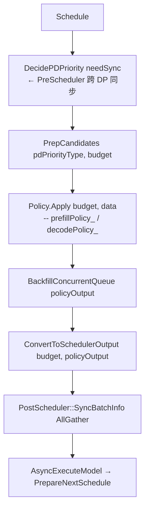

# 调度器与 Continuous Batching

> 来源: 3 files | 最后更新: 2026-07-11

## 核心概念

> **MindIE-LLM Scheduler 调度器** | 类型: repo | 标签: `architecture`, `inference`, `scheduler`, `npu`, `mindie`

# MindIE-LLM Scheduler 调度器
*(来源: wiki/repos/mindie-pyserver/scheduler.md)*

> **Scheduler 调度器深度分析**

# Scheduler 调度器
*(来源: wiki/raw/articles/pyserver/scheduler_deep_analysis.md)*

## 深入分析

### 核心架构

```mermaid
flowchart TB
    subgraph ENGINE_LAYER[ENGINE LAYER]
        direction TB
        IScheduler[IScheduler 接口]
        PrePost[PreScheduler / PostScheduler<br/>跨 DP 同步模块]
    end

    subgraph POLICY_LAYER[POLICY LAYER]
        Policies[StagePolicy | FcfsPolicy | PDDSPolicy | LayerwiseFcfs<br/>KVTransferPolicy]
    end

    subgraph QUEUE_MODEL[QUEUE MODEL]
        Queues[waiting_ | running_ | swapped_ | transferringMap_]
    end

    subgraph BLOCK_MGMT[Block Space Management]
        BlockSpaceManager[BlockSpaceManager<br/>NPU + CPU Blocks]
    end

    IScheduler --> Policies
    PrePost --> Policies
    Policies --> Queues
    Queues --> BlockSpaceManager
```

Scheduler 居中；Pre/Post 负责跨 DP；Policy 层可插拔；底层统一 Block 管理。[^scheduler]

*(来源: wiki/repos/mindie-pyserver/scheduler.md)*

### 三队列模型 + transferringMap

| 队列 | 用途 |
|------|------|
| `waiting_` | 无 KV Block；新 Prefill 或 PD 分离 D 节点首次 Pull KV 前 |
| `running_` | 已分配 Block；Decode 或 Chunked Prefill 进行中 |
| `swapped_` | KV 已 Swap 至 CPU；内存不足时暂存 |
| `transferringMap_` | PD 分离：P 完成 Prefill 待 Publish / D Pull KV 中 |

队列使用 `ConcurrentDeque`，调度线程通过 `Dequeue` 拷贝到 Policy 专属的 `SeqGroupCollection`（非并发 deque），Policy 输出后由 `BackfillConcurrentQueue` 写回。[^scheduler]

*(来源: wiki/repos/mindie-pyserver/scheduler.md)*

### Stage Policy 四种策略

| 策略 | 类 | 决策逻辑 |
|------|----|----------|
| Prefill-First | `PrefillFirstPolicy` | 固定返回 `PREFILL_FIRST` |
| TPT (吞吐优先) | `TptStagePolicy` | 基于 decode 浪费时间窗口，动态切换 P/D 优先级 |
| Latency-First | `LatencyStagePolicy` | 松弛度 (Laxity) + LatencyPredictor 回归预测 |
| Edge-Cloud | `EdgeCloudPolicy` | 边云 Layerwise：跟踪 P/D batch 计数，配合延迟下发 |
| Flex 时分 | `TimeDivisionPolicy` | FlexP/FlexD/FlexPnD 单实例多角色时分复用 |

*(来源: wiki/repos/mindie-pyserver/scheduler.md)*

### Schedule() 核心数据流



*(来源: wiki/repos/mindie-pyserver/scheduler.md)*

### PreScheduler / PostScheduler 跨 DP 同步

**PreScheduler** 在 P/D 决策前同步各 DP 的 `pdPriority_`、`waitingSeqGroupNum_`、`runningSeqGroupNum_`。多数票决策：PREFILL_FIRST 节点数 ≥ 半数 → PREFILL，否则 DECODE。「陪跑」节点（三队列全空）不参与 PD 决策。

**PostScheduler** 在 batch 下发前对齐：
- `SyncBatchInfo` — AllGather 各 DP 的 maxBatchSize / maxSeqLen，取全局 max
- `SyncSeqLenList` — 先 AddPaddingData(-1)，AllGather 后按 batchSizeList 裁剪
- `AllGatherBatchesAcrossDPs` — 集中式场景聚合各 DP 的 MetaDatas 与 SchedulerOutputs

**多 DP 通信路径**：
- **集中式**（同主机多 DP）：`ThreadGroupCC::AllGather`
- **分布式**（跨节点）：`ProcessGroup::AllGather`

*(来源: wiki/repos/mindie-pyserver/scheduler.md)*

### 抢占机制

| 模式 | 行为 | 限制 |
|------|------|------|
| `RECOMPUTE` | 将 running 请求退回 waiting 重算 | Parallel Sampling 不支持，会导致 abort |
| `SWAP` | 将 KV 换出至 CPU | 需 CPU 内存预算 |

*(来源: wiki/repos/mindie-pyserver/scheduler.md)*

### PDDS 与 KV Transfer

| 节点 | Schedule() | ScheduleTransfer() |
|------|-----------|-------------------|
| P | SchedulePrefill → transferringMap_ | `ReleaseKvPulledBlocks()` 回收已 Pull 的 KV |
| D | ScheduleDecode（running + swapped） | `KVTransferSchedulePolicy::PickPullSeqGroup` → transferringMap_ |
| PnD | 标准 FCFS / Chunked | 不调用 Transfer 调度 |

D 节点 Pull 完成后，`KVPulledReqEnterRunningQueue` 将请求从 transferringMap_ 移入 running_。[^scheduler]

*(来源: wiki/repos/mindie-pyserver/scheduler.md)*

### 与 vLLM Scheduler 对比

| 对比维度 | MindIE Scheduler | vLLM Scheduler |
|----------|-----------------|----------------|
| 实现语言 | C++ 引擎层 (`src/scheduler/`) | Python (`vllm/core/scheduler.py`) |
| 接口抽象 | `IScheduler` 多态 + `MakeScheduler` 工厂 | 单一 `Scheduler` 类 |
| 横切模块 | PreScheduler / PostScheduler 独立类 | 调度器内嵌 DP 逻辑 |
| Policy 分层 | StagePolicy + Policy 分离 | 调度器内硬编码 scheduling policy |
| Worker 交互 | Protobuf MetaDatas → ModelExecutor | 直接构造 SequenceGroupMetadata |
| PD 分离 | 内置 PDDSPolicy + KVTransferSchedulePolicy | 需外部 Router / 自建方案 |
| 前缀匹配 | C++ BlockSpaceManager 直接计算 | Python BlockAllocator hash |
| 边云 Layerwise | LayerwiseFcfsPolicy + P 延迟下发 | 无对等内置能力 |
| 异步调度 | `maxScheduledBatch_` + Placeholder -1 token | 同步；Pipeline Parallel 另有机制 |

**结论**：MindIE Scheduler 在队列语义上与 vLLM 同源（waiting/running/swapped + continuous batching），但针对昇腾生产环境做了显著工程扩展：PDDS 内置 KV 传输调度、Pre/PostScheduler 多 DP 协同、异步 Placeholder 流水线、可插拔 StagePolicy 与边云 Layerwise。[^scheduler]

[^scheduler]: [[raw/articles/pyserver/scheduler_deep_analysis.md]]

*(来源: wiki/repos/mindie-pyserver/scheduler.md)*

### 1\. 应用背景

### 1.1 调度器在 MindIE LLM 中的角色

MindIE LLM 是华为昇腾大模型推理加速套件的核心组件。在其 C++ 引擎层（`LlmEngine`）中，**Scheduler** 负责在有限 NPU HBM 与 CPU 内存预算下，决定每一轮 forward 哪些请求进入 batch、以 Prefill 还是 Decode 模式执行，以及如何分配 / 回收 / 迁移 KV Cache Block。

Client / API AddSeqGroup LlmEngine SchedulerThread Scheduler Schedule / Transfer 三队列 + Policy ModelExecutor AsyncExecuteModel 昇腾 NPU

请求从 API 入队，由独立调度线程驱动 Scheduler，输出 SequenceGroupMetaDatas 给 Executor

### 1.2 解决的核心问题

问题域| Scheduler 职责| 关键机制  
---|---|---  
多请求并发| Continuous Batching| waiting / running / swapped 三队列 + FCFS Policy  
KV Cache 内存| Block 分配与抢占| BlockSpaceManager + Recompute / Swap 抢占  
Prefill ↔ Decode| 阶段切换决策| DecidePDPriority + StagePolicy  
PD 分离部署| P 节点 Prefill / D 节点 Decode| PDDSPolicy + transferringMap_ + KV Transfer  
多 DP 协调| 跨 rank 一致 batch| PreScheduler / PostScheduler AllGather  
边云协同| Layerwise 动态切块| LayerwiseFcfsPolicy + EdgeCloudPolicy + P 延迟下发  
  
### 1.3 昇腾场景核心痛点

**NPU 架构适配** 调度器在 C++ 层直接与 BlockSpaceManager 交互，需感知 SP/CP 多 rank Block Table、Prefix Cache computed blocks、以及 Layerwise 边云双 BlockManager。这与 vLLM Python 层 Scheduler 直接操作 BlockAllocator 的模式有本质差异。 

  * **多 DP 协调** ：集中式（单进程多 DP）与分布式（跨节点 ProcessGroup）两套 AllGather 路径，避免 dummy batch 与 PD 决策不一致。
  * **异步推理** ：`activateAsyncInference` 下最多 2 个 outstanding batch，依赖 Placeholder Token（-1）预占 KV slot。
  * **PD 分离** ：MindIE 内置 PDDS + KV Pull/Publish 调度，无需外部 Router（对比 vLLM 常配合 SGLang Router 等）。


### 1.4 与 vLLM Scheduler 的关系

vLLM 的 Scheduler（V0 经典版 / V1 SchedulerCore）在 Python 层实现，与 GPU Worker 紧密耦合。MindIE 采用 `IScheduler` 接口 + C++ 实现，通过 `MakeScheduler()` 工厂创建，并拆出 PreScheduler（决策同步）与 PostScheduler（Batch 同步）两个横切模块——这是面向昇腾多机多 DP 与 PD 分离场景的工程化扩展，而非简单移植 vLLM 逻辑。

*(来源: wiki/raw/articles/pyserver/scheduler_deep_analysis.md)*

### 2\. 设计逻辑

### 2.1 整体架构

ENGINE LAYER Scheduler (IScheduler) CROSS-DP SYNC PreScheduler PostScheduler POLICY LAYER StagePolicy FcfsPolicy PDDSPolicy LayerwiseFcfs KVTransferPolicy QUEUE MODEL waiting_ running_ swapped_ transferringMap_ MEMORY BlockSpaceManager (NPU + CPU Blocks)

Scheduler 居中；Pre/Post 负责跨 DP；Policy 层可插拔；底层统一 Block 管理

### 2.2 三队列模型 + transferringMap

**waiting_** 无 KV Block；新 Prefill 或 PD 分离 D 节点首次 Pull KV 前

**running_** 已分配 Block；Decode 或 Chunked Prefill 进行中

**swapped_** KV 已 Swap 至 CPU；内存不足时暂存

**transferringMap_** PD 分离：P 完成 Prefill 待 Publish / D Pull KV 中

队列使用 `ConcurrentDeque`，调度线程通过 `Dequeue` 拷贝到 Policy 专属的 `SeqGroupCollection`（非并发 deque），Policy 输出后由 `BackfillConcurrentQueue` 写回。P 节点 Prefill 完成后，非 last chunk 的 seq 进 `running_`，否则进 `transferringMap_` 等待 KV 传输。

### 2.3 Stage Policy 四种策略

策略| 类| 决策逻辑  
---|---|---  
Prefill-First| `PrefillFirstPolicy`| 固定返回 `PREFILL_FIRST`  
TPT (吞吐优先)| `TptStagePolicy`| 基于 decode 浪费时间窗口，动态切换 P/D 优先级  
Latency-First| `LatencyStagePolicy`| 松弛度 (Laxity) + LatencyPredictor 回归预测  
Edge-Cloud| `EdgeCloudPolicy`| 边云 Layerwise：跟踪 P/D batch 计数，配合延迟下发  
Flex 时分| `TimeDivisionPolicy`| FlexP/FlexD/FlexPnD 单实例多角色时分复用  
  
### 2.4 Schedule() 数据流时序

Schedule() DecidePDPriority PrepCandidates Policy.Apply Backfill ConvertToOutput PreScheduler 跨 DP (needSync) Dequeue → SeqGroupCollection + SchedulingBudget prefillPolicy_ / decodePolicy_ SchedulerOutputs + MetaDatas Engine: PostScheduler::SyncBatchInfo → AsyncExecuteModel → PrepareNextSchedule

### 2.5 设计决策与权衡

**(1) 同步 vs 异步调度** 默认同步每轮 1 batch（`maxScheduledBatch_=1`）。开启 `activateAsyncInference` 后可达 2+ outstanding batch，通过 Placeholder Token 预写 outputTokenIds 并预占 KV，Response 线程回填真实 token。权衡：提高 NPU 利用率 vs 占位符与 Prefix Cache 兼容性复杂度。 

**(2) 集中式 vs 分布式多 DP** 同主机多 DP 用 `ThreadGroupCC::AllGather`；跨节点用 `ProcessGroup::AllGather`。PreScheduler 在 P/D 决策前同步；PostScheduler 在 batch 下发前对齐 maxBatchSize / seqLenList。权衡：通信开销 vs 避免 dummy request 与 batch 不对齐。 

**(3) Preemption：Recompute vs Swap** `PreemptionMode::RECOMPUTE` 将 running 请求退回 waiting 重算；`SWAP` 将 KV 换出至 CPU。Parallel Sampling 不支持 Recompute，抢占会导致 abort。与 vLLM 的 RECOMPUTE/SWAP 语义对齐。 

**(4) Chunked Prefill** `enableChunkedPrefill` 时 PnD 角色返回 `PDPriorityType::MIX`，Policy 同时从三队列取数；`isLastChunk_` 控制是否加入 placeholder / 输出 token。对比 vLLM 基于 token budget 的流式 partial prefill。 

### 2.6 边云 Layerwise 延迟下发

在 `layerwiseDisaggregated && dpSize==1` 且 PREFILL_FIRST 时，`LayerwiseDecidePDelay()` 可返回三种策略：

  * `PREFILL_KEEP` — 正常下发 Prefill
  * `PREFILL_TO_DECODE` — 本轮改调度 Decode（D batch 计数为 0 且有 running D）
  * `PREFILL_SKIP` — 跳过本轮 Prefill（batchSize=0），等待边云侧响应


`EdgeCloudPolicy` 维护 `prefillBatchCount_` / `decodeBatchCount_`，与 `LayerwiseMixin` 协同，向 TG 侧传递 `requestGap_`、`curWaitQueueLen_` 用于动态切图。

*(来源: wiki/raw/articles/pyserver/scheduler_deep_analysis.md)*

### 3\. 实现细节

### 3.1 IScheduler 接口

src/include/scheduler/ischeduler.h — 核心虚接口

40| virtual void AddSeqGroup(SequenceGroupSPtr &seqGroup) = 0;  
---|---  
42| virtual std::pair<SequenceGroupMetaDatas, SchedulerOutputs> Schedule(bool needSync = false) = 0;  
44| virtual std::pair<SequenceGroupMetaDatas, SchedulerKVTransferOutput> ScheduleTransfer() = 0;  
57| virtual void PrepareNextSchedule(std::vector<ScheduledSequenceGroupSPtr> &scheduledSeqGroups) = 0;  
54| virtual void FetchSeqGeneratedTokens(ConcurrentDeque<...> &queue) = 0; // 异步占位符回填  
71| SchedulerPtr MakeScheduler(SchedulerConfigSPtr, LatencyPredictor, Role pdRole, size_t localDPRank);  
  
### 3.2 Scheduler::Schedule() 核心流程

src/scheduler/scheduler.cpp — Schedule() 主路径

282| PDPriorityType pdPriorityType = DecidePDPriority(needSync);  
---|---  
302| SchedulingBudget budget(budgetTokenNum, batchSize, schedulerConfig_);  
318| data = PrepCandidatesForPolicy(pdPriorityType, budget); // 或 PrepCandidatesForFlex  
325| if (pdPriorityType == PREFILL_FIRST) policyOutput = prefillPolicy_->Apply(budget, data);  
329| else policyOutput = decodePolicy_->Apply(budget, data);  
334| BackfillConcurrentQueue(policyOutput);  
337| SchedulerOutputs schedulerOut = ConvertToSchedulerOutput(budget, policyOutput);  
368| dynamicBatchSize_->ApplyDynamicBatchSize(...); // 可选动态 batch  
  
`DecidePDPriority` 在 PnD 场景综合考虑：Chunked Prefill → MIX；Layerwise → EdgeCloudPolicy；`lastScheduleEmpty_` 强制 Decode；空闲 Block 低于 5% 总量保留 → Decode；否则 StagePolicy 或 ShouldImmediatePrefill。

### 3.3 PreScheduler 跨 DP 同步

PreScheduler::ShareSchedInfo / DecidePDPriority

31| sendData = { pdPriority_, waitingSeqGroupNum_, runningSeqGroupNum_ };  
---|---  
37| ThreadGroupCC::GetInstance().AllGather(sendData, recvData, dpRank);  
95| // 多数票：PREFILL_FIRST 节点数 ≥ 半数 → PREFILL，否则 DECODE  
99| return numPrefill >= (decideScheduleInfos.size() - numPrefill) ? PREFILL_FIRST : DECODE_FIRST;  
  
「陪跑」节点（三队列全空）不参与 PD 决策，避免空 rank 影响全局优先级。

### 3.4 PostScheduler Batch 同步

  * `SyncBatchInfo` — AllGather 各 DP 的 maxBatchSize / maxSeqLen，取全局 max
  * `SyncSeqLenList` — 先 AddPaddingData(-1)，AllGather 后按 batchSizeList 裁剪
  * `AllGatherBatchesAcrossDPs` — 集中式场景聚合各 DP 的 MetaDatas 与 SchedulerOutputs
  * `AllGatherCleanSeqIdsAcrossDPs` — TG 缓存清理 ID 跨 DP 汇总


### 3.5 FcfsPolicy::Apply 三分支

src/scheduler/policy/fcfs_policy.cpp

46| switch (collection->pdPriorityType_) {  
---|---  
47|  case PREFILL_FIRST: return SchedulePrefill(budget); // waiting FCFS  
48|  case DECODE_FIRST: return ScheduleDecode(budget); // running → swapped  
49|  case MIX: return ScheduleChunkedPrefill(budget); // decode 优先 + waiting  
  
Decode 路径在内存不足时调用 `Preempt()`：优先 Swap，配置允许则 Recompute。Swap 成功后继续从 swapped 队列 Swap In。

### 3.6 Placeholder Token 机制

PrepareNextSchedule push PLACEHOLDER token = -1 AsyncExecuteModel FetchSeqGeneratedTokens ReplacePlaceHolderWithToken

`CalculatePlaceHolderNum` 在 MTP（`speculationGamma`）场景下限制最大占位数为 `maxScheduledBatch_ * (1+gamma) + (1+gamma)`，防止持续不命中导致 KV 浪费。

### 3.7 PDDS 与 KV Transfer

节点| Schedule()| ScheduleTransfer()  
---|---|---  
P| SchedulePrefill → transferringMap_| ReleaseKvPulledBlocks() 回收已 Pull 的 KV  
D| ScheduleDecode（running + swapped）| KVTransferSchedulePolicy::PickPullSeqGroup → transferringMap_  
PnD| 标准 FCFS / Chunked| 不调用 Transfer 调度  
  
D 节点 Pull 完成后，`KVPulledReqEnterRunningQueue` 将请求从 transferringMap_ 移入 running_。

### 3.8 LlmEngine 调度线程集成

src/engine/llm_engine.cpp — SchedulerThreadEntry 主循环

436| ScheduleExecTransfer(enginePerDP); // PD 分离 KV 调度  
---|---  
446| if (GetAsyncBatchNum() >= asyncScheduleRound) continue; // 异步轮次控制  
469| scheduler->FetchSeqGeneratedTokens(...); // 回填 token  
485| auto [meta, scheduleOut] = scheduler->Schedule(needSync);  
506| PostScheduleSyncUp(needSync, ...); // PostScheduler 同步  
552| modelExecutor->AsyncExecuteModel(request, handler);  
562| scheduler->PrepareNextSchedule(scheduleOut.scheduledSeqGroups_);  
  
### 3.9 关键配置项

配置项| 作用| 默认/典型值  
---|---|---  
`maxPrefillBatchSize`| Prefill 轮最大 seq 数| 配置依赖模型  
`maxBatchSize`| Decode 轮最大 seq 数| —  
`maxPrefillTokens` / `maxSeqLen`| SchedulingBudget token 上限| 取较大者  
`enableChunkedPrefill`| Chunked Prefill + MIX 模式| false  
`enablePrefixCache`| Prefix Cache computed blocks| —  
`layerwiseDisaggregated`| 边云 Layerwise 调度| false  
`activateAsyncInference`| 异步多 batch 调度| false  
`stageSelectPolicy`| StagePolicy 类型 (0–3)| 0 = PrefillFirst  
`dynamicBatchSizeEnable`| 动态调整 maxBatchSize| —  
`maxQueueDelayMicroseconds`| Prefill batching 等待窗口| 5000μs 默认  
`distributedEnable`| 跨节点 ProcessGroup 通信| —  
`batchPnum`| 边云最大 P batch 数（延迟下发）| 2

*(来源: wiki/raw/articles/pyserver/scheduler_deep_analysis.md)*

### 4\. 竞品分析 — vLLM Scheduler 对比

### 4.1 架构风格

维度| MindIE| vLLM  
---|---|---  
实现语言| C++ 引擎层 (`src/scheduler/`)| Python (`vllm/core/scheduler.py`)  
接口抽象| `IScheduler` 多态 + `MakeScheduler` 工厂| 单一 `Scheduler` 类（V1 为 SchedulerCore）  
横切模块| PreScheduler / PostScheduler 独立类| 调度器内嵌 DP 逻辑 / 外部 Executor 协调  
Policy 分层| StagePolicy（P/D 决策）+ Policy（队列 FCFS）分离| Scheduler 内硬编码 scheduling policy  
Worker 交互| Protobuf MetaDatas → ModelExecutor| 直接构造 SequenceGroupMetadata → GPU Runner  
  
### 4.2 队列模型

队列| MindIE| vLLM  
---|---|---  
Waiting| `waiting_` ConcurrentDeque| `waiting` deque  
Running| `running_`| `running`  
Swapped| `swapped_`| `swapped`  
PD 传输| `transferringMap_` 独立 ConcurrentMap| 无内置；依赖外部 PD 调度器  
线程安全| ConcurrentDeque 主线程入 / 调度线程出| 单进程 GIL 下通常单线程调度  
  
### 4.3 PD 分离

MindIE PDDS vLLM PD P: Prefill transferring D: Pull KV Decode 外部 Router / 自建 SGLang / 自定义 KV 路由 MindIE: 内置 PDDSPolicy + KVTransferSchedulePolicy + PreScheduler 跨 DP 同步 vLLM: Scheduler 假设单节点 PnD；PD 分离需架构层拆分

### 4.4 全维度对比表

对比维度| MindIE Scheduler| vLLM Scheduler  
---|---|---  
Preemption| Recompute / Swap（`PreemptionMode`）| RECOMPUTE / SWAP 枚举，语义类似  
Chunked Prefill| `isLastChunk_` \+ MIX 模式 + Statistics4PartialPrefill| Token budget 流式 partial prefill（V1 更完善）  
多 DP 协调| PreScheduler ShareSchedInfo + PostScheduler AllGather| Data Parallel 广播；多节点依赖 Ray / 外部  
异步调度| `maxScheduledBatch_` \+ Placeholder -1| 默认同步；Pipeline Parallel 另有机制  
Stage Policy| 可插拔 PrefillFirst / TPT / Latency / EdgeCloud| Scheduler 内 policy 参数（如 priority）  
延迟预测| LatencyPredictor + DynamicBatchSize 闭环| 部分版本有 max_num_seqs 启发式  
BlockManager| C++ BlockSpaceManager（Prefix / KV Pool / Layerwise）| Python BlockAllocator / V1 KVCacheManager  
Prefix Cache| 调度层 computedLens / remoteComputedLens| Automatic Prefix Caching hash block  
边云 Layerwise| LayerwiseFcfsPolicy + P 延迟下发 + 双 BlockManager| 无对等内置能力  
Flex 混布| FlexP/D/PnD + TimeDivisionPolicy 角色切换| 无 Flex 角色概念  
  
### 4.5 差异总结

**结论** MindIE Scheduler 在队列语义上与 vLLM 同源（waiting/running/swapped + continuous batching），但针对昇腾生产环境做了显著工程扩展：**PDDS 内置 KV 传输调度** 、**Pre/PostScheduler 多 DP 协同** 、**异步 Placeholder 流水线** 、**可插拔 StagePolicy** 与 **边云 Layerwise** 。vLLM 优势在于 Python 生态迭代快、V1 Scheduler 统一调度核心、以及更广泛的社区 PD 方案集成；MindIE 优势在于 C++ 引擎层低开销、NPU 原生 Block 管理与华为分布式推理场景的一栈式支持。 

📚 相关文档 [文档索引](<index.html>) [Prefix Cache 分析](<prefix_cache_analysis.html>) [Function Call 分析](<mindie_function_call_deep_analysis.html>)

分析日期: 2026-05-31 · 基于 MindIE-LLM-PyServer 分支源码

参考: src/scheduler/*, src/engine/llm_engine.cpp, src/include/scheduler/ischeduler.h

Generated by Hermes Agent → Cursor Agent (composer-2.5-fast)

◀

▶

*(来源: wiki/raw/articles/pyserver/scheduler_deep_analysis.md)*

### 0. 30 秒总览

> vLLM v1 用 **PagedAttention** 把 KV 切成固定 block；调度层 `BlockPool` 管物理块，Worker `BlockTable` 做逻辑→物理映射。调度器**无独立 prefill/decode 阶段**，每步在 `max_num_batched_tokens` / `max_num_seqs` 预算内推进 `num_computed_tokens`。KV 不够就 **recompute 抢占**（v1 无 SWAPPED）。**Chunked prefill** 把长 prompt 切片与 decode 混批。**Prefix cache** 用链式 block hash 共享物理块。**PD 分离**走 `KVConnector`，异步拉 KV 时进 `WAITING_FOR_REMOTE_KVS`。

---

*(来源: interview/2026-07-10/01-PagedAttention与ContinuousBatching调度专题.md)*

### 1. PagedAttention

### 1.1 动机

| 问题 | 连续分配 | PagedAttention |
|------|----------|----------------|
| 碎片 | 按 max_len 预留，短请求浪费 | 固定 block 池按需分配 |
| 动态 batch | 长度不一难拼 | block table 映射 |
| 前缀共享 | 难 | 同 hash → 共享物理块 |

### 1.2 三层结构

**(A) 调度层物理池** — `vllm/v1/core/block_pool.py`
- `KVCacheBlock`：`block_id` / `ref_cnt` / `_block_hash` / 空闲链表
- `BlockPool`：`blocks[]` + `free_block_queue`（LRU 驱逐）+ `cached_block_hash_to_block`

**(B) KV 接口** — `vllm/v1/core/kv_cache_manager.py`
- `allocate_slots()` 失败 → 触发抢占
- `get_computed_blocks()` → prefix 命中
- `usage` → KV 水位 0~1

**(C) Worker 映射** — `vllm/v1/worker/block_table.py`
```
block_table[req_row, logical_block_idx] = physical_block_id
slot = physical_block_id * block_size + offset_in_block
```
Triton `_compute_slot_mapping_kernel` 算 slot；`PagedAttention.write_to_paged_cache` 散射写 KV。

默认 `block_size=16`（`config/cache.py`）；Motor/Conductor 侧常配 **128**。

### 1.3 对照

| | vLLM v1 | SGLang | MindIE |
|--|---------|--------|--------|
| 结构 | 每请求 block table 行 | Radix tree + page allocator | `block_tables` 数组 |
| 前缀 | 链式 block hash | `RadixCache.match_prefix` | `PrefixCachePlugin` |

---

*(来源: interview/2026-07-10/01-PagedAttention与ContinuousBatching调度专题.md)*

### 2. Continuous Batching 状态机

### 2.1 vLLM v1 状态（`vllm/v1/request.py`）

```
WAITING
WAITING_FOR_STRUCTURED_OUTPUT_GRAMMAR
WAITING_FOR_REMOTE_KVS      # PD 异步拉 KV
RUNNING
PREEMPTED                   # v1 无 SWAPPED
FINISHED_*
```

队列：`waiting` / `skipped_waiting` / `running`（`scheduler.py`）。

**重要**：v1 **只有 recompute 抢占**，无 CPU swap。MindIE C++ 仍保留 `SWAP | RECOMPUTE`（`fcfs_policy.cpp`）。

### 2.2 每步 `schedule()` 流程

路径：`vllm/v1/core/sched/scheduler.py`

```
1. token_budget = max_num_scheduled_tokens
2. 先扫 running：扣 budget，allocate_slots 失败 → 抢占队尾/低优先级
3. 再扫 waiting：受 budget、max_num_seqs、KV 块约束
4. 输出 SchedulerOutput（block_ids、num_scheduled_tokens、preempted_req_ids）
```

设计哲学（源码注释 ~398–407）：**没有独立 prefill/decode phase**；只维护 `num_computed_tokens` 追赶 `num_tokens_with_spec`。

### 2.3 抢占（`_preempt_request`）

```python
_free_request_blocks(request)
request.status = PREEMPTED
request.num_computed_tokens = 0   # 全部重算
waiting.prepend_request(request)
```

权衡：实现简单、无 PCIe 搬运；长 prompt 重算代价高。MindIE 用 `maxPreemptCount` 限制 swap 次数后回退 recompute。

---

*(来源: interview/2026-07-10/01-PagedAttention与ContinuousBatching调度专题.md)*

### 3. 三大预算旋钮

路径：`vllm/config/scheduler.py`

| 参数 | 默认（测试基线） | 含义 |
|------|------------------|------|
| `max_num_batched_tokens` | 2048（生产常 8192+） | 单步 token 总量上限 |
| `max_num_seqs` | 128 | 单步并发序列上限 |
| `enable_chunked_prefill` | **True** | 允许 prefill 分块 |
| `watermark` | 0.0 | 接纳新请求时保留空闲块比例 |
| `long_prefill_token_threshold` | 0（禁用） | 长 prompt 单步上限 |

消耗逻辑：
```python
num_new_tokens = min(remaining, token_budget, long_prefill_threshold?)
# chunked 关闭时：waiting 若 num_new_tokens > budget → break（整段原子）
```

**面试速算**：`block_size=16`，`num_gpu_blocks=10000`，`max_model_len=32K` → 单序列最多 2048 块；满长序列理论并发约 4~5（实际更少）。

---

*(来源: interview/2026-07-10/01-PagedAttention与ContinuousBatching调度专题.md)*

### 4. Chunked Prefill

### 为什么需要
长 prompt 一步占满 budget → decode 饥饿 → TPOT P99 差。

### 怎么做
- `request.is_prefill_chunk = True`（`num_computed_tokens < num_tokens`）
- 同一步 `running` 可混 chunked-prefill 与 decode
- Attention：`chunked_prefill_paged_decode.py` 按 `query_len` 分流

### TTFT / TPOT 权衡

| | ON | OFF |
|--|----|-----|
| TTFT | 变慢（多步完成 prompt） | 首步可能一次算完 |
| TPOT | 稳定 | 长 prefill 期间 decode 饿死 |
| 吞吐 | 高 | 锯齿 |

SGLang：`chunked_prefill_size`；MindIE：`SplitfusePlugin`。

---

*(来源: interview/2026-07-10/01-PagedAttention与ContinuousBatching调度专题.md)*

### 5. Prefix Caching

### 哈希链（`kv_cache_utils.py`）
```
block_hash = H(parent_hash, tokens_in_block, extra_keys)
```
`extra_keys`：LoRA / multimodal / `cache_salt`。链式保证第 N 块唯一确定前缀。

### 命中后为何还要重算末 token
`max_cache_hit_length = num_tokens - 1`——采样需要 logits；且 `num_computed_tokens` 需 block 对齐，尾块可能整块重算。

### 写入与驱逐
满块 → `cache_full_blocks()`；`ref_cnt==0` 才可 LRU 驱逐。故意不去重以保证 block ID append-only。

---

*(来源: interview/2026-07-10/01-PagedAttention与ContinuousBatching调度专题.md)*

### 6. PD / 远程 KV 衔接

```
waiting → connector.get_num_new_matched_tokens()
  load_kv_async=True → 只分配块，status=WAITING_FOR_REMOTE_KVS
  Worker 异步 pull → finished_recving
  → _update_waiting_for_remote_kv() → 回 WAITING → 下步 forward
```

防死锁：`_inflight_prefill_reserved_blocks` 预留块不可抢占。
失败：`kv_load_failure_policy=recompute` 回退重算。

---

*(来源: interview/2026-07-10/01-PagedAttention与ContinuousBatching调度专题.md)*

### 7. 面试 10 题（口述要点）

**Q1 block table 存什么？**  
每请求一行，逻辑块→物理块 ID；slot = pid×block_size+offset。

**Q2 为何 v1 无 SWAPPED？**  
简化为纯 recompute；MindIE/v0 保留 SWAP。权衡：算力 vs PCIe。

**Q3 batched_tokens vs max_seqs？**  
前者限 token 总量，后者限并发数；可 128×1 decode 或 1×2048 prefill。

**Q4 chunked 如何与 decode 同批？**  
无阶段概念；先扫 running 再 waiting；kernel 按 query_len 分流。

**Q5 前缀全命中为何还算 1 token？**  
要 logits 采样；且 block 对齐可能重算尾块。

**Q6 block hash 怎么保证安全共享？**  
链式 hash + extra_keys 隔离 + ref_cnt；不去重保 ID 稳定。

**Q7 watermark 干什么？**  
接纳 WAITING 时留空闲块，防 thrashing。

**Q8 WAITING_FOR_REMOTE_KVS？**  
异步拉 KV 期间不进 RUNNING；完成后 promote。

**Q9 抢占对 SLA？**  
长 prompt recompute 贵 → 控 budget、开 chunked、设 watermark。

**Q10 vLLM hash cache vs SGLang radix？**  
hash map 简单；radix 可节点分裂、更细粒度（HiCache）。

---

*(来源: interview/2026-07-10/01-PagedAttention与ContinuousBatching调度专题.md)*

### 附录：源码索引

| 主题 | 路径 |
|------|------|
| 调度主循环 | `vllm/v1/core/sched/scheduler.py` |
| 请求状态 | `vllm/v1/request.py` |
| KV 分配 | `vllm/v1/core/kv_cache_manager.py` |
| 物理块池 | `vllm/v1/core/block_pool.py` |
| Block hash | `vllm/v1/core/kv_cache_utils.py` |
| Worker 映射 | `vllm/v1/worker/block_table.py` |
| 调度配置 | `vllm/config/scheduler.py` |
| MindIE 抢占 | `MindIE-LLM/src/scheduler/policy/fcfs_policy.cpp` |

*(来源: interview/2026-07-10/01-PagedAttention与ContinuousBatching调度专题.md)*

## 面试要点

**PagedAttention + Continuous Batching + Scheduler + Chunked Prefill**

# PagedAttention + Continuous Batching + Scheduler + Chunked Prefill

> 基于 `vllm/v1/` 真实源码；对照 `sglang/`、`MindIE-LLM/`。
> 目标：把「vLLM 加速配置」从背名单升级为「能讲清旋钮背后的调度语义」。

---

*(来源: interview/2026-07-10/01-PagedAttention与ContinuousBatching调度专题.md)*

## 源文件索引

- wiki/repos/mindie-pyserver/scheduler.md — MindIE-LLM Scheduler 调度器
- wiki/raw/articles/pyserver/scheduler_deep_analysis.md — Scheduler 调度器深度分析
- interview/2026-07-10/01-PagedAttention与ContinuousBatching调度专题.md — PagedAttention + Continuous Batching + Scheduler + Chunked Prefill
