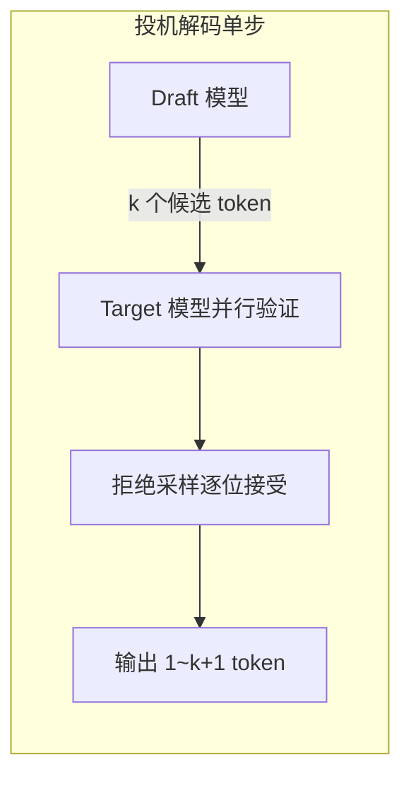
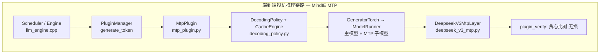
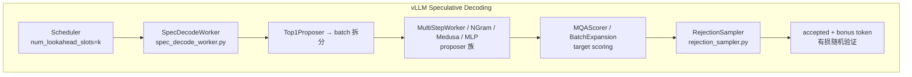
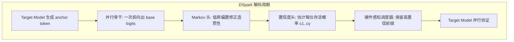
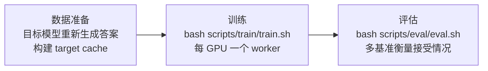

# 投机推理 (MTP / DSpark)
> 覆盖 20 个知识点 | 来源 9 个文件 | 更新于 2026-07-15

## 1. 一句话总结
LLM 自回归解码每步仅生成 1 个 token，GPU/NPU 算力在 decode 阶段往往闲置。投机推理通过草案模型（Draft Model）一次预测多个 token，再由目标模型（Target Model）批量验证，将“k 次 target 前向”压缩成“1 次 target 前向 + k 次廉价 draft 前向”，在数学无损（拒绝采样保证分布一致）的前提下大幅减少推理步数、提升吞吐。

## 2. 核心原理
### 2.1 问题背景
- **自回归解码瓶颈**：每步产 1 token，decode 阶段是 memory-bound——每步都要把全部权重从 HBM 搬进计算单元，算力大量闲置。
- **延时与吞吐矛盾**：延时与序列长度线性相关；高并发下 GPU 利用率更低。
- **公式本质**：单 token 延迟 = (T_draft + T_verify) / τ。只有当该比值小于纯 target 自回归一步的时间时，投机解码才划算。

### 2.2 方案概述
投机推理通过 **Draft-Verify 双角色解耦** 实现加速：
1. **Draft 模型**（轻量/并行）自回归生成 k 个候选 token 及分布 q；
2. **Target 模型**对“上下文 + k 个草稿”做一次并行前向验证，得到分布 p；
3. **拒绝采样逐位验证**：以 `min(1, p(x)/q(x))` 概率接受；被拒后丢弃后续全部草稿，从 `norm(max(0, p−q))` 中重采样；全接受时还可白拿一个 bonus token。

**数学性质**：标准拒绝采样保证输出分布与 target 模型完全一致（lossless）。

## 3. 实现细节
### 3.1 MindIE MTP 架构
MindIE 基于 DeepSeek 论文 Multi-Token Prediction，在 DeepSeek V3 主模型上增加固定 MTP 层（layer 61），通过 `plugin_params` 启用 `MtpPlugin`。

**MTP 层核心逻辑**：拼接主模型 hidden states 与 embedding 输入：
last_hidden_states = forward_context.mtp_metadata.last_hidden_states
hidden_states = mtp_layer.embed_tokens(input_ids)
hidden_states = mtp_layer.enorm(hidden_states)
last_hidden_states = mtp_layer.hnorm(last_hidden_states)
hidden_states = torch.concat([hidden_states, last_hidden_states], dim=-1)
hidden_states = mtp_layer.eh_proj(hidden_states)
residual, hidden_states = mtp_layer(hidden_states, residual)

#### 关键代码路径
- **主编排**：`MtpPlugin::generate_token()` → `DecodingPolicy::decode_model_input_update()`
- **草案生成**：`DeepseekV3MtpModel.forward()` — 共享主模型 block table，通过 `forward_context.mtp_metadata` 传递 last_hidden_states
- **验证**：`DecodingPolicy.verify_greedy_one_batch()` — 逐位贪心比对，连续匹配则接受，首次不等截断
- **Hidden 传递**：`CacheEngine.cache_update()` → `infer_context.set_mtp_hidden_states_prefix()`

### 3.2 vLLM Speculative Decoding 架构
vLLM v0.8.3 以 `SpecDecodeWorker` 为编排中心，支持 5 类 Proposer，验证侧默认 RejectionSampler。

#### 关键类职责映射

| 职责 | MindIE | vLLM |
|------|--------|------|
| 主编排 | MtpPlugin | SpecDecodeWorker |
| 输入构造 | DecodingPolicy.decode_model_input_update | Top1Proposer + ProposerWorkerBase |
| 草案生成 | DeepseekV3MtpModel.forward | MultiStepWorker.sampler_output |
| 目标打分 | 主模型 forward (同 batch) | MQAScorer / BatchExpansionTop1Scorer |
| 验证接受 | verify_greedy_one_batch | RejectionSampler |
| Hidden 传递 | CacheEngine + infer_context | previous_hidden_states |

### 3.3 DSpark 深度架构
DSpark（Confidence-Scheduled Speculative Decoding with Semi-Autoregressive Generation）是 DeepSeek 于 2026 年 6 月发表的投机解码框架，已部署于 DeepSeek-V4 Flash/Pro 线上生产流量，替代了此前的 MTP-1 基线。

**两个核心机制**：
1. **半自回归生成（Semi-Autoregressive Generation）**：并行骨干负责速度（一次前向出整块 logits），轻量串行 Markov 头修复块内 token 间依赖，缓解后缀衰减。
2. **置信度调度验证（Confidence-Scheduled Verification）**：置信度头估计每个位置的存活概率，硬件感知调度器按实时 GPU 负载动态裁剪验证长度。

#### 半自回归：并行阶段 + 串行阶段
- **并行阶段**：基于 DFlash 骨干，一次前向产出所有 γ 个位置的 base logits `U_1...U_γ`。微调：将 anchor token 也作为第一个预测位置，减少计算量。
- **串行阶段**：叠加前缀依赖偏置 `B_k(x_0, x_<k, x_k)`，通过自回归因式分解定义块级分布：
  P(X|x_0) = Π p_k(x_k|x_0, x_<k), p_k(v) = exp(U_k(v) + B_k(...)) / Σ exp(...)

**两种串行头**：

| 方案 | 机制 | 特点 |
|------|------|------|
| **马尔可夫头**（默认） | B(x_{k-1}, x_k) = W_1[x_{k-1}] W_2，rank-256 低秩分解 | 仅看前一个 token，计算几乎可忽略 |
| **RNN 头** | 门控循环状态 s_k 累积完整前缀，含并行骨干 hidden h_k | 增益有限，默认关闭 |

串行延迟开销极低：草稿长度 4→16，延迟仅增加 0.2%–1.3%，接受长度最高提升 30%。

#### 置信度调度验证
**置信度头** — 轻量线性投影 + sigmoid：
c_k = σ(w^T [h_k; W_1[x_{k-1}]])
监督信号为分析接受率：`c*_k = 1 - ½‖p^d_k - p^t_k‖₁`（总变差距离）。

**顺序温度缩放（STS）** — 后处理校准，将联合概率校准至经验接受率，ECE 从 3%–8% 降至 ~1%。

**硬件感知前缀调度器** — 将验证长度选择形式化为全局吞吐量最大化问题：
Θ = τ · SPS(B)
贪心算法：按全局存活概率 `a_{r,j} = Π_{i≤j} c_{r,i}` 降序排列候选 token，逐步准入并查表更新 Θ，在 Θ 下降时早停。调度逻辑完全在 GPU 内执行。

**异步适配（生产环境）**：
- 利用两步前的历史预测决定当前动态截断长度，将准入过程转化为动态 top-K 选择
- 移除早停机制进行无约束全局搜索（因 ZOS 天然隔离当前 token 信息泄漏，仍保证无损）
- 完全隐藏调度延迟，与 ZOS 和 CUDA Graph 无缝集成

#### 训练
| 项 | 内容 |
|------|------|
| 目标模型 | 冻结 |
| 共享层 | embedding 层和 LM head（均冻结） |
| 训练模块 | 并行骨干 + 串行块 + 置信度头 |
| 数据 | Open-PerfectBlend（1.3M 样本，chat 17.6% / math 39.4% / code 38.9%） |
| 损失 | L_ce(0.1) + L_tv(0.9) + L_conf(1.0)，位置权重 w_k = exp(-(k-1)/γ) |

**训练优化（HAI-LLM 框架内）**：
- 隐藏状态通信：只传送 LM head 前的 hidden state（O(d) 而非 O(V)），避免全词表 logits 传输
- Anchor-bounded 序列打包：用 token 级 attention index 替代 2D mask，避免 padding 开销

### 3.4 DeepSpec 全栈训练框架
DeepSpec 是随 DSpark 一同开源的推测性解码草稿模型全栈训练与评估代码库（GitHub 1.4k+ Star）。

| 维度 | 支持项 |
|------|--------|
| 草稿模型 | DSpark、DFlash、Eagle3 |
| 目标模型 | Qwen3、Gemma |
| 评估数据集 | GSM8K、MATH500、AIME25、HumanEval、MBPP、LiveCodeBench、MT-Bench、Alpaca、Arena-Hard-v2 |

### 3.5 MindIE 并行解码替代方案
除 MTP 外，MindIE 还支持两种无额外模型权重的并行解码方案：

| 方案 | 草案来源 | 验证 | 模型绑定 |
|------|---------|------|---------|
| MTP | MTP 层 forward | 贪心比对 | DeepSeek V3 紧耦合 |
| Lookahead | Jacobi 多 token 猜测 | 贪心比对 | 通用 plugin |
| Memory Decoding | 历史序列匹配（trie 树） | 贪心比对 | 无额外模型权重 |

**互斥限制**：MTP 与并行解码（LA/Memory）不能同时开；Lookahead 与 Memory Decoding 也不能同时开。

### 3.6 数据结构：vLLM Speculator 类层级
vLLM V1 把 draft 生成抽象为 `BaseSpeculator` 类层级，CUDA Graph 捕获、KV cache 分配、rejection sampling 等基础设施全部共享：

| 类别 | 类 | 草稿生成方式 |
|------|-----|-------------|
| **串行自回归** | `AutoRegressiveSpeculator` | 逐 token 串行：`_prefill` + `_multi_step_decode` 循环 N-1 次 |
| | → `EagleSpeculator` | EAGLE/EAGLE3 特征级自回归 |
| | → `MTPSpeculator` | DeepSeek/GLM/Qwen 等 MTP 权重 |
| | → `Gemma4Speculator` | Q-only、复用 target KV |
| **并行一次出块** | `DFlashSpeculator` | Block diffusion：context-KV 预计算 + 非因果 query-block 前向 |
| | → `DSparkSpeculator` | DFlash 主干 + 序列化 Markov 采样头 + 置信度调度 |

**DSpark × vLLM 时，`DSparkSpeculator(DFlashSpeculator)` 仅重写四处**：
1. Anchor-as-first-prediction：每请求只发 N 个 query token（非 1+N），每个位置都参与采样
2. 序列化 Markov 采样：`_sample_sequential()` — 最终 logits = 并行主干 base_logits + Markov(上一步采样 token) 的低秩偏置
3. CUDA Graph 覆盖全流程：并行主干 forward + 循环 N 步 Markov 采样全部并入单张 `FULL` Graph
4. 缩小词表概率化采样：draft 可用比 target 更小的词表，采样时 scatter 回 target 词表

### 3.7 验证机制深度对比
#### MindIE：确定性贪心比对（无损）
verify_greedy_one_batch(verify_guess_tokens, next_guess_tokens):
    gg = 0
    for eg, guess_tokens in enumerate(verify_guess_tokens):
        if guess != correct: break
        gg += 1
    return gg  # 连续匹配数，+1 为最终接受 token
贪心解码下与自回归严格等价；开启采样类后处理时仅支持有限后处理（如重复惩罚），收窄随机性来源以保证一致性。

#### vLLM：随机拒绝采样（有损但分布无损）
accept if uniform_random < min(1, q(x) / p(x))  # q=target, p=draft
### reject 时从 (q(x)-p(x))+ 归一化分布恢复采样
### 输出 shape: [batch, k+1] 含 bonus token

| 维度 | MindIE MTP | vLLM Spec Decode |
|------|-----------|------------------|
| 验证算法 | verify_greedy_one_batch | RejectionSampler / TypicalAcceptance |
| 精度一致性 | 贪心下无损（开=关输出一致） | 标准拒绝采样分布无损（stochastic） |
| 恢复机制 | 丢弃后续草稿 | (q-p)+ 归一化重采样 |
| 奖励 token | 无（固定草稿数） | Bonus token (+1) |

## 4. 框架对比
### 4.1 MindIE vs vLLM 全维度对比

| 维度 | MindIE MTP | vLLM Spec Decode |
|------|-----------|------------------|
| 整体架构 | Plugin + DecodingPolicy | Worker + Proposer + Scorer + Sampler |
| 草案模型 | 内置 MTP 层 (DeepSeek V3) | 5 种 Proposer（EAGLE/MTP/DFlash/DSpark/NGram/Medusa） |
| 模型绑定 | 紧耦合（主模型扩展层） | 松耦合（独立 speculative model） |
| 验证方式 | 贪心比对（贪心下无损） | 拒绝采样（分布无损） |
| GPU multi-step | DecodingPolicy 循环调度 | TP1DraftModelRunner 零 CPU 同步、CUDA Graph 全捕获 |
| KV 隔离 | 共享 block table + dummy slot | 独立 KV block 均分 |
| PD 分离 | 完整（dummy block, hidden 处理） | N/A |
| DP / SCP | 集中式 DP + context/seq parallel | N/A |
| 扩展性 | 仅 DeepSeek V3 | 任意 draft model |
| 适用场景 | 低时延 DeepSeek 推理 | 通用加速（代码/对话/多模型） |

### 4.2 DSpark 离线评估表现
目标模型：Qwen3-{4B, 8B, 14B}、Gemma4-12B。草稿模型：Eagle3（1 层）、DFlash（5 层）、DSpark（5 层）。

**主结果（接受长度 τ，越高越好）**：

| 目标模型 | 草稿器 | Math (GSM8K) | Math (MATH500) | Code (HumanEval) | Chat (MT-Bench) | Chat (Alpaca) |
|----------|--------|-------------|----------------|-------------------|-----------------|---------------|
| Qwen3-4B | Eagle3 | 5.14 | 4.62 | 4.16 | 2.39 | 2.26 |
| | DFlash | 5.40 | 4.85 | 4.74 | 3.07 | 2.96 |
| | **DSpark** | **6.11** | **5.70** | **5.38** | **3.64** | **3.54** |
| Qwen3-8B | Eagle3 | 5.30 | 4.77 | 4.33 | 2.66 | 2.54 |
| | DFlash | 5.33 | 4.91 | 4.64 | 3.11 | 2.98 |
| | **DSpark** | **6.17** | **5.78** | **5.52** | **3.72** | **3.58** |
| Qwen3-14B | Eagle3 | 5.24 | 4.60 | 4.14 | 2.62 | 2.47 |
| | DFlash | 5.41 | 4.84 | 4.59 | 3.10 | 2.94 |
| | **DSpark** | **6.21** | **5.74** | **5.43** | **3.70** | **3.58** |

**域效应**：结构化任务（Math/Code）接受长度远高于开放对话（Chat），这是动态调度的重要动机。

**生产部署（DeepSeek-V4 真实线上流量）**：

| 指标 | V4-Flash | V4-Pro |
|------|----------|--------|
| 中等 SLA 吞吐提升 | +51% (@80 tok/s/user) | +52% (@35 tok/s/user) |
| 严格 SLA 吞吐提升 | +661% (@120 tok/s/user) | +406% (@50 tok/s/user) |
| 匹配吞吐下生成加速 | 60%–85% | 57%–78% |

### 4.3 vLLM Proposer 对比

| 类型 | 需要草稿模型 | KV cache | 特点 |
|------|-------------|----------|------|
| MultiStepWorker | 是 | 是 | 通用 draft，GPU multi-step |
| MLPSpeculatorWorker | 是（轻量） | 否 | 基于 target hidden states |
| MedusaWorker | 是（多 head） | 否 | 并行多 head 预测 |
| NGramWorker | 否 | 否 | Prompt n-gram 查找 |
| DeepSeek MTP | 是 | 是 | num_spec_prefill_steps，模型自带权重 |

### 4.4 方法演进全链对比

| 方法 | 核心改进 | 优势场景 | 劣势场景 |
|------|---------|---------|---------|
| **Vanilla SD** | 首提 draft-verify + 拒绝采样框架，数学无损 | 已有同系列小模型陪大模型的场景 | 小模型与 target 分布不对齐，接受率天花板低 |
| **Medusa** | 去掉独立模型，直接在 target 上加多头 | 最小改动加速，不愿维护独立模型 | 各头独立预测无序列依赖，接受率有限；非严格无损 |
| **EAGLE-1** | 特征层自回归 + 复用 target emb/LM head | 通用长文本/对话，训练成本低 | 草稿串行，块越长延迟越大 |
| **EAGLE-2** | 置信度动态决定草稿树方向 | 上下文难度差异大的任务 | 依赖置信度校准良好 |
| **EAGLE-3** | 去 l_fea 直接预测 token + 多层特征融合 | 有数据、追求极致加速比的场景 | 训练复杂度上升，草稿仍严格自回归 |
| **MTP** | 预训练联合训练草稿头，推理时白捡 | 自研可控预训练厂商 | 依赖模型预置 MTP 模块 |
| **DFlash** | Block diffusion 并行去噪，draft 延迟与块长解耦 | 需长草稿块 + 高吞吐场景 | 纯并行牺牲块内依赖，后缀衰减 |
| **DSpark** | 半自回归（并行主干+Markov 头）+ 置信度按负载调度 | 生产级高并发在线服务 | 工程复杂度最高，通用落地仍在扩 |

## 5. 面试要点
### 5.1 常见追问
#### Q: 投机推理为什么能加速？
- Decode 小 batch 是 memory-bound：权重搬运是瓶颈，算力有大量闲置
- 用闲置算力换延迟：便宜 draft 猜 k 个，target 一次验证覆盖 k 步
- 性能公式：单 token 延迟 = (T_draft + T_verify) / τ
- 只有当 (T_draft+T_verify)/τ < T_target 时才划算

#### Q: 投机推理什么时候会失效？（5 种场景，面试最爱追问）
1. **接受率低**：draft 与 target 分布差异大（领域不匹配、高温采样），草稿大量被拒
2. **大 batch / GPU 已饱和**：decode 变 compute-bound 后，验证 k 个草稿抢别人算力 → 系统总吞吐下降（DSpark 的置信度调度就是为此设计）
3. **draft 本身开销过大**：串行 draft 单步延迟 × k 逼近 target 一步延迟，收益被吃光
4. **输出短**：prefill 占主导的短输出场景，decode 加速可省有限
5. **显存税**：draft 模型权重 + 草稿 KV 挤压 KV cache 池 → 最大 batch 变小

#### Q: EAGLE 为什么比 Medusa 好？其核心思想是什么？
- **在特征层做自回归**：target 的 top-layer hidden feature 比 token 序列更平滑、规律性强，轻量单层网络就能外推
- **消除 token 不确定性**：把上一步实际采样出的 token（经 emb）与特征拼接，消除 token 层随机采样的歧义
- 草稿头仅约一层 transformer decoder，复用 target 的 embedding 和 LM head

#### Q: DFlash 的核心创新是什么？
- **Block diffusion 草案**：把未来一个 block 全置为 [MASK]，一次（或极少几次）并行去噪前向直接产出整块草稿——draft 延迟与草稿长度近乎解耦
- **KV 注入**：把 target 模型多个中间层的 hidden feature 融合后注入草稿模型每层 KV cache，弥补独立生成质量不足
- 验证侧不变，仍是标准拒绝采样，无损

#### Q: DSpark 相对 Eagle3 和 DFlash 的提升来自哪里？
- **半自回归**：并行主干继承高吞吐（T_draft ≈ O(1)），轻量 Markov 头（rank-256 低秩偏置）补上块内连贯性，接受长度比 Eagle3 高 26%–31%
- **置信度调度**：动态按 GPU 负载裁剪验证长度——闲时多验、忙时少验，直击“高并发下验证浪费算力”这一核心失效场景
- 串行头开销极小：仅 0.2%–1.3% 的额外延迟，换来 τ 最高 30% 提升

#### Q: MTP 与结构化输出（structured output / grammar）能否同时开启？
- **不能。MindIE 入口硬互斥**：`InferParam::ValidateMtpConstraints` 中，mtp 与 `response_format` 组合直接报错 `"structured output cannot be used with mtp"`
- **工程理由**：插件层未打通——MTP 路径零 grammar 引用，matcher 未设 rollback，bitmask 仅 `batch×1` 单位置
- **产品理由**：fail-fast 保正确性，避免“加速表象 + JSON 已坏”
- vLLM 有投机×grammar 路径（多位置 mask + rollback + verify 挂载），MindIE 尚未对齐到同能力

### 5.2 口述话术
**基本原理（15 秒版）**：
> “投机解码就是用便宜的小模型串行猜 k 个 token，target 大模型一次并行验证。拒绝采样保证输出分布完全等同于 target 单独解码。性能账本是一个公式：单 token 延迟 = (起草时间 + 验证时间) / 每轮接受数。”

**性能公式展开（追问时）**：
> “加速比 ≈ T_target · τ / (T_draft + T_verify)。分母三项同时受方法影响：τ 由接受率决定、T_draft 看是串行还是并行、T_verify 看 batch 大小和 GPU 是否空闲。大 batch 下 T_verify 不再免费，这就是 DSpark 加置信度调度器的原因。”

**方法演进关键节点（20 秒版）**：
> “演进两条腿：把 draft 做得更准，和把 draft/verify 做得更省。EAGLE 把自回归挪到特征层，MTP 联合训练零对齐成本，DFlash 用 diffusion 并行一次出整块，DSpark 把并行主干和轻量 Markov 连贯修正拼一起，再加一个置信度头按 GPU 实时负载裁验证长度。”

**DSpark 一句话核心**：
> “DSpark 用半自回归的 Markov 头拉高分母（接受长度），用并行主干 + 轻量校对压低分子（起草成本），再用置信度调度动态兜住分子里 verify 项在高并发下的隐性上涨——三管齐下优化的都是同一个单 token 延迟公式。”

## 6. 延伸阅读
### 6.1 相关主题
- DeepSeek-V3/V4 模型系列
- PD 分离与量化部署
- Dynamo（NVIDIA 分布式推理 runtime）
- Profiling 分层排查（nsys/msprof）
- 结构化输出（structured output / grammar constraints）

### 6.2 源文件

| 文件路径 | 标题 | 类型 |
|----------|------|------|
| wiki/repos/mindie-pyserver/mtp-spec-decode.md | MTP / Speculative Decoding 投机推理 | 技术文档 |
| wiki/ai/techniques/dspark.md | DSpark 置信度调度投机解码 | 技术文档 |
| wiki/ai/infrastructure/deepspec.md | DeepSpec 全栈投机解码训练框架 | 技术文档 |
| wiki/raw/articles/pyserver/mtp_spec_decode_deep_analysis.md | MTP / 投机推理 — 深度分析 | 深度分析 |
| wiki/raw/articles/deepseek-dspark-qzw-2026.md | 梁文锋署名的DSpark，看懂这10个点就够了！ | 行业解读 |
| wiki/raw/articles/deepseek-dspark-jxz-2026.md | 刚刚，DeepSeek V4更新DSpark，推理速度提升80% | 行业报道 |
| wiki/raw/papers/dspark-paper-2026.md | DSpark 论文全文 | 学术论文 |
| interview/interview-review/02-投机解码专题.md | 投机解码专题（原理/失效/演进/vLLM DSpark 源码） | 面试专题 |
| interview/2026-07-15/01-P0口述卡-Dynamo投机量化Profiling.md | P0 口述卡：投机解码部分 | 口述卡 |
| interview/2026-07-15/23-MTP与结构化互斥深挖卡.md | MTP 与结构化互斥深挖卡 | 口述卡 |