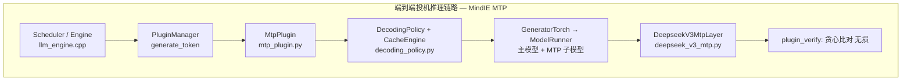

# 投机推理 (MTP / DSpark)
> 覆盖 12 个知识点 | 来源 6 个文件 | 更新于 2026-07-13

## 1. 一句话总结
投机推理通过“轻量级草稿模型一次预测多个 token → 目标模型批量并行验证 → 拒绝采样接受最长一致前缀”的 draft-verify 范式，将自回归解码从串行逐 token 生成改造为并行批量校验，在保持输出分布数学无损的前提下，将 GPU 闲置算力转化为实际吞吐。DSpark 在此基础上以半自回归架构（并行主干 + 轻量 Markov 串行头）修复并行草案的后缀质量衰减，并通过置信度调度验证按实时 GPU 负载动态裁剪验证长度，在 DeepSeek-V4 线上部署中相对 MTP-1 基线实现单用户生成速度 60%–85% 的提升。

## 2. 核心原理
### 2.1 问题背景
LLM 自回归解码每步仅生成 1 个 token，而 GPU/NPU 算力在 decode 阶段往往未饱和。大模型推理的瓶颈不是浮点运算，而是显存带宽——GPU 大部分时间花在把模型权重从显存搬到计算核心上。搬一次也是搬，搬十次也是搬，把多个 token 塞进同一个 batch 可以让每一次显存读取都物尽其用。投机推理的本质就是把“猜出来的多个候选 token”打包成一个 batch 送给大模型验证，将“k 次 target 前向”压缩成“1 次 target 前向 + k 次廉价 draft 前向”。

### 2.2 方案概述
投机推理（Speculative Decoding）引入一个轻量级的草稿模型（Draft Model），预先生成若干候选 token，再由目标模型（Target Model）对这批候选进行批量验证和接受。验证通过拒绝采样（Rejection Sampling）逐位检查：接受概率为 `min(1, p(x)/q(x))`，一旦某位被拒绝，丢弃其后所有草稿，并从修正分布 `norm(max(0, p−q))` 中重采样；全部接受时还能白拿一个 bonus token。这套规则在数学上保证输出分布与原模型完全一致，没有任何质量损失。

## 3. 实现细节
### 3.1 核心性能公式
投机解码的加速本质由单 token 延迟公式决定：
单 token 延迟 = (T_draft + T_verify) / τ
- `T_draft`：草稿模型生成 k 个候选的耗时
- `T_verify`：Target 对“上下文 + k 个草稿”做一次并行前向验证的时间
- `τ`：期望接受长度

优化只有三条路：降低 `T_draft`（猜得更快）、提高 `τ`（猜得更准）、或减少 `T_verify` 浪费（验得更聪明）。不开投机解码时 τ=1、无额外 draft 开销，单 token 延迟 = `T_target`。投机解码要划算的充要条件是 `(T_draft + T_verify)/τ < T_target`。

### 3.2 MindIE MTP 架构
MindIE 基于 DeepSeek 论文 Multi-Token Prediction，在 DeepSeek V3 主模型上增加固定 MTP 层（layer 61），通过 `plugin_params` 启用 `MtpPlugin`。

MTP 层核心逻辑：拼接主模型 hidden states 与 embedding 输入：
last_hidden_states = forward_context.mtp_metadata.last_hidden_states
hidden_states = mtp_layer.embed_tokens(input_ids)
hidden_states = mtp_layer.enorm(hidden_states)
last_hidden_states = mtp_layer.hnorm(last_hidden_states)
hidden_states = torch.concat([hidden_states, last_hidden_states], dim=-1)
hidden_states = mtp_layer.eh_proj(hidden_states)
residual, hidden_states = mtp_layer(hidden_states, residual)

验证机制：确定性贪心比对（无损）。
verify_greedy_one_batch(verify_guess_tokens, next_guess_tokens):
    gg = 0
    for eg, guess_tokens in enumerate(verify_guess_tokens):
        if guess != correct: break
        gg += 1
    return gg  # 连续匹配数，+1 为最终接受 token

### 3.3 DSpark 半自回归生成
DSpark 的核心创新：把并行和串行拼在一起，各取所长。并行骨干（DFlash 风格）负责速度，轻量串行头负责修正后缀衰减。

**并行阶段**：基于 DFlash 骨干，一次前向传播产出所有 γ 个位置的 base logits `U_1...U_γ`。将 anchor token 作为第一个预测位置，使 γ 个输入 token 产生 γ 个草稿 logits，减少计算量。

**串行阶段**：在 base logits 上叠加前缀依赖偏置 `B_k(x_0, x_<k, x_k)`，通过自回归因式分解定义块级分布：
P(X|x_0) = Π p_k(x_k|x_0, x_<k)，其中 p_k(v) = exp(U_k(v) + B_k(x_0, x_<k, v)) / Σ exp(...)

两种串行头实现：

| 方案 | 机制 | 特点 |
|------|------|------|
| **马尔可夫头**（默认） | B(x_{k-1}, x_k) = W_1[x_{k-1}] W_2，rank-256 低秩分解 | 仅看前一个 token，计算可忽略 |
| **RNN 头** | 门控循环状态 s_k 累积完整前缀，含并行骨干 hidden h_k | 增益有限，默认关闭 |

论文对比：草稿长度 4→16，串行延迟开销仅 +0.2%–1.3%，但接受长度最高提升 30%。

### 3.4 置信度调度验证
**置信度头**：轻量线性投影 + sigmoid：`c_k = σ(w^T [h_k; W_1[x_{k-1}]])`，监督信号为分析接受率 `c*_k = 1 - ½‖p^d_k - p^t_k‖₁`（总变差距离）。

**顺序温度缩放（STS）**：后处理校准，通过逐位置 1D 网格搜索最优温度，将联合概率 `Π c_i` 校准至经验接受率，ECE 从 3%–8% 降至 ~1%。

**硬件感知前缀调度器**：将验证长度选择形式化为全局吞吐量最大化问题 `Θ = τ · SPS(B)`。贪心算法按全局存活概率 `a_{r,j} = Π_{i≤j} c_{r,i}` 降序排列所有候选 token，逐步准入并查表更新 Θ，在 Θ 下降时早停。调度逻辑完全在 GPU 内执行。

**异步适配生产环境**：利用两步前的历史预测决定当前动态截断长度，将准入过程转化为动态 top-K 选择，与 ZOS 和 CUDA Graph 无缝集成。

### 3.5 MindIE 并行解码方案对比

| 方案 | 草案来源 | 验证 | 模型绑定 |
|------|---------|------|---------|
| MTP | MTP 层 forward | 贪心比对 | DeepSeek V3 紧耦合 |
| Lookahead | Jacobi 多 token 猜测 | 贪心比对 | 通用 plugin |
| Memory Decoding | 历史序列匹配 | 贪心比对 | 无额外模型权重 |

### 3.6 vLLM Proposer 对比

| 类型 | 需要模型 | KV cache | 特点 |
|------|---------|----------|------|
| MultiStepWorker | 是 | 是 | 通用 draft，GPU multi-step |
| MLPSpeculatorWorker | 是 (轻量) | 否 | 基于 target hidden states |
| MedusaWorker | 是 (多 head) | 否 | 并行多 head 预测 |
| NGramWorker | 否 | 否 | Prompt n-gram 查找 |
| DeepSeek MTP | 是 | 是 | num_spec_prefill_steps |

## 4. 框架对比
### 4.1 MindIE vs vLLM 投机推理全维度对比

| 维度 | MindIE MTP | vLLM Spec Decode |
|------|-----------|------------------|
| 整体架构 | Plugin + DecodingPolicy | Worker + Proposer + Scorer + Sampler |
| 草案模型 | 内置 MTP 层 (DeepSeek V3) | 5 种 Proposer (EAGLE/MTP/DFlash/DSpark 等) |
| 模型绑定 | 紧耦合（主模型扩展层） | 松耦合（独立 speculative model） |
| 验证方式 | 贪心比对（无损，仅贪心解码下等价） | 拒绝采样（有损/无损可选，支持采样场景严格无损） |
| GPU multi-step | DecodingPolicy 循环调度 | CUDA Graph 捕获，DSpark 单图覆盖“并行主干+序列化采样” |
| KV 隔离 | 共享 block table + dummy slot | 独立 KV block 均分 |
| PD 分离 | 完整 | N/A |
| 精度保证 | 贪心解码下无损（仅支持重复惩罚等有限后处理） | 可配置 Typical 近似贪心或 standard 严格无损 |

### 4.2 贪心 vs 拒绝采样适用场景

| 方法 | 优点 | 缺点 |
|------|------|------|
| 贪心比对 (MindIE) | 与自回归 bit-level 一致；易调试；生产一致性高 | 无法接受低概率但正确的草稿扩展 |
| 拒绝采样 (vLLM) | 理论保证 target 分布；bonus token 提吞吐 | 随机性；需 draft/target 概率对齐 |

### 4.3 DSpark 与其他投机解码方法对比

| 方法 | 核心改进 | 优势场景 | 劣势场景 |
|------|---------|---------|---------|
| **Vanilla SD** | 首次提出 draft-verify + 拒绝采样框架，数学无损 | 已有现成小模型家族，验证可行性 | 小模型与 target 分布不对齐，额外模型维护成本高 |
| **Medusa** | 去掉独立 draft 模型，target 最后一层加多头 | 最小改动加速，零额外模型部署 | 各头独立预测无序列依赖，接受率有限 |
| **EAGLE-3** | 直接预测 token + 多层特征融合，打破 scaling 瓶颈 | 有充足训练数据，追求极致加速比 | 草稿逐 token 串行，draft 延迟随 k 线性涨 |
| **MTP** | 训练阶段联合训练草稿头，零额外蒸馏/对齐成本 | 自研预训练流程，推理直接复用 | 依赖模型预训练预留 MTP 模块 |
| **DFlash** | block diffusion 并行出整块，draft 延迟与块长解耦 | 需较长草稿块且高吞吐场景 | 纯并行牺牲块内依赖，后缀衰减明显 |
| **DSpark** | 半自回归 + 置信度调度，同时补齐块内不连贯和高并发验证浪费 | 生产级高并发在线服务，负载波动大 | 工程复杂度最高，通用性待更多模型验证 |

## 5. 面试要点
### 5.1 常见追问
#### Q: 投机推理的核心原理是什么？为什么能加速？
- 用便宜的草稿模型串行猜 k 个 token，Target 模型一次前向并行验证这 k 个 token
- 加速公式：单 token 延迟 = `(T_draft + T_verify) / τ`——分子是将 k 次 target 前向压缩成 1 次，分母是期望接受长度
- GPU decode 阶段 memory-bound——批量验证 k 个草稿的成本远低于逐 token 生成

#### Q: 投机解码在什么情况下会失效？
- **接受率低**：draft 与 target 分布差异大（领域不匹配、高温采样）→ τ→1
- **大 batch / GPU 已饱和**：compute-bound 后验证 k 个草稿抢别的请求算力
- **draft 本身开销过大**：串行自回归的 draft 单步延迟 × k 逼近 T_target
- **输出短**：prefill 占主导，decode 加速没多少可省
- **显存税**：draft 模型权重 + 草稿 KV 挤压 KV cache 池

#### Q: DSpark 相比 DFlash 的核心改进是什么？
- **半自回归**：并行主干负责速度，轻量 Markov 头（rank-256 低秩分解）从前往后逐个位置注入前缀依赖偏置，修复后缀衰减
- **置信度调度验证**：confidence 头估计草稿 token 的“存活概率”，硬件感知调度器按 GPU 实时负载动态裁剪送验长度——闲时多验、忙时少验，直击高并发下验证浪费算力

#### Q: EAGLE 为什么比 Medusa 好？EAGLE-3 又解决了什么问题？
- EAGLE-1：在特征层（target top-layer hidden）做自回归，比 token 层更平滑；复用 target 的 embedding 和 LM head
- EAGLE-2：用置信度动态决定草稿树往哪儿长（免重新训练）
- EAGLE-3：去掉限制表达力的特征预测损失、直接预测 token + 多层特征融合（training-time test），打破 EAGLE-1/2 的 scaling 瓶颈

#### Q: MindIE MTP 和 vLLM Spec Decode 在验证机制上的根本差异是什么？
- **MindIE**：贪心逐位比对（`verify_greedy_one_batch`），贪心解码下与自回归等价，但采样场景不支持 rejection sampling 的严格无损
- **vLLM**：RejectionSampler `min(1, p/q)` 接受 + 拒绝后从 `(q-p)+` 归一化分布重采样，采样场景下仍数学无损

### 5.2 口述话术
“投机推理本质是用闲置算力换延迟——把'k 次大模型前向'压缩成'1 次验证 + k 次廉价草稿'。演进主线就两条腿：把草稿做得更准，和把 verify 做得更省。DSpark 是目前最前沿的落地方案，通过半自回归架构同时拉高接受率、压低草稿开销，再用置信度调度防止高并发下 verify 算力被浪费，在 DeepSeek-V4 线上部署中相对 MTP-1 基线做到了 60–85% 的用户速度提升。”

## 6. 延伸阅读
### 6.1 相关主题
- DeepSeek-V3/V4 架构
- DeepSpec 全栈投机解码训练框架
- vLLM V1 推理引擎架构
- MindIE-LLM PyServer 推理框架

### 6.2 源文件

| 文件路径 | 标题 | 类型 |
|---------|------|------|
| wiki/repos/mindie-pyserver/mtp-spec-decode.md | MTP / Speculative Decoding 投机推理 | 技术文档 |
| wiki/ai/techniques/dspark.md | DSpark 置信度调度投机解码 | 技术文档 |
| wiki/ai/infrastructure/deepspec.md | DeepSpec 全栈投机解码训练框架 | 技术文档 |
| wiki/raw/articles/pyserver/mtp_spec_decode_deep_analysis.md | MTP / 投机推理 — 深度分析 | 深度分析 |
| wiki/raw/articles/deepseek-dspark-qzw-2026.md | 梁文锋署名的DSpark，看懂这10个点就够了！ | 解读文章 |
| wiki/raw/articles/deepseek-dspark-jxz-2026.md | DeepSeek V4更新DSpark，推理速度提升80% | 解读文章 |
| wiki/raw/papers/dspark-paper-2026.md | DSpark 原始论文 | 论文 |
| interview/interview-review/02-投机解码专题.md | 专题 02：投机解码——原理、失效场景与方法演进 | 面试专题 |