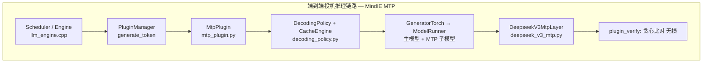
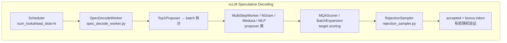

# 投机推理 (MTP / DSpark)
> 覆盖 18 个知识点 | 来源 6 个文件 | 更新于 2026-07-11

## 1. 一句话总结
投机推理用小模型/轻量层"猜"多个未来 token，再由大模型一次前向并行"验"，把串行逐 token 生成变成批量校验，从而提升推理吞吐。核心创新沿着两条腿演进：**把草稿做得更准**（Medusa → EAGLE 特征级自回归 → EAGLE-3 多层融合 → MTP 联合训练）和**把草稿/验证做得更省**（DFlash 并行扩散一次出整块 → DSpark 半自回归 + 按 GPU 负载动态调度验证长度）。MindIE（华为昇腾）采用 Plugin 模式 + 无损贪心验证，vLLM 采用独立 Worker 体系 + 概率拒绝采样，两者架构理念不同但都实现了投机推理的工程落地。

## 2. 核心原理
### 2.1 问题背景
大模型自回归解码每步只生成 1 个 token，而 GPU/NPU 算力在 decode 阶段往往未饱和（memory-bound：大部分时间花在把权重从显存搬到计算单元）。传统自回归每步产出 1 token，延迟与序列长度线性相关，算力大量闲置。

投机推理的核心思路：用便宜的草稿模型串行猜 k 个 token，再让 target 模型一次前向并行验证这 k 个 token，把"k 次 target 前向"压缩成"1 次 target 前向 + k 次廉价 draft 前向"。

### 2.2 方案概述
投机推理的加速公式为 **L = (T_draft + T_verify) / τ**，其中 τ 为接受 token 数。三条加速路径：
1. 降低 T_draft（猜得更快）
2. 提高 τ（猜得更准）  
3. 减少 T_verify 浪费（验得更聪明）

**标准流程（draft-verify + 拒绝采样）**：
1. Draft 模型自回归生成 k 个候选 token（及其分布 q）
2. Target 模型对"上下文 + k 个草稿 token"做一次前向，得到每个位置的分布 p
3. 拒绝采样逐位验证：对草稿 token x，以 `min(1, p(x)/q(x))` 概率接受；一旦某位被拒绝，丢弃其后所有草稿，并从修正分布 `norm(max(0, p−q))` 中重采样一个 token
4. 全部接受时还能白拿一个 bonus token

**关键性质：数学上无损**——拒绝采样保证最终输出序列的分布与 target 模型单独解码完全一致。

## 3. 实现细节
### 3.1 MindIE MTP 架构
MindIE 基于 DeepSeek 论文 Multi-Token Prediction，在 DeepSeek V3 主模型上增加固定 MTP 层（layer 61），通过 `plugin_params` 启用 `MtpPlugin`。与主模型共享 block table，通过 Plugin 机制融入现有生成链路。



**MTP 层核心逻辑**：拼接主模型 hidden states 与 embedding 输入后送入 transformer 层：
```
last_hidden_states = forward_context.mtp_metadata.last_hidden_states
hidden_states = mtp_layer.embed_tokens(input_ids)
hidden_states = mtp_layer.enorm(hidden_states)
last_hidden_states = mtp_layer.hnorm(last_hidden_states)
hidden_states = torch.concat([hidden_states, last_hidden_states], dim=-1)
hidden_states = mtp_layer.eh_proj(hidden_states)
residual, hidden_states = mtp_layer(hidden_states, residual)
```

**验证机制**：MindIE 采用确定性贪心比对（无损），`verify_greedy_one_batch` 逐位比对草稿 token 与目标模型输出，第一次不等即截断。

#### 关键代码路径
- `mindie_llm/text_generator/plugins/mtp/mtp_plugin.py` — MtpPlugin 主编排
- `mindie_llm/text_generator/plugins/mtp/decoding_policy.py` — DecodingPolicy 输入构造与验证

#### 数据流
Prefill: 主模型 hidden → MTP 层 → 缓存 D 的 hidden states（`CacheEngine.cache_update`）
Decode: num_speculative_tokens 次 MTP 小模型前向 + 1 次主模型验证前向 → 贪心比对

### 3.2 vLLM Speculative Decoding 架构
vLLM 以 `SpecDecodeWorker` 为编排中心，支持 5 类 Proposer（独立 draft 模型、MLPSpeculator、Medusa、NGram、DeepSeek MTP），验证侧可选 RejectionSampler 或 TypicalAcceptanceSampler。



**vLLM V1 Speculator 类层级（源码级）**：
```text
BaseSpeculator（抽象接口）
└── DraftModelSpeculator（draft_tokens/温度/种子等公共状态）
    ├── AutoRegressiveSpeculator（逐 token 串行：_prefill → _multi_step_decode 循环）
    │   ├── EagleSpeculator（method="eagle"/"eagle3"）
    │   ├── MTPSpeculator（method="mtp"）
    │   └── Gemma4Speculator
    └── DFlashSpeculator（一次并行前向出整块，非因果 attention）
        └── DSparkSpeculator（DFlash 主干 + 序列化 Markov 采样）
```

**两种根本不同的 draft 生成范式**：

| 维度 | AutoRegressiveSpeculator | DFlashSpeculator/DSparkSpeculator |
|------|-------------------------|----------------------------------|
| 草稿生成方式 | 逐 token 串行，每步一次完整 forward | 一次并行 forward 出整块 N 个 token |
| draft 前向次数 | N 次 | 1 次 |
| 每步依赖 | 上一步真实采样 token | 块内用统一 mask token 占位 |
| CUDA Graph 粒度 | prefill(1次) + decode(循环 N-1 次) | 单张图覆盖整块 |
| attention | causal（标准自回归） | 非因果（DSpark 固定 `causal=False`） |

#### 关键代码路径
- `vllm/v1/worker/gpu/spec_decode/speculator.py` — DraftModelSpeculator 基类
- `vllm/v1/worker/gpu/spec_decode/autoregressive/speculator.py` — 自回归草案器
- `vllm/v1/worker/gpu/spec_decode/dspark/speculator.py` — DSpark 草案器
- `vllm/v1/sample/rejection_sampler.py` — 拒绝采样验证

### 3.3 DSpark 半自回归草稿
DSpark 用"并行 draft 主干 + 轻量串行 Markov 头"解决纯并行草案器的后缀衰减问题：

**并行阶段**：基于 DFlash 骨干，一次前向产出所有 γ 个位置的 base logits U_1...U_γ

**串行阶段**：在 base logits 上叠加前缀依赖偏置，通过自回归因式分解定义块级分布：
```
P(X|x_0) = Π p_k(x_k|x_0, x_<k)
p_k(v) = exp(U_k(v) + B_k(x_0, x_<k, v)) / Σ exp(...)
```

两种串行头实现：

| 方案 | 机制 | 特点 |
|------|------|------|
| **马尔可夫头**（默认） | B(x_{k-1}, x_k) = W_1[x_{k-1}] W_2，rank-256 低秩分解 | 仅看前一个 token，计算几乎忽略 |
| **RNN 头** | 门控循环状态 s_k 累积完整前缀 | 增益有限，默认关闭 |

Markov 头的低秩分解：`B = W_1 · W_2`，其中 `W_1 ∈ R^{V×r}`（embedding）、`W_2 ∈ R^{r×V}`（投影），将 `V×V` 转移矩阵（约 10¹⁰ 参数）压缩为 `2×V×r`（约 5×10⁷），量级降两三个数量级。

**三种"串行"的本质区别**：

| 方法 | 串行的本质 | 计算量随 N |
|------|-----------|-----------|
| MTP/EAGLE | 每步跑一次完整 transformer 前向（计算上的累加） | 线性增长 |
| DSpark Markov 头 | 只做 embedding 查表 + 低秩矩阵乘（逻辑上的校对） | 常数级增量 |

#### 关键代码路径
- `vllm/v1/worker/gpu/spec_decode/dspark/speculator.py::_sample_sequential` — 序列化 Markov 采样
- `vllm/model_executor/models/qwen3_dspark.py::DSparkMarkovHead` — 低秩 Markov 头实现

### 3.4 DSpark 置信度调度验证
**置信度头**：轻量线性投影 + sigmoid，估计每个草稿 token 的存活概率：
```
c_k = σ(w^T [h_k; W_1[x_{k-1}]])
```
监督信号为分析接受率：`c*_k = 1 - ½‖p^d_k - p^t_k‖₁`（总变差距离）

**顺序温度缩放（STS）**：神经网络天然过度自信（ECE 3%–8%），STS 通过逐位置 1D 网格搜索最优温度，将联合概率校准至经验接受率，ECE 降至 ~1%。

**硬件感知前缀调度器**：将验证长度选择形式化为全局吞吐量最大化问题 `Θ = τ · SPS(B)`，贪心算法按全局存活概率降序排列候选 token 逐步准入。生产环境中采用异步适配：
- 利用两步前历史预测决定当前截断长度（兼容 ZOS/CUDA Graph 回放）
- 移除早停，进行无约束全局搜索（异步设计天然隔离信息泄漏，保证无损）

**负载自适应**：
- 中等并发（<200 并发）：分配较长验证预算（4–6 token/请求）
- 高并发饱和：动态缩减验证长度，拒绝低置信度尾部 token
- 异步调度器完全隐藏调度延迟

#### 关键代码路径
- `vllm/v1/worker/gpu/spec_decode/dspark/speculator.py::_sample_sequential` — 含置信度计算

### 3.5 MindIE 并行解码替代方案
MindIE 除 MTP 外，还提供两种无需额外训练权重的插件：

| 方案 | 草案来源 | 验证 | 模型绑定 |
|------|---------|------|---------|
| MTP | MTP 层 forward | 贪心比对 | DeepSeek V3 紧耦合 |
| Lookahead (LA) | Jacobi 多 token 猜测（N/W/G 参数） | 贪心比对 | 通用 plugin |
| Memory Decoding | trie 树历史序列匹配 | 贪心比对 | 无额外模型权重 |

三者互斥，共享 `Plugin` 统一接口（`model_inputs_update` / `sample_preprocess` / `plugin_verify` / `plugin_cache_update`）。

### 3.6 vLLM 多种 Proposer 对比

| 类型 | 需要模型 | KV cache | 特点 |
|------|---------|----------|------|
| MultiStepWorker | 是 | 是 | 通用 draft，GPU multi-step |
| MLPSpeculatorWorker | 是 (轻量) | 否 | 基于 target hidden states |
| MedusaWorker | 是 (多 head) | 否 | 并行多 head 预测 |
| NGramWorker | 否 | 否 | Prompt n-gram 查找 |
| DeepSeek MTP | 是 | 是 | num_spec_prefill_steps |
| DFlash/DSpark | 是 | 是 | 并行/半自回归 draft |

### 3.7 DSpark 训练
**目标模型冻结**，草稿模型共享其 embedding 层和 LM head（均冻结），仅训练骨干草案器、串行块和置信度头。

**数据**：Open-PerfectBlend（1.3M 样本，chat 17.6% / math 39.4% / code 38.9%），仅用 prompt，由各目标模型重新生成回答。10 epoch 至收敛。

**损失函数**（三项加权，位置权重 w_k = exp(-(k-1)/γ)）：

| 损失 | 权重 | 作用 |
|------|------|------|
| L_ce | 0.1 | 交叉熵，预测正确 token |
| L_tv | 0.9 | 总变差距离，最小化草案与目标分布差异（直接最大化接受率） |
| L_conf | 1.0 | 二元交叉熵，训练置信度头预测分析接受标签 |

**训练优化**（HAI-LLM 框架内）：
- 隐藏状态通信：只传送 LM head 前的 hidden state（O(d) 而非 O(V)）
- Anchor-bounded 序列打包：用 token 级 attention index 替代 2D mask，避免 padding 开销

**DeepSpec 全栈训练框架**：随 DSpark 开源，三阶段流程（数据准备 → 训练 → 评估），支持 DSpark/DFlash/Eagle3 三种草案模型，Qwen3/Gemma 目标模型，10 个评估数据集。仓库地址：`https://github.com/deepseek-ai/DeepSpec`。

### 3.8 验证机制深度对比

| 维度 | MindIE MTP | vLLM Spec Decode |
|------|-----------|------------------|
| 验证算法 | `verify_greedy_one_batch` | RejectionSampler / TypicalAcceptance |
| 精度一致性 | 无损（开=关输出一致） | 有损（stochastic）但数学上保证 target 分布 |
| 恢复机制 | 丢弃后续草稿 | (q-p)+ 归一化重采样 |
| 奖励 token | 无（固定草稿数） | Bonus token (+1) |
| EOS | stop_criteria 逐 token | sampler 内处理 |
| DP 适配 | lm_head_indice, hit_mask | N/A（单卡语义） |

MindIE 的贪心比对在采样模式下不完全等价于拒绝采样的无损保证；vLLM 的 `standard` 模式代表严格数学无损。

## 4. 框架对比
### 4.1 MindIE vs vLLM 投机推理全维度对比

| 维度 | MindIE-LLM（Plugin 体系） | vLLM（V1 GPU Speculator 体系） |
|------|--------------------------|-------------------------------|
| 整体架构 | Plugin + DecodingPolicy | Worker + Proposer + Scorer + Sampler |
| 抽象方式 | `Plugin` 统一接口（`model_inputs_update`/`sample_preprocess`/`plugin_verify`/`plugin_cache_update`） | `BaseSpeculator`/`DraftModelSpeculator` 类层级，Triton kernel 复用 |
| 草案模型 | 内置 MTP 层 (DeepSeek V3) + Lookahead/Memory Decoding | EAGLE/EAGLE3、MTP、DFlash、DSpark、ngram、medusa、suffix |
| 模型绑定 | MTP 紧耦合（主模型扩展层）；Lookahead/Memory 无绑定 | 松耦合（独立 speculative model 或 head） |
| 验证方式 | 贪心比对（无损贪心，采样时有限制） | 拒绝采样 `standard`/`synthetic`/`block`（probability-aware 无损） |
| 图捕获 | ATB 图模式（C++ 侧组图） | CUDA Graph（`FULL`/`FULL_DECODE_ONLY`/`PIECEWISE`），DSpark 单图覆盖主干+采样 |
| PD 分离 | 完整（dummy block, hidden 处理, hit_mask 异步补齐） | N/A |
| DP / SCP | 集中式 DP + context/seq parallel | N/A |
| 适用场景 | 华为昇腾 NPU，低时延 DeepSeek 推理 | NVIDIA/AMD GPU，通用加速（代码/对话/多模型） |
| 典型硬件 | 昇腾 Atlas 800I A2/A3、300I Duo | NVIDIA/AMD GPU |

### 4.2 投机推理方法演进全景对比

| 方法 | 核心改进 | 优势场景 | 劣势场景 |
|------|---------|---------|---------|
| **Vanilla SD** | 首次提出 draft-verify + 拒绝采样框架，数学无损 | 已有同系列小模型，验证可行性 | 小模型与 target 分布不对齐，独立部署成本高 |
| **Medusa** | 去掉独立 draft 模型，target 上加多头 | 最小改动加速，不愿维护独立模型 | 各头独立预测，接受率有限，非严格无损 |
| **EAGLE-1** | 特征层自回归（比 token 层平滑），复用 embedding/LM head | 通用长文本生成，训练成本低 | 逐 token 串行，块越长 draft 延迟越大 |
| **EAGLE-2** | 置信度动态决定草稿树扩展 | 上下文难度差异大的任务 | 依赖置信度校准良好 |
| **EAGLE-3** | 放弃特征预测，直接预测 token + 多层特征融合 + training-time test | 有充足训练数据，追求极致加速 | 训练复杂度高，仍逐 token 串行 |
| **MTP** | 预训练联合训练草稿头，训练-推理零对齐成本 | 自研、控制预训练流程的厂商 | 依赖模型预训练时预留 MTP 模块 |
| **DFlash** | block diffusion 并行去噪出整块，draft 延迟与块长解耦 | 长草稿块、大 batch 高吞吐场景 | 纯并行牺牲块内依赖，后缀衰减 |
| **DSpark** | 半自回归（并行主干+Markov 头）+ 置信度调度验证 | 生产级高并发在线服务，负载波动大 | 工程复杂度全场最高，通用性有待验证 |

## 5. 面试要点
### 5.1 常见追问
#### Q: 投机推理为什么能加速？加速公式是什么？
- 加速公式：`L = (T_draft + T_verify) / τ`
- 本质：把"k 次 target 前向"压缩成"1 次 target 前向 + k 次廉价 draft 前向"
- 三条优化路径：降低 T_draft（猜更快）、提高 τ（猜更准）、减少 T_verify 浪费（验更聪明）
- 验证是并行的（target 一次前向处理整块），draft 成本足够低时整体延迟下降

#### Q: 投机解码什么情况下会失效？
- **接受率低**：draft 与 target 分布差异大（领域不匹配、高温采样、高熵写作），草稿大量被拒
- **大 batch / 高并发下 GPU 已饱和**：验证 k 个草稿的算力从其他请求嘴里抢，总吞吐下降（DSpark 的置信度调度为此设计）
- **draft 本身开销过大**：draft 单步延迟 × k 逼近 target 一步延迟
- **输出短**：prefill 占主导，decode 加速有限
- **显存税**：draft 权重 + 草稿 KV 挤压 KV cache 池 → 最大 batch 变小

#### Q: EAGLE 为什么比 Medusa 好？
- Medusa 各头独立预测，没有序列依赖，接受率有限
- EAGLE-1 核心洞察：**在特征层（target top-layer hidden）做自回归比在 token 层更容易**——feature 序列更平滑、规律性强，单层网络即可外推
- 草稿头把上一步实际采样出的 token embedding 与 feature 拼接输入，消除 token 采样的不确定性
- EAGLE-3 更进一步：放弃特征预测直接预测 token、多层特征融合、training-time test 消除训练-推理不一致

#### Q: DFlash 是怎么做到一次前向出整块草稿的？
- 用 block diffusion：把未来一个 block 全部置为 [MASK]，一次并行去噪前向产出整块草稿
- **KV 注入（target feature injection）**：把 target 多个中间层的 hidden feature 注入草稿模型每层 KV cache，深度条件在 target 语义状态上保住接受率
- draft 延迟与草稿长度近乎解耦

#### Q: DSpark 相比 DFlash 多了什么？为什么能打败 DFlash？
- **半自回归**：并行主干负责速度 + 轻量 Markov 头补上块内局部依赖，缓解 DFlash 的后缀衰减
- **置信度调度验证**：按 GPU 实时负载动态裁剪验证长度，闲多验、忙少验，直击高并发下验证浪费算力的失效场景
- 离线接受长度比 Eagle3 高 26–31%、比 DFlash 高 16–18%；线上单用户生成速度 Flash +60–85%、Pro +57–78%

#### Q: 并行草案（DFlash）的全局接受长度竟然高于全自回归（Eagle3），为什么？
- **位置 1 的容量优势**：并行草案 O(1) 延迟允许更深的网络（5 层 vs 1 层），第一位置条件接受率显著更高（Math: 0.88 vs 0.81; Chat: 0.72 vs 0.53）
- 投机解码是严格前缀生存过程，第一 token 拒绝即整块作废，此优势杠杆效应极大
- **后期位置 Eagle3 优势**：自回归在后半段维持/提升接受率（Chat: 0.53→0.74），DFlash 衰减（Code: 0.87→0.78）
- **DSpark 融合效果**：继承并行骨干的高初始接受率（Math: 0.93），同时通过串行头缓解衰减

#### Q: MindIE 为什么选择 Plugin 模式而非独立 Worker？
- MTP 与现有 `PluginManager` 生成链路天然契合：prefill/decode 共用 `generate_token`
- 通过 `plugin_data_param` 传递 `mtp_model_inputs` 与 `hidden_states`，无需替换整个 ModelRunner
- Lookahead、Memory Decoding 与 MTP 可互斥注册，降低侵入性

#### Q: MindIE 贪心验证 vs vLLM 拒绝采样，各有什么优劣？
- **MindIE 贪心**：与自回归 bit-level 一致、易调试；但无法接受低概率但正确的草稿扩展，采样场景下有限制
- **vLLM 拒绝采样**：理论保证 target 分布、bonus token 提吞吐、支持任意采样参数；但引入随机性，需 draft/target 概率对齐

### 5.2 口述话术
**投机推理一句话总结**："用便宜的小模型/轻量层猜 k 个未来 token，大模型一次前向并行验证，把串行逐 token 变成批量校验，数学上通过拒绝采样保证无损。加速效果取决于三个因素：猜得够快、猜得够准、验证不浪费算力。"

**演进主线一句话**："演进就是两条腿——把 draft 做得更准（Medusa 多头 → EAGLE 特征级自回归 → EAGLE-3 多层融合 → MTP 联合训练），和把 draft/verify 做得更省（树 attention 并行验证 → DFlash diffusion 一次出整块 → DSpark 半自回归 + 按 GPU 负载调度验证长度）。每一步都是上一步的优势场景不变、劣势场景被下一步针对性修补。"

**DSpark 一句话**："并行骨干保证速度，轻量 Markov 头补上块内连贯性，置信度头估计草稿存活概率，硬件感知调度器按 GPU 实时负载动态裁剪验证长度——同时解决了纯并行草案的后缀衰减和固定长度验证的算力浪费。"

## 6. 延伸阅读
### 6.1 相关主题
- **DeepSeek-V4 / V3** — MTP 的原始模型载体，V4 线上已部署 DSpark
- **DeepSpec** — DSpark 配套的全栈投机解码训练框架（Eagle3/DFlash/DSpark，Qwen3/Gemma）
- **vLLM Speculative Decoding** — vLLM V1 投机推理引擎架构（`vllm/v1/worker/gpu/spec_decode/`）
- **MindIE-LLM PyServer** — 华为昇腾投机推理引擎，Plugin 体系（MTP/Lookahead/Memory Decoding）

### 6.2 源文件

| 文件路径 | 标题 | 类型 |
|---------|------|------|
| wiki/repos/mindie-pyserver/mtp-spec-decode.md | MTP / Speculative Decoding 投机推理 | 技术文档 |
| wiki/ai/techniques/dspark.md | DSpark 置信度调度投机解码 | 技术文档 |
| wiki/ai/infrastructure/deepspec.md | DeepSpec 全栈投机解码训练框架 | 技术文档 |
| wiki/raw/articles/pyserver/mtp_spec_decode_deep_analysis.md | MTP / 投机推理 — 深度分析 | 深度分析 |
| wiki/raw/articles/deepseek-dspark-qzw-2026.md | 梁文锋署名的DSpark，看懂这10个点就够了！ | 技术解读 |
| wiki/raw/articles/deepseek-dspark-jxz-2026.md | 刚刚，DeepSeek V4更新DSpark，推理速度提升80% | 新闻解读 |
| wiki/raw/papers/dspark-paper-2026.md | DSpark论文全文 | 学术论文 |
| interview/interview-review/02-投机解码专题.md | 投机解码专题——原理、失效场景与方法演进 | 面试专题 |