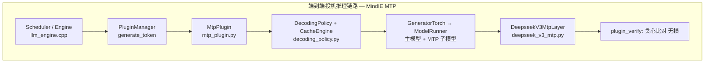
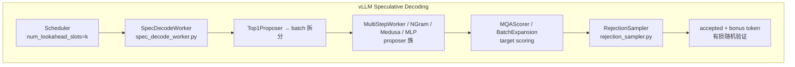
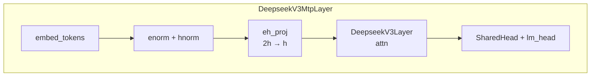

# 投机推理 (MTP / DSpark)

> 来源: 8 files | 最后更新: 2026-07-11

## 核心概念

> **MTP / Speculative Decoding 投机推理** | 类型: repo | 标签: `architecture`, `inference`, `speculative-decoding`, `mtp`, `mindie`

# MTP / Speculative Decoding 投机推理
*(来源: wiki/repos/mindie-pyserver/mtp-spec-decode.md)*

> **DSpark 置信度调度投机解码** | 类型: technique | 标签: `inference`, `architecture`

# DSpark 置信度调度投机解码
*(来源: wiki/ai/techniques/dspark.md)*

> **DeepSpec 全栈投机解码训练框架** | 类型: infrastructure | 标签: `inference`, `training`, `open-source`

# DeepSpec 全栈投机解码训练框架
*(来源: wiki/ai/infrastructure/deepspec.md)*

> **MTP / Speculative Decoding 深度分析**

# MTP / 投机推理
*(来源: wiki/raw/articles/pyserver/mtp_spec_decode_deep_analysis.md)*


# 梁文锋署名的DSpark，看懂这10个点就够了！
*(来源: wiki/raw/articles/deepseek-dspark-qzw-2026.md)*


# 刚刚，DeepSeek V4更新DSpark，推理速度提升80%
*(来源: wiki/raw/articles/deepseek-dspark-jxz-2026.md)*


Pages: 33
*(来源: wiki/raw/papers/dspark-paper-2026.md)*

## 深入分析

### MindIE MTP 架构

MindIE 基于 DeepSeek 论文 [Multi-Token Prediction](https://arxiv.org/pdf/2404.19737)，在 DeepSeek V3 主模型上增加固定 MTP 层（layer 61），通过 `plugin_params` 启用 `MtpPlugin`。



*(来源: wiki/repos/mindie-pyserver/mtp-spec-decode.md)*

### vLLM Speculative Decoding 架构



*(来源: wiki/repos/mindie-pyserver/mtp-spec-decode.md)*

### 关键类职责映射

| 职责 | MindIE | vLLM |
|------|--------|------|
| 主编排 | MtpPlugin | SpecDecodeWorker |
| 输入构造 | DecodingPolicy.decode_model_input_update | Top1Proposer + ProposerWorkerBase |
| 草案生成 | DeepseekV3MtpModel.forward | MultiStepWorker.sampler_output |
| 目标打分 | 主模型 forward (同 batch) | MQAScorer / BatchExpansionTop1Scorer |
| 验证接受 | verify_greedy_one_batch | RejectionSampler |
| Hidden 传递 | CacheEngine + infer_context | previous_hidden_states |

*(来源: wiki/repos/mindie-pyserver/mtp-spec-decode.md)*

### MTP 模型架构



| 维度 | MindIE DeepseekV3MtpLayer | vLLM deepseek_mtp.py |
|------|--------------------------|---------------------|
| 基类 | 继承 DeepseekV3Layer | 独立 MultiTokenPredictor |
| 额外组件 | embed + enorm + SharedHead + eh_proj | SharedHead + 多 MTP 层 |
| KV cache | 共享主模型 block table | 独立 kv (dummy blocks) |
| Slot | 2 * num_speculative_tokens / batch | draft model runner 管理 |

MTP 层核心逻辑：拼接主模型 hidden states 与 embedding 输入：

```
last_hidden_states = forward_context.mtp_metadata.last_hidden_states
hidden_states = mtp_layer.embed_tokens(input_ids)
hidden_states = mtp_layer.enorm(hidden_states)
last_hidden_states = mtp_layer.hnorm(last_hidden_states)
hidden_states = torch.concat([hidden_states, last_hidden_states], dim=-1)
hidden_states = mtp_layer.eh_proj(hidden_states)
residual, hidden_states = mtp_layer(hidden_states, residual)
```

*(来源: wiki/repos/mindie-pyserver/mtp-spec-decode.md)*

### 验证机制对比

**MindIE：确定性贪心比对（无损）**

```
verify_greedy_one_batch(verify_guess_tokens, next_guess_tokens):
    gg = 0
    for eg, guess_tokens in enumerate(verify_guess_tokens):
        if guess != correct: break
        gg += 1
    return gg  # 连续匹配数，+1 为最终接受 token
```

**vLLM：随机拒绝采样（有损）**

```
accept if uniform_random < min(1, q(x) / p(x))  # q=target, p=draft
# reject 时从 (q(x)-p(x))+ 归一化分布恢复采样
# 输出 shape: [batch, k+1] 含 bonus token
```

| 维度 | MindIE MTP | vLLM Spec Decode |
|------|-----------|------------------|
| 验证算法 | verify_greedy_one_batch | RejectionSampler / TypicalAcceptance |
| 精度一致性 | 无损（开=关输出一致） | 有损（stochastic） |
| 恢复机制 | 丢弃后续草稿 | (q-p)+ 归一化重采样 |
| 奖励 token | 无（固定草稿数） | Bonus token (+1) |

*(来源: wiki/repos/mindie-pyserver/mtp-spec-decode.md)*

### MindIE 并行解码方案对比

| 方案 | 草案来源 | 验证 | 模型绑定 |
|------|---------|------|---------|
| MTP | MTP 层 forward | 贪心比对 | DeepSeek V3 紧耦合 |
| Lookahead | Jacobi 多 token 猜测 | 贪心比对 | 通用 plugin |
| Memory Decoding | 历史序列匹配 | 贪心比对 | 无额外模型权重 |

*(来源: wiki/repos/mindie-pyserver/mtp-spec-decode.md)*

### vLLM Proposer 对比

| 类型 | 需要模型 | KV cache | 特点 |
|------|---------|----------|------|
| MultiStepWorker | 是 | 是 | 通用 draft，GPU multi-step |
| MLPSpeculatorWorker | 是 (轻量) | 否 | 基于 target hidden states |
| MedusaWorker | 是 (多 head) | 否 | 并行多 head 预测 |
| NGramWorker | 否 | 否 | Prompt n-gram 查找 |
| DeepSeek MTP | 是 | 是 | num_spec_prefill_steps |

*(来源: wiki/repos/mindie-pyserver/mtp-spec-decode.md)*

### 设计洞察

**为何 MindIE 选择 Plugin 模式**：MTP 与现有 `PluginManager` 生成链路天然契合，通过 `plugin_data_param` 传递 `mtp_model_inputs` 与 `hidden_states`，无需替换整个 ModelRunner。

**为何 vLLM 选择独立 Worker 体系**：`SpecDecodeWorker` 包装 target 与 draft 两个完整 Worker，复用现有 `execute_model`、KV 分配与 TP 逻辑。

**核心权衡**：MindIE 以 **无损贪心** 换取可预期的生产一致性（尤其 PD+量化+DP）；vLLM 以 **拒绝采样** 换取更高平均接受长度与通用 draft 生态。[^mtp]

---

**Related pages:** [[repos/mindie-pyserver/index|MindIE-LLM PyServer]], [[dspark|DSpark 置信度调度投机解码]]

[^mtp]: [[raw/articles/pyserver/mtp_spec_decode_deep_analysis.md]]

*(来源: wiki/repos/mindie-pyserver/mtp-spec-decode.md)*

### 核心问题

投机解码的加速公式为 L = (T_draft + T_verify) / τ。三条加速路径：
1. 降低 T_draft（猜得更快）
2. 提高 τ（猜得更准）
3. 减少 T_verify 浪费（验得更聪明）

现有方案的瓶颈：
- **自回归草案（Eagle3/MTP）**：T_draft ∝ γ，串行瓶颈导致块长受限于浅层架构
- **并行草案（DFlash）**：T_draft ≈ O(1)，但因缺乏 token 间依赖建模，接受率在块尾部急剧衰减（后缀衰减 / 多模态碰撞）
- **固定长度验证**：高并发下，验证低置信度尾部 token 浪费关键批处理容量

DSpark 通过两个互补机制同时拉动三条杠杆。^[raw/papers/dspark-paper-2026.md]

*(来源: wiki/ai/techniques/dspark.md)*

### 架构

### 半自回归生成（Semi-Autoregressive Generation）

分两阶段：

**并行阶段** — 基于 DFlash 骨干（Chen et al., 2026），一次前向传播产出所有 γ 个位置的 base logits U_1...U_γ。对 DFlash 的微调：将 anchor token 作为第一个预测位置，使 γ 个输入 token 产生 γ 个草稿 logits，减少计算量。^[raw/papers/dspark-paper-2026.md]

**串行阶段** — 在 base logits 上叠加前缀依赖偏置 B_k(x_0, x_<k, x_k)，通过自回归因式分解定义块级分布：

P(X|x_0) = Π p_k(x_k|x_0, x_<k)，其中 p_k(v) = exp(U_k(v) + B_k(x_0, x_<k, v)) / Σ exp(...)

两种串行头实现：

| 方案 | 机制 | 特点 |
|------|------|------|
| **马尔可夫头**（默认） | B(x_{k-1}, x_k) = W_1[x_{k-1}] W_2，rank-256 低秩分解 | 仅看前一个 token，计算可忽略 |
| **RNN 头** | 门控循环状态 s_k 累积完整前缀，含并行骨干 hidden h_k | 增益有限，默认关闭 |

论文对比：草稿长度 4→16，串行延迟开销仅 +0.2%–1.3%，但接受长度最高提升 30%。^[raw/papers/dspark-paper-2026.md]

### 置信度调度验证（Confidence-Scheduled Verification）

**置信度头** — 轻量线性投影 + sigmoid：

c_k = σ(w^T [h_k; W_1[x_{k-1}]])

其中 h_k 是骨干 hidden state，W_1[x_{k-1}] 是马尔可夫嵌入。监督信号为分析接受率：

c*_k = 1 - ½‖p^d_k - p^t_k‖₁（总变差距离）

**顺序温度缩放（STS）** — 后处理校准。因神经网络天然过度自信，原始置信度 ECE 3%–8%。STS 通过逐位置 1D 网格搜索最优温度，将联合概率 Î c_i 校准至经验接受率，ECE 降至 ~1%，同时保持排序不变（保序变换）。^[raw/papers/dspark-paper-2026.md]

**硬件感知前缀调度器** — 将验证长度选择形式化为全局吞吐量最大化问题：

Θ = τ · SPS(B)

其中 B = Σ(1 + ℓ_r) 为总批大小，τ 为期望接受 token 数，SPS(B) 为预标定的引擎吞吐量曲线。贪心算法：按全局存活概率 a_{r,j} = Π_{i≤j} c_{r,i} 降序排列所有候选 token，逐步准入并查表更新 Θ，在 Θ 下降时早停。调度逻辑完全在 GPU 内执行。^[raw/papers/dspark-paper-2026.md]

**异步适配生产环境** — 论文揭示了直接部署的两个冲突：
1. 真实硬件 SPS(B) 是锯齿状阶跃曲线，非平滑单峰
2. 同步调度与 ZOS / CUDA Graph 回放冲突

解决方案：利用两步前的历史预测决定当前动态截断长度，将准入过程转化为动态 top-K 选择。移除早停机制进行无约束全局搜索，因 ZOS 天然隔离了当前 token 信息泄漏，仍保证无损。^[raw/papers/dspark-paper-2026.md]

*(来源: wiki/ai/techniques/dspark.md)*

### 训练

**目标模型冻结**，草稿模型共享其 embedding 层和 LM head（均冻结），仅训练骨干草案器、串行块和置信度头。

**数据**：Open-PerfectBlend（1.3M 样本，chat 17.6% / math 39.4% / code 38.9%），仅用 prompt，由各目标模型重新生成回答。随机采样多个 anchor 位置形成 γ-token 训练块。10 epoch 至收敛。^[raw/papers/dspark-paper-2026.md]

**损失函数**（三项加权，位置权重 w_k = exp(-(k-1)/γ)）：

| 损失 | 权重 | 作用 |
|------|------|------|
| L_ce | 0.1 | 交叉熵，预测正确 token |
| L_tv | 0.9 | 总变差距离，最小化草案与目标分布差异（= 直接最大化接受率） |
| L_conf | 1.0 | 二元交叉熵，训练置信度头预测分析接受标签 c*_k |

**训练优化**（HAI-LLM 框架内）：
- 隐藏状态通信：只传送 LM head 前的 hidden state（O(d) 而非 O(V)），避免全词表 logits 传输
- Anchor-bounded 序列打包：用 token 级 attention index 替代 2D mask，避免 padding 开销^[raw/papers/dspark-paper-2026.md]

*(来源: wiki/ai/techniques/dspark.md)*

### 离线评估

目标模型：Qwen3-{4B, 8B, 14B}、Gemma4-12B。草稿模型：Eagle3（1 层）、DFlash（5 层）、DSpark（5 层，马尔可夫头），统一框架和训练数据重训。^[raw/papers/dspark-paper-2026.md]

### 主结果（接受长度 τ，越高越好）

| 目标模型 | 草稿器 | Math (GSM8K) | Math (MATH500) | Code (HumanEval) | Chat (MT-Bench) | Chat (Alpaca) |
|----------|--------|-------------|----------------|-------------------|-----------------|---------------|
| Qwen3-4B | Eagle3 | 5.14 | 4.62 | 4.16 | 2.39 | 2.26 |
| | DFlash | 5.40 | 4.85 | 4.74 | 3.07 | 2.96 |
| | **DSpark** | **6.11** | **5.70** | **5.38** | **3.64** | **3.54** |
| Qwen3-8B | Eagle3 | 5.30 | 4.77 | 4.33 | 2.66 | 2.54 |
| | DFlash | 5.33 | 4.91 | 4.64 | 3.11 | 2.98 |
| | **DSpark** | **6.17** | **5.78** | **5.52** | **3.72** | **3.58** |
| Qwen3-14B | Eagle3 | 5.24 | 4.60 | 4.14 | 2.62 | 2.47 |
| | DFlash | 5.41 | 4.84 | 4.59 | 3.10 | 2.94 |
| | **DSpark** | **6.21** | **5.74** | **5.43** | **3.70** | **3.58** |

Qwen3 系列 macro-average：DSpark 超 Eagle3 30.9%/26.7%/30.0%，超 DFlash 16.3%/18.4%/18.3%。域效应明显：结构化任务（Math/Code）接受长度远高于开放对话（Chat），这是动态调度的重要动机。^[raw/papers/dspark-paper-2026.md]

### 位置级分析——为什么并行能赢自回归？

论文揭示了反直觉现象：并行草案（DFlash）的全局接受长度竟高于全自回归（Eagle3）。原因：

- **位置 1 的容量优势**：并行草案 O(1) 延迟允许更深的网络（5 层 vs 1 层），第一位置的条件接受率显著更高（Math: 0.88 vs 0.81; Chat: 0.72 vs 0.53）。因投机解码是严格前缀生存过程，第一 token 拒绝即整块作废，此优势杠杆效应极大
- **后期位置的自回归优势**：Eagle3 在后半段维持/提升接受率（Chat: 0.53→0.74），DFlash 衰减（Code: 0.87→0.78）
- **DSpark 的融合效果**：继承并行骨干的高初始接受率（Math: 0.93），同时通过串行头缓解衰减，全程维持高位^[raw/papers/dspark-paper-2026.md]

### 深度与块长

- 2 层 DSpark 即可超越 5 层 DFlash，证明少量自回归带来极高参数效率
- 块长 γ=7 时 DSpark 相对 DFlash 增益：Math +16%, Code +15%, Chat +18%；γ=15 时扩至 +30%/+26%/+22%，差距随块长增大^[raw/papers/dspark-paper-2026.md]

*(来源: wiki/ai/techniques/dspark.md)*

### 生产部署

**DSpark-5**（γ=5）部署于 DeepSeek-V4 Flash 和 Pro preview。并行骨干：3 层 MoE + mHC + 滑动窗口注意力 128。

**MTP-1 基线背景**：此前生产环境持守单 token 推测（MTP-1），因为静态多 token 推测（如 MTP-3/5）在高并发下验证开销导致吞吐量严格下降。DSpark 通过动态调度突破了这一限制。^[raw/papers/dspark-paper-2026.md]

### Pareto 前沿（来自线上真实流量遥测）

| 指标 | V4-Flash | V4-Pro |
|------|----------|--------|
| 中等 SLA 吞吐提升 | +51% (@80 tok/s/user) | +52% (@35 tok/s/user) |
| 严格 SLA 吞吐提升 | +661% (@120 tok/s/user) | +406% (@50 tok/s/user) |
| 匹配吞吐下生成加速 | 60%–85% | 57%–78% |

严格 SLA 下的巨大倍数反映 MTP-1 在该交互性要求下已接近运行边界（只能维持极小的并发批处理），DSpark 实质性扩展了可行交互性前沿。^[raw/papers/dspark-paper-2026.md]

### 负载自适应

- 中等并发（<200 并发请求）：调度器分配较长验证预算（4–6 token/请求），充分利用空闲算力
- 高并发饱和：动态缩减验证长度，拒绝低置信度尾部 token，稳定吞吐
- 异步调度器完全隐藏调度延迟，与 ZOS 和 CUDA Graph 无缝集成^[raw/papers/dspark-paper-2026.md]

### 可变长度执行

动态路由引入的物理执行挑战：标准 decode kernel 针对固定 query 长度高度优化。DSpark 将所有 token 扁平化为独立元素处理，序列内依赖通过稀疏注意力的 marker tensor 传递。在 V4 架构上仅需修改 index-attention 和 compress kernel。^[raw/papers/dspark-paper-2026.md]

### 局限

固定草案侧开销不可回收：对固有低接受率的复杂查询，并行骨干生成完整 γ-token 块的前期计算无法补偿。未来方向：难度感知的早退机制。^[raw/papers/dspark-paper-2026.md]

*(来源: wiki/ai/techniques/dspark.md)*

### 与相关工作的关系

DSpark 在「并行生成 + 投机解码」这一交叉领域的最新进展：

- **DFlash**（Chen et al., 2026）：纯并行草案，通过 KV injection 注入目标模型上下文特征。DSpark 以其为并行骨干
- **Eagle3**（Li et al., 2026b）：自回归草案，基于 Training-Time Test (TTT)。DSpark 的串行修正借鉴了自回归建模思路
- **Domino**（Huang et al., 2026a）：与 DSpark 同期工作，引入 CausalEncoder（类似 RNN Head）
- **DFlare**（Zhang et al., 2026a）：通过逐层融合解决 DFlash 的条件瓶颈
- **MTP**（DeepSeek-AI, 2024）：DeepSeek-V3 起使用的多 token 预测策略，是 V4 系列的基础推理加速方案

DSpark 的关键差异化：在并行骨干上叠加极轻量串行修正（rank-256 马尔可夫头），避免全局归一化或隐变量边缘化，使每个位置的 token 概率保持为精确 softmax 评估，满足拒绝采样的无损要求。^[raw/papers/dspark-paper-2026.md]

---

**Related pages:** [[deepseek]], [[deepseek-v4-pro]], [[repos/mindie-pyserver/mtp-spec-decode|MTP 投机推理]], [[deepspec]]

*(来源: wiki/ai/techniques/dspark.md)*

### 设计目标

让研究者和工程师可以直接在成熟框架上为自己的大模型训练定制草稿模型，跳过重复的基础设施搭建工作。^[raw/articles/deepseek-dspark-jxz-2026.md]

*(来源: wiki/ai/infrastructure/deepspec.md)*

### 三阶段流程


各阶段按顺序运行，前一阶段输出作为后一阶段输入。

### 数据准备

- 下载提示词数据
- 使用推理引擎对目标模型重新生成答案
- 构建 target cache（以默认 Qwen/Qwen3-4B 为例，约 38 TB）
- 需充分评估存储资源

### 训练

- 入口：`bash scripts/train/train.sh`
- 为每张可见 GPU 启动一个 worker
- 通过 `config_path` 在 `config/` 目录选择算法和目标模型
- 支持 `--opts` 覆盖单个配置字段
- 默认面向单节点 8 卡环境

### 评估

- 入口：`bash scripts/eval/eval.sh`
- 使用训练好的草稿模型 checkpoint 在多个基准任务上衡量接受情况

*(来源: wiki/ai/infrastructure/deepspec.md)*

### 支持的算法与模型

| 维度 | 支持项 |
|------|--------|
| 草稿模型 | DSpark、DFlash、Eagle3 |
| 目标模型 | Qwen3、Gemma |
| 评估数据集 | GSM8K、MATH500、AIME25、HumanEval、MBPP、LiveCodeBench、MT-Bench、Alpaca、Arena-Hard-v2 |

涵盖数学推理、代码生成、对话能力和综合问答。^[raw/articles/deepseek-dspark-jxz-2026.md]

---

**Related pages:** [[dspark]], [[deepseek]], [[deepseek-v4-pro]]

*(来源: wiki/ai/infrastructure/deepspec.md)*

### 1\. 应用背景

### 1.1 投机推理解决了什么问题

LLM 自回归解码每步仅生成 1 个 token，而 GPU/NPU 算力在 decode 阶段往往未饱和。**投机推理（Speculative Decoding）** 通过草案模型一次预测多个 token，再由目标模型批量验证，在保持（或近似保持）输出分布的前提下减少推理步数、提升吞吐。

痛点| 传统自回归| 投机/并行解码  
---|---|---  
每步产出| 1 token / step| k 草稿 + 验证，可接受 1~k+1 token  
算力利用| Decode 算力闲置| 小模型/轻量层填充空隙  
时延| 与序列长度线性相关| 接受率高时显著降低 TPOT  
  
### 1.2 MindIE MTP 方案

基于 DeepSeek 论文 [Multi-Token Prediction](<https://arxiv.org/pdf/2404.19737>)，在 DeepSeek V3 主模型上增加固定 MTP 层（layer 61），与主模型共享 block table，通过 `plugin_params` 启用 `MtpPlugin`。

主模型 PrefillA..D → E + hidden MTP PrefillB..E roll 输入 输出 E CacheEngine存 hidden(D) Prefill: 主模型 → MTP 层 → 丢弃草稿，缓存 hidden states

MindIE MTP Prefill 阶段数据流（MTP=1 示例）

### 1.3 vLLM Speculative Decoding 方案

vLLM v0.8.3 以 `SpecDecodeWorker` 为编排中心，支持 5 类 Proposer：独立 draft 模型、MLPSpeculator、Medusa、NGram、DeepSeek MTP，验证侧可选 RejectionSampler 或 TypicalAcceptanceSampler。

get_spec_proposalsProposer k 步 score_proposalsMQA / BatchExp _verify_tokensRejectionSampler accepted + bonus SpecDecodeWorker._run_speculative_decoding_step() 编排

vLLM v0.8.3 投机解码单步编排

### 1.4 在各自架构中的定位

层级| MindIE| vLLM  
---|---|---  
调度入口| PluginManager.generate_token| Scheduler → ExecuteModelRequest  
投机抽象| Plugin 插件（MtpPlugin）| SpecDecodeWorker 包装 target+draft  
草案来源| 内置 DeepseekV3MtpLayer| 可插拔 Proposer 体系  
验证| DecodingPolicy 贪心比对| RejectionSampler / TypicalAcceptance

*(来源: wiki/raw/articles/pyserver/mtp_spec_decode_deep_analysis.md)*

### 2\. 整体架构对比

### 2.1 分层链路（HTML/CSS 架构图）

端到端投机推理链路

MindIE MTP

Scheduler / Enginellm_engine.cpp

↓

PluginManagergenerate_token / async

↓

MtpPluginmtp_plugin.py

↓

DecodingPolicy + CacheEnginedecoding_policy.py

↓

GeneratorTorch → ModelRunner主模型 + MTP 子模型

↓

DeepseekV3MtpLayerdeepseek_v3_mtp.py

↓

plugin_verify 贪心比对无损

vLLM Spec Decode

Schedulernum_lookahead_slots=k

↓

SpecDecodeWorkerspec_decode_worker.py

↓

Top1Proposerbatch 拆分

↓

MultiStepWorker / NGram / Medusa / MLPproposer 族

↓

MQAScorer / BatchExpansiontarget scoring

↓

RejectionSamplerrejection_sampler.py

↓

accepted + bonus token有损随机验证

### 2.2 关键类职责映射

职责| MindIE 类/文件| vLLM 类/文件  
---|---|---  
主编排| MtpPlugin| SpecDecodeWorker  
输入构造| DecodingPolicy.decode_model_input_update| Top1Proposer + ProposerWorkerBase  
草案生成| DeepseekV3MtpModel.forward| MultiStepWorker.sampler_output  
目标打分| 主模型 forward (同 batch)| MQAScorer / BatchExpansionTop1Scorer  
验证接受| verify_greedy_one_batch| RejectionSampler  
Hidden 传递| CacheEngine + infer_context| previous_hidden_states  
配置| config.json plugin_params| SpeculativeConfig + CLI

*(来源: wiki/raw/articles/pyserver/mtp_spec_decode_deep_analysis.md)*

### 3\. 启动与配置

### 3.1 MindIE MTP 启动流程

config.json plugin_params 解析 MtpPlugin 构造 DecodingPolicy+CacheEngine

plugin_type=mtp → PluginManager 注册 → 策略与缓存引擎初始化

参数| 说明| 示例  
---|---|---  
plugin_type| 必须为 mtp| `"mtp"`  
num_speculative_tokens| 每轮草稿数，通常 1~2| `1`  
model_role| standard / PD 分离角色| `"standard"`  
  
**配置示例**`"plugin_params": "{\"plugin_type\":\"mtp\",\"num_speculative_tokens\": 1}"`

### 3.2 vLLM Spec Decode 启动流程

CLI args SpeculativeConfig create_spec_worker proposer+scorer+sampler

按 draft model_type 选择 Worker 与验证采样器

CLI / Config| 作用  
---|---  
\--speculative-model| 草案模型 HF ID 或 [ngram]  
\--num-speculative-tokens| 草稿 token 数 k  
\--prompt-lookup-max/min| NGramWorker 窗口  
acceptance_method| rejection_sampler / typical_acceptance_sampler  
  
### 3.3 配置对比表

维度| MindIE MTP| vLLM Spec Decode  
---|---|---  
配置方式| config.json plugin_params| CLI args / env vars  
草案模型来源| 内置 MTP 层（DeepSeek V3）| 外部模型 / head / n-gram  
草稿层数| num_speculative_tokens: 1~2| num_speculative_tokens: 任意  
验证方法| token-by-token 贪心比对| RejectionSampler / TypicalAcceptance  
特性叠加| PD分离 + PrefixCache + quant| CUDA Graph + Chunked Prefill + quant

*(来源: wiki/raw/articles/pyserver/mtp_spec_decode_deep_analysis.md)*

### 4\. 核心实现深度分析

### 4.1 MindIE MTP 数据流

MTP×k 步草稿 f,g,... 主模型 VerifyE,f,g → F,x,x 贪心比对 接受 F 每 decode step: num_speculative_tokens 次 MTP + 1 次主模型 forward

MindIE Decode：小模型草稿 → 主模型验证 → token-by-token 接受

主模型 PrefillA..D → E + hidden MTP PrefillB..E roll 输入 输出 E

Prefill：主模型 hidden → MTP 层 → 缓存 D 的 hidden states

MtpPlugin.sample_preprocess — 采样参数按 speculative 长度展开

1| if sampling_metadata is None or sampling_metadata.is_prefill:  
---|---  
2|  return logits  
3| draft_tokens = result[2].cpu()  
4| logits_num_per_batch = [self.num_speculative_tokens + 1] * batch_size  
5| input_ids_pad = self.decoding_policy.all_token_ids_padding(...)  
  
DecodingPolicy.verify_greedy_one_batch — 无损贪心验证

1| def verify_greedy_one_batch(verify_guess_tokens, next_guess_tokens):  
---|---  
2|  gg = 0  
3|  for eg, guess_tokens in enumerate(verify_guess_tokens):  
4|  correct = next_guess_tokens[eg]  
5|  if guess != correct: break  
6|  gg += 1  
7|  return gg # 连续匹配数，+1 为最终接受 token  
  
DecodingPolicy.decode_model_input_update — 大小模型输入

1| mtp_model_inputs, hidden_states = self.get_mtp_draft_model_inputs(...)  
---|---  
2| self.plugin_data_param.mtp_model_inputs = mtp_model_inputs  
3| self.plugin_data_param.hidden_states = hidden_states  
4| model_inputs_new = self.get_mtp_main_model_inputs(model_inputs, ...)  
5| q_lens = [self.num_speculative_tokens + 1] * batch_size  
  
CacheEngine.cache_update — hidden states 缓存

1| self.infer_context.set_mtp_last_token_num(cached_ids[i], token_len)  
---|---  
2| self.infer_context.set_mtp_hidden_states_prefix(  
3|  cached_ids[i], token_alias_len[i], hidden_states_cpu[...])  
  
### 4.2 vLLM Spec Decode 数据流

get_spec_proposalsProposer k 步 score_proposalsMQA / BatchExp _verify_tokensRejectionSampler accepted + bonus SpecDecodeWorker._run_speculative_decoding_step() 编排

vLLM v0.8.3 投机解码单步编排

RejectionSampler — min(1, q/p) 接受判定

1| # PyTorch fallback: _batch_modified_rejection_sampling  
---|---  
2| accept if uniform_random < min(1, q(x) / p(x)) # q=target, p=draft  
3| # reject 时从 (q(x)-p(x))+ 归一化分布恢复采样  
4| # 输出 shape: [batch, k+1] 含 bonus token  
  
### 4.3 MTP 模型架构对比

DeepseekV3MtpLayer

embed_tokens

↓

enorm + hnorm

↓

eh_proj (2h→h)

↓

DeepseekV3Layer (attn)

↓

SharedHead + lm_head

DeepSeekMTP (vLLM)

MultiTokenPredictor

↓

num_nextn_predict_layers

↓

SharedHead (RMSNorm+LMHead)

↓

独立 KV + spec_step_idx

维度| MindIE DeepseekV3MtpLayer| vLLM deepseek_mtp.py  
---|---|---  
基类| 继承 DeepseekV3Layer| 独立 MultiTokenPredictor  
额外组件| embed + enorm + SharedHead + eh_proj| SharedHead + 多 MTP 层  
KV cache| 共享主模型 block table| 独立 kv (dummy blocks)  
Slot| 2 * num_speculative_tokens / batch| draft model runner 管理  
多步推理| DecodingPolicy 循环 + flash_causal| TP1DraftModelRunner GPU multi-step  
  
DeepseekV3MtpModel.forward — 拼接主模型 hidden

1| last_hidden_states = forward_context.mtp_metadata.last_hidden_states  
---|---  
2| hidden_states = mtp_layer.embed_tokens(input_ids)  
3| hidden_states = mtp_layer.enorm(hidden_states)  
4| last_hidden_states = mtp_layer.hnorm(last_hidden_states)  
5| hidden_states = torch.concat([hidden_states, last_hidden_states], dim=-1)  
6| hidden_states = mtp_layer.eh_proj(hidden_states)  
7| residual, hidden_states = mtp_layer(hidden_states, residual)  
  
### 4.4 MindIE 并行解码替代方案

MTPDeepSeek 专用 · 无损

Lookahead (LA)N/W/G · Jacobi 迭代

Memory Decoding前缀树 + 历史缓存

方案| 草案来源| 验证| 模型绑定  
---|---|---|---  
MTP| MTP 层 forward| 贪心比对| DeepSeek V3 紧耦合  
Lookahead| Jacobi 多 token 猜测| 贪心比对| 通用 plugin  
Memory Decoding| 历史序列匹配| 贪心比对| 无额外模型权重  
  
### 4.5 vLLM 多种 Proposer 对比

类型| 文件| 需要模型| KV cache| 特点  
---|---|---|---|---  
MultiStepWorker| multi_step_worker.py| 是| 是| 通用 draft，GPU multi-step  
MLPSpeculatorWorker| mlp_speculator_worker.py| 是 (轻量)| 否| 基于 target hidden states  
MedusaWorker| medusa_worker.py| 是 (多 head)| 否| 并行多 head 预测  
NGramWorker| ngram_worker.py| 否| 否| Prompt n-gram 查找  
DeepSeek MTP| deepseek_mtp + MultiStep| 是| 是| num_spec_prefill_steps

*(来源: wiki/raw/articles/pyserver/mtp_spec_decode_deep_analysis.md)*

### 5\. 验证机制深度对比

### 5.1 算法差异

MindIE: 确定性贪心 draft[i]==target[i] → 继续；否则截断 vLLM: 随机拒绝采样 U<min(1,q/p) 接受；拒绝则恢复分布

精度：MindIE 无损 vs vLLM 按论文分布近似（可有 bonus token）

### 5.2 验证机制对比表

维度| MindIE MTP| vLLM Spec Decode  
---|---|---  
验证算法| verify_greedy_one_batch| RejectionSampler / TypicalAcceptance  
精度一致性| 无损（开=关输出一致）| 有损（stochastic）  
恢复机制| 丢弃后续草稿| (q-p)+ 归一化重采样  
奖励 token| 无（固定草稿数）| Bonus token (+1)  
EOS| stop_criteria 逐 token| sampler 内处理  
DP 适配| lm_head_indice, hit_mask| N/A（单卡语义）

*(来源: wiki/raw/articles/pyserver/mtp_spec_decode_deep_analysis.md)*

### 6\. 数据流完整追踪

### 6.1 单次 Decode Step 对比

MindIE 单步

PluginManager

↓

MtpPlugin.model_inputs_update

↓

MTP 子模型 × k

↓

主模型 verify forward

↓

plugin_verify

vLLM 单步

SpecDecodeWorker

↓

Top1Proposer → MultiStep

↓

MQAScorer

↓

RejectionSampler

↓

SamplerOutput

MTP×k 步草稿 f,g,... 主模型 VerifyE,f,g → F,x,x 贪心比对 接受 F 每 decode step: num_speculative_tokens 次 MTP + 1 次主模型 forward

MindIE Decode：小模型草稿 → 主模型验证 → token-by-token 接受

*(来源: wiki/raw/articles/pyserver/mtp_spec_decode_deep_analysis.md)*

### 7\. 竞品深度对比表

### 7.1 全维度对比

维度| MindIE MTP| vLLM Spec Decode  
---|---|---  
整体架构| Plugin + DecodingPolicy| Worker + Proposer + Scorer + Sampler  
草案模型| 内置 MTP 层 (DeepSeek V3)| 5 种 Proposer  
模型绑定| 紧耦合（主模型扩展层）| 松耦合（独立 speculative model）  
验证方式| 贪心比对（无损）| 拒绝采样（有损）  
GPU multi-step| DecodingPolicy 循环调度| TP1DraftModelRunner 零 CPU 同步  
KV 隔离| 共享 block table + dummy slot| 独立 KV block 均分  
PD 分离| 完整（dummy block, hidden 处理）| N/A  
DP / SCP| 集中式 DP + context/seq parallel| N/A  
异步调度| hit_mask + fill_in_model_result| N/A  
精度保证| 无损| 有损（可配置 Typical 近似贪心）  
扩展性| 仅 DeepSeek V3| 任意 draft model  
适用场景| 低时延 DeepSeek 推理| 通用加速（代码/对话/多模型）

*(来源: wiki/raw/articles/pyserver/mtp_spec_decode_deep_analysis.md)*

### 8\. 设计洞察与架构决策

### 8.1 为何 MindIE 选择 Plugin 模式

MTP 与现有 `PluginManager` 生成链路天然契合：prefill/decode 共用 `generate_token`，通过 `plugin_data_param` 传递 `mtp_model_inputs` 与 `hidden_states`，无需替换整个 ModelRunner。Lookahead、Memory Decoding 与 MTP 可互斥注册，降低侵入性。

### 8.2 为何 vLLM 选择独立 Worker 体系

`SpecDecodeWorker` 包装 target 与 draft 两个完整 Worker，复用现有 `execute_model`、KV 分配与 TP 逻辑；Proposer/Scorer/Sampler 职责分离便于接入 NGram、Medusa 等异构草案而无需改动主引擎。

### 8.3 精度与吞吐权衡

**核心权衡** MindIE 以**无损贪心** 换取可预期的生产一致性（尤其 PD+量化+DP）；vLLM 以**拒绝采样** 换取更高平均接受长度与通用 draft 生态，适合可接受分布近似的场景。

场景| 推荐取向  
---|---  
金融/合规要求输出一致| MindIE 贪心 MTP  
多模型通用加速、开源 draft| vLLM SpecDecodeWorker  
无 draft 权重、长 prompt| vLLM NGramWorker  
  
### 8.4 PD 分离 + MTP 的设计挑战

D 节点拿不到 P 的 hidden states 时用全 0 占位；首次 decode 的 MTP 层 KV 已在 P 侧计算并通过 pull KV 同步，故使用 **dummy block table** 避免污染真实 slot（`get_mtp_draft_model_inputs_pd`）。异步场景下 `hit_mask` \+ `fill_in_model_result` 补齐滞后一轮的 token/slot/position 更新。

### 8.5 贪心 vs 拒绝采样适用场景

方法| 优点| 缺点  
---|---|---  
贪心比对 (MindIE)| 与自回归 bit-level 一致；易调试| 无法接受低概率但正确的草稿扩展  
拒绝采样 (vLLM)| 理论保证 target 分布；bonus token 提吞吐| 随机性；需 draft/target 概率对齐  
  
📚 相关文档 [文档索引](<index.html>) [Flash Attention](<flash_attention_deep_analysis.html>)

分析日期: 2026-06-01 · MindIE-LLM-PyServer feat/py-config-manager

参考: mtp_plugin.py, decoding_policy.py, deepseek_v3_mtp.py, docs/research/vllm_spec_decode.md, mtp.md

Generated by Hermes Agent → Cursor Agent (composer-2.5-fast)

◀ 1/1 ▶

*(来源: wiki/raw/articles/pyserver/mtp_spec_decode_deep_analysis.md)*

### 10个概念理解DSpark

### 1. 批处理解码（Batching in LLM Decoding）

想要搞懂大模型各类推理加速技术，首先要理解GPU一个非常特殊的运行特性：**让GPU同时解码10个token，其实只比解码1个token慢一点点。**

卡帕西曾经讲过，原因在于大模型推理的瓶颈不是浮点运算，而是显存带宽，GPU大部分时间花在把模型权重从显存搬到计算核心上。

搬一次也是搬，搬十次也是搬，既然权重已经加载到了缓存里，不如一次搬运、干十件事。

这就是连续批处理：把多个请求的token塞进同一个batch，让每一次显存读取都物尽其用。

理解了这一点，就明白为什么推测解码能奏效，它的本质就是把"猜出来的多个候选token"打包成一个batch送给大模型验证，而验证batch的成本，远低于逐个生成的成本。

### 2. 推测解码（Speculative Decoding）

大模型生成是自回归的，第N+1个token依赖第N个token的结果，没法直接并行。

但有一种绕路的办法，如果你能「猜」出接下来几个token是什么，就可以把猜出来的候选序列一次性喂给大模型做批量验证。

验证是通过拒绝采样，系统逐个检查候选token，接受最长的正确前缀，在第一个分歧点重新采样一个token。

这套规则在数学上保证输出分布与原模型完全一致，没有任何质量损失。

所以推测解码的本质是用"猜+验"替代"逐字生成"。

猜的环节用小模型可以很快，验的环节进行批量验证可以很高效，所以最终每一步都能往前跳好几个token。DSpark就是这个方向上的最新进展。

### 3. 草稿模型（Draft Model）

那怎么猜呢？最直接的方案是拿一个小模型当"草稿器"。

比如用Qwen 0.8B给Qwen 397B探路，小模型跑得快，把候选序列生成好，大模型只需要做一次前向传播来验证。

通过了就全收，没通过就从分歧点重新来。

这个设计把推理过程分成了两个角色，速度型选手草稿器负责猜，力量型选手目标模型负责判。

二者配合得好，整体速度就能大幅提升。

但要想配合得好，背后需要权衡大量工程取舍。

### 4. 推测并不免费（Speculation is Not Free）

草稿模型引入了额外开销。

如果草稿器自己跑得太慢，或者一次猜了16个token但只有前3个被接受，那这笔帐就不划算了。

论文给出了一个核心公式来描述实际延迟：**每个token的耗时 = (草稿耗时 + 验证耗时) / 被接受的token数 τ**

在这个理论下，加速只有三条路可以走：降低草稿耗时（猜得更快）、提高τ（猜得更准）、减少验证浪费（验得更聪明）。

猜得越多不一定越好，因为如果多猜的token大概率被拒绝，它们只会白白占用验证batch的宝贵算力。

所以DSpark的整篇论文，可以理解为同时拉动这三个杠杆的一次系统性尝试。

### 5. Eagle与MTP，复用目标模型的内部理解

第一根杠杆，就是优化草稿模型本身的构造。

草稿模型不用从零训一个完整的小模型，有一种更聪明的做法是直接把目标模型最后一层的隐藏状态拿过来，在上面加1–2层Transformer头当草稿器。

这就是Eagle系列和MTP（Multi-Token Prediction）的思路。好处有两个：
- **快**：草稿器只有1–2层，计算量极低
- **准**：因为它直接吃的是目标模型的内部理解，也就是最后一层激活值，等于站在巨人肩膀上猜下一步，比从头用小模型独立推理要靠谱得多

DeepSeek-V3就已经在用MTP做单token推测（MTP-1）。DSpark论文中所有的加速数字都是跟MTP-1这个基线对比的，也就是说，60%–85%的速度提升是在已经优化过的基础上再叠加的。

### 6. DFlash，用并行一口气猜完

但Eagle/MTP的问题在于，要生成N个候选token，就得跑N步，第2个token依赖第1个的输出，第3个依赖第2个……串行的链条没法打破。

DFlash的思路是借鉴扩散模型的做法，一次前向传播就把全部N个候选位置同时产出。

速度确实快，但代价是各位置之间没有依赖关系。开头几个token可能很准，因为上下文信息充足，但越往后越拉胯。

论文管这个问题叫**多模态碰撞**。举个例子，位置1采样出"of"，位置2独立采样出"problem"，各自看概率都合理，拼在一起就变成了"of problem"这种不通顺的组合。

位置越靠后，这种跑偏的概率越大，接受率急剧下滑。这就是所谓的**后缀衰减（suffix decay）**，也是纯并行方案在实际部署中加速效果打折的主因。

### 7. DSpark ≈ Eagle + DFlash，两头都要

DSpark的核心创新，用一句话说清就是把并行和串行拼在一起，各取所长。

具体做法分两步：
1. 用DFlash的并行骨干网络一口气生成所有位置的基础logits，这一步负责**速度**
2. 用一个轻量级的顺序头从前往后逐个位置注入前缀依赖偏置，这一步负责**修正后缀衰减**

用上面的例子来看，效果是：位置1采样出"of"之后，顺序头会把位置2的概率分布往"course"方向推，同时压低"problem"的概率。

并行骨干保证了整体速度不拖后腿，顺序头保证了后半段的接受率不崩盘。

在论文的离线测试中，DSpark的平均接受长度比Eagle3高26%–31%，比DFlash高16%–18%。

两层DSpark甚至打得过五层DFlash。

### 8. 更便宜的串行模块，马尔可夫头

既然第二步要加一个顺序头，那它的成本不就把第一步省下来的时间又吃回去了吗？

DSpark的回答是：不会，因为并行骨干已经把上下文信息编码好了，串行步骤不需要再做完整的注意力计算，只需要做极轻量的修正。

默认方案是一个**马尔可夫头**，它只看前一个token就决定当前位置的修正方向，通过低秩分解（rank 256），即使词表有十几万个token，计算成本也几乎可以忽略。

实测数据就很能说明问题：草稿长度从4扩展到16，每轮额外增加的延迟只有0.2%–1.3%，但接受长度最高提升了30%。

论文里还提供了一个 RNN 头的可选方案，可以追踪整个草稿块的前缀信息，但实际增益有限，所以默认没有开启。

这也体现了DSpark的工程审美：不是越复杂越好，而是找到成本和收益的最优折中。

### 9. 可变长度草稿与硬件感知调度

那每次应该猜几个token呢？这个问题没有固定答案。

首先，不同类型的请求天然不同。代码生成的可预测性高（语法模式强），草稿器猜8–16个token可能都能过审；开放式闲聊不确定性大，猜4个就可能翻车。

其次，服务器的实时负载也在变化。GPU空闲时，多猜几个token没什么额外成本，反正算力闲着也是闲着；高并发时，每一块验证batch的算力都很金贵，不该浪费在大概率被拒绝的尾部token上。

于是DSpark用一个**置信度头**给每个草稿位置打分，预估它在验证中存活的概率。

这套方案会预先测算GPU在各类批次尺寸下的硬件吞吐数据，生成吞吐量参考曲线，再依据曲线结果为每条请求动态匹配最优验证长度。

整套调度逻辑完全在GPU内部执行，无需CPU参与，虽然实现门槛极高，但该方案已经落地了。

### 10. 在线草稿器校准

接下来，就是最后一块拼图：在线草稿置信度校准。

置信度头的思路很好，但有一个实际问题是"神经网络天生过度自信"。它觉得自己猜的每个token都对，这就会导致原始置信度评分不可靠，该停的时候不停，该放手的时候死撑。

如果直接用模型输出的概率设阈值，系统表现会跑偏。

DSpark 的做法是在运行时持续观察草稿器的实际表现。

论文中使用**顺序温度缩放**做后处理校准，把预期校准误差从3%–8%压到了约1%。

更关键的是，这个校准过程是在线的，系统边跑边调，根据当前工作负载的实际接受率动态修正阈值。

代码任务跑多了，它就学会对代码草稿更宽容；聊天任务来了，它自动收紧阈值。越跑越准，真正做到了自适应。

*(来源: wiki/raw/articles/deepseek-dspark-qzw-2026.md)*

### 总结

这10个概念单独拎出来，大部分确实算不上全新，但整套方案完成了算法、调度、硬件适配三位一体的端到端工程闭环。

而且DeepSpec全栈训练库一并开源，Eagle3、DFlash、DSpark三种草稿模型的训练代码全部放出，支持Qwen3和Gemma等外部模型——你想给自己的模型训一个草稿器，直接拿过去改就行。

*(来源: wiki/raw/articles/deepseek-dspark-qzw-2026.md)*

### OMT

DSpark配套的DeepSpec库目前在GitHub已经拿下1.4k Star，各路开发者都开始实操内卷。

论文地址：https://github.com/deepseek-ai/DeepSpec/blob/main/DSpark_paper.pdf
参考链接：
[1] https://x.com/dzhulgakov/status/2070922887595499930
[2] https://x.com/Hikari_07_jp/status/2070842526450479188

*(来源: wiki/raw/articles/deepseek-dspark-qzw-2026.md)*

### 1. 基本原理：draft-verify 与拒绝采样

**动机**：自回归解码一次前向只出 1 个 token，decode 阶段是 memory-bound——每步都要把全部权重从 HBM 搬进计算单元，算力大量闲置。投机解码的思路是：**用便宜的草稿模型串行猜 k 个 token，再让 target 模型一次前向并行验证这 k 个 token**，把"k 次 target 前向"压缩成"1 次 target 前向 + k 次廉价 draft 前向"。

**流程（可背版）：**
1. Draft 模型自回归生成 k 个候选 token（及其分布 q）；
2. Target 模型对"上下文 + k 个草稿 token"做一次前向，得到每个位置的分布 p；
3. **拒绝采样逐位验证**：对草稿 token x，以 `min(1, p(x)/q(x))` 概率接受；一旦某位被拒绝，丢弃其后所有草稿，并从修正分布 `norm(max(0, p−q))` 中重采样一个 token；
4. 全部接受时还能白拿一个 bonus token（target 分布直接采样）。

**关键性质：数学上无损**。拒绝采样保证最终输出序列的分布与 target 模型单独解码完全一致（lossless），这是投机解码区别于"用小模型近似"的根本点。每步期望接受长度记为 τ（accept length），端到端加速比 ≈ τ / (draft 开销 + 1 次 verify 开销)。

vLLM 中的对应实现（工作区可查证）：
- `vllm/v1/sample/rejection_sampler.py` —— 拒绝采样验证
- `vllm/v1/spec_decode/eagle.py` / `medusa.py` / `ngram_proposer.py` / `suffix_decoding.py` —— 各类 proposer
- `vllm/config/speculative.py` —— `SpeculativeConfig`（method、num_speculative_tokens 等）

*(来源: interview/interview-review/02-投机解码专题.md)*

### 2. 失效场景（Q36 完整答案，必背）

投机解码是**用闲置算力换延迟**的交易，交易不成立时就失效甚至负收益：

1. **接受率低**：draft 与 target 分布差异大（领域不匹配、高温采样、多语种/代码混杂、高熵创意写作）。草稿大量被拒 → draft 计算全部白费，target 还多算了被拒 token 的验证 → 比不开更慢。
2. **大 batch / 高并发下 GPU 已饱和**（最容易被忽略、面试最爱追问）：decode 只有在 batch 小、memory-bound 时才有"免费算力"可用。batch 大到 compute-bound 后，验证 k 个草稿的算力是从其他请求嘴里抢的——单请求延迟或许略降，**系统总吞吐下降**。所以生产系统常在高负载时自动缩短甚至关闭投机长度（DSpark 的置信度调度就是为此设计）。
3. **draft 本身开销过大**：draft 是串行自回归，若 draft 单步延迟 × k 逼近 target 一步延迟，收益被吃光。这也是 EAGLE（单层草稿头）、DFlash（一次前向出整块）不断压 draft 延迟的原因。
4. **输出短**：prefill 占主导的短输出场景，decode 加速没多少可省。
5. **显存税**：draft 模型权重 + 草稿 KV + 验证的临时张量都占显存，挤压 KV cache 池 → 最大 batch 变小 → 间接掉吞吐。

一句话总结（背）：**"接受率不够高、或 GPU 本来就不闲，投机解码就会失效；前者浪费了草稿，后者抢了别人的算力。"**

*(来源: interview/interview-review/02-投机解码专题.md)*

### 3. 方法演进（Q13–Q15 完整答案）

### 3.1 Vanilla SD（2023，Leviathan/Chen）
独立小模型做 draft。问题：小模型与 target 分布对不齐、还要单独维护一个模型。

### 3.2 Medusa（2024）
不用独立 draft，在 target 最后一层 hidden state 上加多个并行解码头，第 i 个头预测第 i 个未来 token。多头 + 静态候选树 + tree attention 一次验证。优点：便宜；缺点：各头独立预测、没有序列依赖，接受率有限，且通常非严格无损（typical acceptance）。
（vLLM 实现：`vllm/v1/spec_decode/medusa.py`）

### 3.3 EAGLE-1（2024）—— 特征级自回归（Q15 必背）
**核心洞察：在特征层（target 的 top-layer hidden feature）做自回归，比在 token 层做更容易。** 原因有二：
1. feature 序列比 token 序列更平滑、规律性强，轻量单层网络就能外推；
2. token 层的随机采样给序列引入不确定性——EAGLE 把**上一步实际采样出的 token**（经 target 的 embedding）与 feature 拼接一起输入草稿网络，消除这部分歧义。

草稿头只有约一层 transformer decoder，复用 target 的 embedding 和 LM head（这就是候选人 Q37 想说的"拿大模型的层来用"的准确版本）。同时使用**树形草稿**：同一位置采多个候选构成 draft tree，target 用 tree attention 一次前向并行验证整棵树，被拒后还能走兄弟分支。

### 3.4 EAGLE-2（EMNLP 2024）—— 动态草稿树
EAGLE-1/Medusa 的树是**静态、上下文无关**的，而"好猜"程度强依赖上下文（"10+2=" 后基本确定，开放问题则发散）。EAGLE-2 发现草稿模型置信度与真实接受率高度相关（well-calibrated），于是**用置信度作为接受率的近似，动态决定树往哪儿长**：扩展阶段每层只展开全局接受概率 top-k 的节点；重排阶段选总接受概率最高的 token 进验证。不需要重新训练，直接提升接受长度。

### 3.5 EAGLE-3（2025）—— training-time test + 多层特征融合
发现 EAGLE 的**特征预测损失（l_fea）成了 scaling 的枷锁**：草稿模型被迫拟合 target 的 top-layer feature，加训练数据收益很快饱和。EAGLE-3 两处改动：
1. **放弃特征预测、直接预测 token**——去掉 l_fea 后草稿模型表达力解放，能吃下更大训练数据（发现了推理加速的 scaling law）；
2. **多层特征融合（training-time test）**：不再只用 top-layer，而是把 target 低/中/高多层特征融合作为输入；训练时用特殊 attention mask 模拟推理时的多步自回归过程（"训练时测试"），消除训练-推理不一致带来的误差累积。
效果：最高 6.5× 加速、比 EAGLE-2 提升约 1.4×；SGLang 里 batch 64 下吞吐 +38%。仍沿用 EAGLE-2 的动态草稿树。
（vLLM 实现：`vllm/v1/spec_decode/eagle.py`，支持 EAGLE/EAGLE3 两种 method）

### 3.6 MTP（DeepSeek-V3，2024/2025）
Multi-Token Prediction：**训练时**就让主模型带若干顺序的 MTP 模块（各带一层 transformer），第 i 个模块基于主干 hidden state 与前序 token 预测第 i+1 个未来 token。本意是加密训练信号、提升数据效率；**推理时 MTP 模块可以直接当 draft 头做投机解码**（EAGLE 论文亦指出 MTP 受 EAGLE 启发）。因为与主模型联合训练、共享表征，分布对齐天然好，DeepSeek-V3/R1 线上即用 MTP 自加速。vLLM 中对应 `speculative_config: {"method": "mtp"}`（模型自带 MTP 权重时）。

### 3.7 DFlash（2026-02，UCSD/Z Lab，ICML 2026）—— block diffusion 草稿（Q14 完整答案）
**动机**：EAGLE/MTP 的 draft 仍是**串行自回归**——k 个草稿要 k 次前向，draft 延迟随 k 线性涨，GPU 利用率差。
**做法**：
1. 用轻量 **block diffusion** 模型做 draft：把未来一个 block（如 8–16 token）全部置为 [MASK]，一次（或极少几次）并行去噪前向直接产出整块草稿——**draft 延迟与草稿长度近乎解耦**；
2. **KV 注入（target feature injection）**：把 target 模型多个中间层的 hidden feature 融合后注入草稿模型每一层的 KV cache，让 draft 深度条件在 target 的语义状态上，弥补 diffusion 模型本身生成质量的不足，保证接受率；
3. verify 侧不变，仍是标准拒绝采样，无损。
**效果**：>6× 无损加速，比 EAGLE-3 最多快 2.5×；SGLang 已集成进 Spec V1/V2 引擎（LMSYS 2026-06-15 博客），vLLM 也有支持；小米 MiMo v2.5 用它做到 >1k tps。
一句话（背）："**DFlash 把'草稿怎么来'从串行自回归换成 block diffusion 并行去噪，一次前向出一整块草稿；靠把 target 的多层特征注进 draft 的每层 KV 保住接受率。**"

### 3.8 DSpark（2026-06-27，DeepSeek）—— 面试官说的"上周那篇新论文"（Q12 答案）
论文：《DSpark: Confidence-Scheduled Speculative Decoding with Semi-Autoregressive Generation》，随 **DeepSpec**（MIT 开源训练库，内置 Eagle3/DFlash/DSpark 三种 drafter）与 DeepSeek-V4-Pro/Flash-DSpark 检查点一起发布。**不是新模型，是挂在 V4 上的推理优化模块**。两个核心设计：
1. **半自回归草稿（Semi-Autoregressive Draft）**：纯并行草稿（如 DFlash 类）块内 token 相互独立、后缀质量衰减（suffix decay）。DSpark 用"并行 draft 主干 + 轻量串行 Markov 头"：主干并行出整块，小 Markov 头顺序建模块内局部依赖，兼得并行速度与序列一致性。离线接受长度比 EAGLE-3 高 26–31%、比 DFlash 高 16–18%。
2. **置信度调度验证（Confidence-Scheduled Verification）**：加一个 confidence 头估计每个草稿 token 的"存活概率"，配合**硬件感知调度器**按实时 GPU 负载动态裁剪送验长度——GPU 闲多验、忙少验，直击"高并发下验证浪费算力"这一失效场景（见第 2 节第 2 条）。
**效果**：DeepSeek-V4 真实线上流量中，相对 MTP-1 基线，单用户生成速度 Flash +60–85%、Pro +57–78%；线上 shipped 配置为 DSpark-5（5-token 草稿块 + Markov 头）。输出无损。

> 论文级描述之外，vLLM 仓库（`vllm/v1/worker/gpu/spec_decode/dspark/`）里已经有 DSpark 的工程实现，源码级细节见第 6 节。

### 3.9 各方法核心改进与优劣势场景一览（背诵表）

每一代方法都是在解决**上一代最痛的那个瓶颈**，同时也留下了新的瓶颈给下一代解决。这张表把"核心改进→优势场景→劣势场景"串成一条线，是回答"为什么会有这么多方法、它们分别解决了什么问题"的完整答案：

| 方法 | 核心改进（解决了上一代的什么问题） | 优势场景（什么情况下该选它） | 劣势场景（什么情况下会失效/不划算） |
|---|---|---|---|
| **Vanilla SD** | 首次提出 draft-verify + 拒绝采样框架，证明"用小模型猜、大模型验"可以做到**数学无损** | 已有现成的小模型家族（如同系列的 7B 陪 70B）、只想验证投机解码可行性的场景 | 小模型与 target 分布天然不对齐（没有联合训练/蒸馏），接受率天花板低；还要独立部署维护一个模型，显存/运维成本高 |
| **Medusa** | 去掉独立 draft 模型，直接在 target 最后一层加多头，**零额外模型部署** | 想要最小改动加速、不愿意训练/维护独立草稿模型的场景；对接受率要求不极致 | 各头独立预测、没有块内序列依赖，草稿越长头之间越不一致，接受率有限；`typical acceptance` 验证方式通常不是严格无损 |
| **EAGLE-1** | 把"自回归"从 token 层搬到更平滑的**特征层**，草稿头复用 target 的 embedding/LM head，用极小的头拿到不错的接受率 | 通用长文本生成、对话等场景；训练成本低（约一层 transformer），中小团队也能落地 | 草稿仍是**逐 token 串行**，块越长 draft 延迟越大；要吃到树验证的收益还需要 attention 后端支持 tree attention |
| **EAGLE-2** | 发现草稿置信度与接受率高度相关，**用置信度动态决定草稿树怎么长**，免重新训练即可提升接受长度 | 上下文难度差异大的任务（部分位置几乎确定、部分位置高度发散，如代码补全+自然语言混合） | 效果依赖"草稿置信度校准良好"这一前提；如果置信度与真实接受率脱节，会退化为接近静态树的效果 |
| **EAGLE-3** | 去掉限制表达力的特征预测损失、**直接预测 token**+**多层特征融合**+训练时模拟多步自回归，打破了 EAGLE-1/2 的 scaling 瓶颈 | 有充足训练数据、追求极致接受率/加速比的头部厂商或开源社区（SGLang/vLLM 生产部署） | 训练侧复杂度和成本上升（training-time test 需要特殊 attention mask 模拟推理）；草稿本质仍是严格自回归，单步 draft 延迟没有下降 |
| **MTP** | **训练阶段**就把草稿头联合训练进主干（预训练目标之一），推理时白捡一个天然对齐的草稿头，零额外蒸馏/对齐成本 | 自研、能控制预训练流程的厂商（DeepSeek-V3/R1 等）；追求"训练一次、推理直接复用"的一体化方案 | 依赖模型预训练时就预留 MTP 模块，第三方/开源模型若未内置则无法直接套用；草稿头之间仍是逐层串行，层数越多延迟越高 |
| **DFlash** | 用 **block diffusion** 把草稿生成从串行自回归换成一次（或极少几次）并行去噪，**draft 延迟与草稿块长度近乎解耦** | 需要较长草稿块（8–16 token）、且大 batch/高吞吐场景下仍要求 draft 开销极低的部署（如 SGLang Spec V2、MiMo v2.5 高并发线上） | 纯并行牺牲了块内 token 的相互依赖，块越长后缀质量衰减（suffix decay）越明显；依赖 target 多层特征注入 KV 的质量，实现复杂度显著高于自回归类方法 |
| **DSpark** | **半自回归**（并行主干负责速度 + 轻量 Markov 头补上块内连贯性）+ **置信度调度验证**（按 GPU 实时负载动态裁剪验证长度），同时补齐"块内不连贯"和"高并发验证浪费算力"两个短板 | 生产级高并发在线服务（对接受率、draft 延迟、GPU 利用率三者都敏感）；负载波动大、需要按实时压力自适应投机长度的场景 | 工程复杂度全场最高（并行 backbone + 序列化 Markov 采样 + 置信度调度器三部分耦合）；目前主要在 DeepSeek-V4 自研体系里验证，通用性有待更多第三方模型落地检验 |

**一句话记忆每个"核心改进"**：Vanilla SD 证明可行 → Medusa 去掉独立模型 → EAGLE-1 挪到特征层 → EAGLE-2 加动态树 → EAGLE-3 打破 scaling 瓶颈 → MTP 联合训练零对齐成本 → DFlash 并行去噪解耦延迟与块长 → DSpark 半自回归+按负载调度验证。**每一步都是"上一步的优势场景不变，劣势场景被下一步专门针对性修补"**——这也是面试官追问"为什么还要发明新方法"的标准回答框架。

### 演进主线一句话（背）
> "**演进就是两条腿：把 draft 做得更准（独立小模型 → Medusa 多头 → EAGLE 特征级自回归 → EAGLE-2 动态树 → EAGLE-3 多层融合直接预测 → MTP 联合训练），和把 draft/verify 做得更省（树 attention 并行验证 → DFlash diffusion 一次出整块 → DSpark 半自回归 + 按 GPU 负载调度验证长度）。**"

*(来源: interview/interview-review/02-投机解码专题.md)*

### 4. 如何提高草稿接受率（Q37 准确版）

1. **让 draft 看到 target 的内部表征**：EAGLE 复用 target 的 embedding/LM head 并以 top-layer feature（EAGLE-3：多层融合特征；DFlash：注入每层 KV）为输入——这是"拿大模型的层"这一记忆的准确形态；
2. **数据对齐**：用 target 生成/蒸馏的数据训练 draft，直接对齐条件分布；
3. **联合训练**：MTP 把 draft 头放进预训练，一致性天然最好；
4. **结构性手段**：树形草稿 + 动态扩展（EAGLE-2）在同样算力下提高"至少一条路径被接受"的概率；
5. **推理期自适应**：按置信度提前止损（低置信就停止起草）、按负载调整草稿/验证长度（DSpark）。

*(来源: interview/interview-review/02-投机解码专题.md)*

### 5. vLLM 投机推理引擎架构与 DSpark 源码级实现（结合 `vllm/v1/worker/gpu/spec_decode/`）

vLLM V1 把"draft 怎么产生"抽成一套 **Speculator** 类层级（`vllm/v1/worker/gpu/spec_decode/`），不同方法只需实现"怎么跑 draft 模型 + 怎么采样"，CUDA Graph 捕获、KV cache 分配、rejection sampling 等基础设施全部共享。这是理解 DSpark 工程实现的钥匙。

### 5.1 类层级总览

```text
BaseSpeculator（抽象接口：init_cudagraph_manager / capture / propose）
└── DraftModelSpeculator（speculator.py：草稿模型公共状态——draft_tokens/temperature/seeds/draft_logits 缓冲区、
    │                      idx_mapping、EPLB 转发、sample_draft 里的 gumbel 采样封装）
    ├── AutoRegressiveSpeculator（autoregressive/speculator.py：草稿"逐 token 串行"生成，
    │   │                          先 _prefill 出第 1 个草稿 token，再 _multi_step_decode 循环 N-1 步）
    │   ├── EagleSpeculator          （eagle/speculator.py，method="eagle"/"eagle3"）
    │   ├── MTPSpeculator            （mtp/speculator.py，method="mtp"，DeepSeek/GLM/Qwen 等 MTP 权重）
    │   └── Gemma4Speculator         （gemma4/speculator.py，Q-only、复用 target KV，不推进 position）
    └── DFlashSpeculator（dflash/speculator.py：草稿"一次并行前向出整块"，
        │                  block diffusion 风格，context-KV 预计算 + 非因果 query-block 前向）
        └── DSparkSpeculator（dspark/speculator.py：DFlash 主干 + 序列化 Markov 采样头）
```

`vllm/v1/worker/gpu/spec_decode/__init__.py::init_speculator()` 按 `speculative_config.method` 分发到具体类——这与 `SpeculativeMethod` 里的字面量枚举（`config/speculative.py`）一一对应：`ngram/medusa/mlp_speculator/draft_model/suffix/custom_class/eagle/eagle3/mtp/.../dflash/dspark` 等。其中 `ngram/medusa/suffix/custom_class` 走的是另一套更轻量的 CPU/简单 proposer（`vllm/v1/spec_decode/ngram_proposer.py`、`medusa.py`、`suffix_decoding.py`），不接入上面这套 GPU Speculator 状态机；EAGLE/MTP/DFlash/DSpark 才是"完整草稿模型 + CUDA Graph 全流程捕获"的重量级路径。

**两种根本不同的 draft 生成范式**在类层级上体现得很清楚：

| 维度 | AutoRegressiveSpeculator（EAGLE/MTP/Gemma4） | DFlashSpeculator/DSparkSpeculator |
|---|---|---|
| 草稿生成方式 | 逐 token 串行：`_prefill` 出 token 0，再 `_multi_step_decode` 循环 N-1 次，每步都是一次完整 forward | 一次并行 forward 出整块 N 个 token（`num_query_per_req = 1 + N` 个 query token 一次前向） |
| draft 前向次数 | N 次（每次 1 token） | 1 次（N 个 token 同时算） |
| 每步依赖 | 上一步采样出的 token 真实喂给下一步（`update_draft_inputs` 写回 `input_ids`） | 块内除首 token（bonus/anchor）外全部用统一的 `parallel_drafting_token_id`（类 `[MASK]`）占位，靠非因果 attention 一次算完 |
| CUDA Graph 粒度 | 拆成 `prefill_cudagraph_manager`（1 次）+ `decode_cudagraph_manager`（循环 N-1 次，每次 decode_query_len=1） | 单个 `query_cudagraph_manager`，`decode_query_len = num_query_per_req`，一张图覆盖整块 |
| attention 是否 causal | causal（标准自回归） | 非因果（`dflash_causal` 控制，DSpark 固定 `causal=False`） |
| 块内 token 依赖建模 | 天然有（每步都基于真实前一步 token） | DFlash：无显式依赖（纯并行，接受率随块变长而衰减）；**DSpark：加一个轻量 Markov 头补上** |

### 5.2 DSpark 相对 DFlash 基类的关键改动

`DSparkSpeculator(DFlashSpeculator)` 只重写了下面四处，其余（context-KV 预计算、非因果 query-block 前向、CUDA Graph 管理）全部继承自 DFlash：

#### 5.2.0 直觉理解：Markov 串行头到底在做什么（先讲人话，再看代码）

**背景 1：并行生成快但"乱"。** DFlash/DSpark 的并行主干一次前向"呼啦"吐出一整块 N 个 token，每个位置互相看不到彼此的采样结果（只共享同一份上下文），拼起来偶尔会出现"of problem"这种局部不通顺的组合——纯并行牺牲的就是块内 token 之间的**局部连贯性**。

**背景 2：马尔可夫链——下一个词只看"当前词"。** 一阶马尔可夫假设：`P(下一个词 | 全部历史) ≈ P(下一个词 | 上一个词)`。如果能拿到一个 `vocab_size × vocab_size` 的转移矩阵，就能直接给每个候选词加一个"符合语言局部逻辑"的修正——但 `vocab_size` 常有 10 万+，矩阵是 `vocab_size²` 级别（约 10¹⁰ 参数），存不起也学不动。

**DSpark 的解法：用低秩分解把转移矩阵"压扁"。** 不存完整的 `V×V` 矩阵，而是学两个小矩阵：`markov_w1`（`V × r` 的 embedding，把"上一个词"映射到一个 `r` 维隐向量，`r` 通常几百）和 `markov_w2`（`r × V` 的投影，把这个隐向量再展开成对"当前词"每个候选的偏置分数）。等价于把转移矩阵近似分解成两个低秩矩阵相乘（`V×V ≈ (V×r)·(r×V)`），参数量从 `V²`（约 10¹⁰）压到 `2×V×r`（约 5×10⁷），量级降了两三个数量级，换来的是"一次 embedding 查表 + 一次小矩阵乘"就能算出偏置——这就是代码里 `DSparkMarkovHead.markov_w1/markov_w2` 的真实含义（源码见下方 5.2② 小节）。

**这个头是"从左到右串行"工作的**：从块内第一个位置开始，拿"已经确定"的上一个 token，去修正当前位置的 logits，采样出当前 token 后又变成"下一步的已知上一个词"，如此从左到右滚动。它不重新生成 token 的语义内容（语义内容由并行主干一次性给出的 `base_logits` 决定），只对已有的候选分布做一次轻量的"顺序连贯性"加分/减分——所以整个过程几乎不增加计算量，是校对而不是重新创作。

**一图看懂：三种"串行"的本质区别**

| 方法 | 比喻 | 串行的本质 | 每步在算什么 | 计算量随 N 的关系 |
|---|---|---|---|---|
| **MTP**（`AutoRegressiveSpeculator`/`MTPSpeculator`） | 分层"盖房子" | **计算上的累加**：第 i 个 MTP 模块的输出（hidden state + 真实 token embedding）是第 i+1 个模块的输入 | 每步都跑一次完整的 MTP 模块前向（多层 transformer） | 线性增长：生成 N 个 token 要跑 N 次模块前向 |
| **EAGLE**（`AutoRegressiveSpeculator`/`EagleSpeculator`） | 逐字"手抄报" | **依赖上的强制**：第 n 个 token 的输入依赖第 n-1 个 token 的真实采样结果，严格自回归 | 每步都跑一次草稿头前向（约 1 层 transformer decoder） | 线性增长：同样要跑 N 次前向，无法并行 |
| **DSpark**（`DFlashSpeculator`/`DSparkSpeculator`） | 轻量"审稿人" | **逻辑上的校对**：并行骨干先一次性把 N 个 token 的 `base_logits` 全部算完，Markov 头只是从左到右对这份已有结果做偏置微调 | 每步只做一次 embedding 查表 + 一次低秩小矩阵乘，**不重新跑 transformer 层** | 近似常数级增量：主干前向只需 1 次，Markov 头的 N 步都是极轻量算子，整体被塞进同一张 CUDA Graph 一次性捕获（见 5.2③） |

三者共同点：都是"串行"，都需要"知道前一个 token 才能定下一个 token"；根本区别在于**串行的对象是什么**——MTP/EAGLE 串行的是"完整的模型前向计算"，DSpark 串行的是"一个几乎免费的偏置修正"。这正是"半自回归（Semi-Autoregressive）"名称的含义：主干是并行（非自回归）的，只有校对这一薄层是自回归（串行）的。

**① Anchor-as-first-prediction（采样位置差异）**

DFlash 每请求发 `1 + N` 个 query token：第 0 个是 anchor/bonus（不参与采样，只是"已知的最后一个真实 token"用来建立上下文），后面 N 个 mask token 各自在自己的位置被采样。DSpark 反过来，只发 `N` 个 query token，**每个位置都参与采样**，第 k 个位置预测的是"下一个"token（`sample_pos = query_pos + 1`），锚点（anchor）本身也是一次有效预测：

```3:24:vllm/vllm/v1/worker/gpu/spec_decode/dspark/speculator.py
"""DSpark speculator: semi-autoregressive parallel drafting.
...
Differences from DFlash:
  * Anchor-as-first-prediction: each request emits exactly ``N =
    num_speculative_tokens`` query tokens (anchor + N-1 noise), NOT ``1 + N``.
    ...
  * Sequential Markov sampling: instead of DFlash's single parallel sample, we
    sample left-to-right, adding a prefix-dependent Markov bias derived from the
    previously sampled token at each step.
"""
```

这个开关落在共享的 Triton kernel `_prepare_dflash_inputs_kernel` 里的 `SAMPLE_FROM_ANCHOR` 编译期常量（`vllm/v1/worker/gpu/spec_decode/dflash/speculator.py`），DFlash/DSpark 复用同一个 kernel，仅这一个标志位不同——工程上是"同一套并行 drafting 基础设施，两种论文的采样布局都能表达"。

**② 序列化 Markov 采样头（`_sample_sequential`）**

主干（并行、非因果 transformer）一次前向后，DSpark 不是直接 argmax/gumbel 出 N 个独立 token，而是**在主干输出的隐藏状态之上，做一次轻量的顺序采样**：

```101:150:vllm/vllm/v1/worker/gpu/spec_decode/dspark/speculator.py
def _sample_sequential(self, num_reqs: int, head_hidden: torch.Tensor) -> None:
    ...
    base_logits = self.model.compute_draft_logits(sample_hidden)
    ...
    prev = self.input_buffers.input_ids[self._anchor_idx[:num_reqs]]  # 锚点 token
    for i in range(n_spec):
        markov_embed = self.model.markov_embed(prev)
        bias = self.model.markov_bias(markov_embed)
        logits_i = base_logits[:, i] + bias        # base_logits(并行主干) + Markov 偏置(序列依赖)
        ...
        draft_sampled_i = gumbel_sample(...)        # 或贪心 argmax
        self.draft_tokens[:num_reqs, i] = draft_sampled_i
        prev = draft_sampled_i                       # 喂给下一步的 Markov 头
```

即：`最终 logits = 主干并行预测的 base_logits + Markov(上一步采样 token) 的偏置`。Markov 头本身极轻（`DSparkMarkovHead`，`qwen3_dspark.py`）：

```36:67:vllm/vllm/model_executor/models/qwen3_dspark.py
class DSparkMarkovHead(nn.Module):
    """Sequential transition-bias head (low-rank V x r, r x V).
    ``markov_w1[token]`` embeds the previously sampled token (target vocab,
    ``vocab_size``); ``markov_w2`` projects it to a draft-vocab bias
    (``draft_vocab_size``) added to the base draft logits.
    """
    def __init__(self, vocab_size, draft_vocab_size, markov_rank, prefix):
        self.markov_w1 = VocabParallelEmbedding(vocab_size, markov_rank, ...)
        self.markov_w2 = ParallelLMHead(draft_vocab_size, markov_rank, ...)
```

一个 `vocab -> rank -> vocab` 的低秩双线性头（rank 通常几十到上百），代价近似一次 embedding lookup + 一次小矩阵乘，比"整块重新跑一次 transformer 层"便宜几个数量级——这正是"论文摘要里说的 semi-autoregressive：主干并行、局部依赖靠一个几乎免费的头补上"的工程落地。

**③ CUDA Graph 覆盖整个序列化过程**

DSpark 把"并行主干 forward + 循环 N 步的 Markov 采样"全部塞进同一个 `_generate_draft`，被 `FULL` CUDA Graph 一次性捕获（`_generate_draft` 内部虽然有 Python `for i in range(n_spec)` 循环，但捕获后回放时循环体已经展开固化进图里）：

```152:170:vllm/vllm/v1/worker/gpu/spec_decode/dspark/speculator.py
def _generate_draft(self, num_reqs, num_tokens_padded, attn_metadata, slot_mappings,
                     num_tokens_across_dp, cudagraph_runtime_mode=CUDAGraphMode.NONE) -> None:
    head_hidden = self._run_model(num_tokens_padded, attn_metadata, slot_mappings,
                                   num_tokens_across_dp, cudagraph_runtime_mode)
    self._sample_sequential(num_reqs, head_hidden)
```

这样"并行主干 1 次 kernel launch + N 次 Markov 头小算子"整体只有 1 次 Python/CUDA Graph 回放开销，避免了 AutoRegressiveSpeculator 那种"每个草稿步都单独过一次 decode CUDA Graph"的调度开销。

**④ 缩小词表的概率化采样（reduced-vocab d2t）**

DSpark（跟 EAGLE3 类似）允许 draft 用比 target 更小的词表训练。`DSparkSpeculator.load_draft_model` 里会预先建立 `draft_id -> target_id` 的散射索引，采样时先把 draft 词表的 logits scatter 回 target 词表的对应列（其余列置 `-inf`），再统一用 Gumbel-max 采样并写回 `draft_logits`（后续 rejection sampler 要用这份"处理后的 draft 分布"做严格的 `min(1, p/q)` 校验）：

```77:99:vllm/vllm/v1/worker/gpu/spec_decode/dspark/speculator.py
def load_draft_model(self, target_model, target_attn_layer_names):
    model = load_dspark_model(target_model, self.vllm_config)
    if self.draft_logits is not None and model.draft_id_to_target_id is not None:
        d2t = model.draft_id_to_target_id
        self._d2t_scatter_index = torch.arange(d2t.shape[0], device=d2t.device) + d2t
        self._draft_scatter_buf = torch.full((self.max_num_reqs, self.vocab_size), float("-inf"), ...)
    return model
```

### 5.3 验证侧：与 draft 方法无关的统一 Rejection Sampler

无论 draft 是串行（EAGLE/MTP）还是并行（DFlash/DSpark），验证阶段都走同一套 `RejectionSampler`（`vllm/v1/worker/gpu/spec_decode/rejection_sampler.py` + `rejection_sampler_utils.py::rejection_sample`），支持三种模式（`SpeculativeConfig.rejection_sample_method`）：

- `standard`：经典 `min(1, p(x)/q(x))` 逐位接受 + 拒绝后重采样 `norm(max(0, p-q))`，**数学无损**；
- `synthetic`：用人工设定的接受率（调试/压测用，不查真实 target 分布）；
- `block`：块级验证（`use_block_verification`），用于配合半自回归/树形草稿的场景。

Draft 侧只需要提供两样东西给 verifier：`draft_sampled`（草稿 token id）和可选的 `draft_logits`（`draft_sample_method="probabilistic"` 时才需要，贪心模式下没有 `q` 分布，退化为"token 完全相同才接受"的确定性比对）。这一点 DSpark/DFlash/EAGLE/MTP 全部复用，是 vLLM 把"drafter 多样化"和"verify 逻辑统一化"解耦得很干净的地方。

*(来源: interview/interview-review/02-投机解码专题.md)*

### 6. MindIE 中的投机推理实现（结合 `MindIE-LLM/`）

MindIE-LLM 把投机类技术分成两条产品线，工程上分别有独立插件（`mindie_llm/text_generator/plugins/`），共享同一个 `Plugin` 基类接口（`model_inputs_update` / `sample_preprocess` / `plugin_verify` / `plugin_cache_update`）：

| 类别 | 插件 | 候选 token 来源 | 对应 vLLM 概念 |
|---|---|---|---|
| **MTP（模型自带草稿头）** | `mtp/mtp_plugin.py` | DeepSeek-V3/R1 训练自带的 MTP 层，走真实小模型前向 | 对应 vLLM 的 `AutoRegressiveSpeculator`/MTPSpeculator |
| **并行解码（无需额外训练权重）** | `la/la_plugin.py`（lookahead，Jacobi 迭代） | 基于 Prompt+输出用 Jacobi 迭代生成候选（N/W/G 参数） | 类似 vLLM 的 ngram/suffix proposer 思路，但算法不同（Jacobi vs n-gram 匹配） |
| | `memory_decoding/memory_decoding_plugin.py`（trie 树缓存） | 前缀树缓存历史输入输出，检索式生成候选 | 对应 vLLM 的 `suffix_decoding.py`（后缀树/suffix automaton 检索） |

三者**互斥**（文档明确：MTP 不能和并行解码同时开，lookahead 和 memory_decoding 也不能同时开），且都走"小模型/廉价算法出草稿 → 大模型一次前向验证 → token-by-token 贪心比对"的统一范式，但 MindIE 当前的 verify **只支持贪心逐位比对（无 rejection sampling 的随机接受）**，与 vLLM 默认支持的概率化 `min(1, p/q)` 拒绝采样不同——这是两个引擎在“有损/无损”边界条件上的一个实现差异点（MindIE 贪心解码下与自回归严格等价；开启采样类后处理时，官方文档也明确"仅支持重复惩罚"等有限后处理，収窄了随机性来源以保证一致性）。

### 6.1 MTP 插件：大小模型协同的输入构造 + 逐位校验

`MtpPlugin`（`mindie_llm/text_generator/plugins/mtp/mtp_plugin.py`）与 `DecodingPolicy`（同目录 `decoding_policy.py`）共同完成：

1. **输入构造（`decode_model_input_update`）**：每个请求固定用 `num_speculative_tokens + 1` 个 token 的输入长度喂给"大模型"（target）和"小模型"（MTP 层），二者复用同一份 `q_len`/`attention_mask`；MTP 层的 `input_ids` 是大模型上一轮输出后 roll 一位再拼接的结果，`hidden_states` 取自上一轮大模型的中间层输出：

```222:236:MindIE-LLM/docs/zh/developer_guide/architecture_design/mtp.md
Decode阶段的推理流程类似大小模型投机推理，先进行小模型推理，再进行大模型推理：
① 小模型（MTP层）推理输出草稿token
② 草稿token拼接给大模型输入得到推理结果
③ 校验verify操作进行token-by-token的比对，判断可接受的token数
```

2. **逐位贪心校验（`DecodingPolicy.verify_greedy_one_batch`）**：与 vLLM 的概率拒绝采样不同，MindIE 走确定性比对——只在贪心解码下保证与自回归严格等价：

```73:82:MindIE-LLM/mindie_llm/text_generator/plugins/mtp/decoding_policy.py
@staticmethod
def verify_greedy_one_batch(verify_guess_tokens, next_guess_tokens):
    gg = 0
    for eg, guess_tokens in enumerate(verify_guess_tokens):
        correct = next_guess_tokens[eg]
        guess = guess_tokens
        if guess != correct:
            break
        gg += 1
    return gg
```

即：草稿 token 与"大模型基于同一输入位置真实计算出的 token"逐位相等就继续接受，第一次不等就截断——这与 vLLM `standard` 模式在**贪心场景下**的效果一致（贪心时 `min(1, p(x)/q(x))` 退化为"target 是否也选中同一 token"），但没有 vLLM 那样在采样场景下的"拒绝后从修正分布重采样"的通用无损保证。`torch` 后端（`_exp` 后缀函数）用张量化的 `matches`/`cumprod` 实现了同样语义的向量化版本，避免逐请求 Python 循环。

3. **跨轮次的 hidden_states / KV 缓存管理（`CacheEngine`）**：MTP 层需要"上一轮大模型输出的隐藏状态"作为下一轮草稿生成的输入，`CacheEngine.cache_update` 按 `token_alias_len`（prefill 是 1，decode 是 `num_speculative_tokens+1`）把对应长度的 hidden_states 存进 `infer_context`，供下一轮 `get_input_hidden_states` 取回拼 batch；异步调度场景下还要用 `hit_mask` 判断"哪些请求上一轮命中了缓存结果，需要在入队前用最新输出打补丁"（`prepare_masks_for_filling` + `fill_in_model_result`），这是 MindIE 异步调度与投机解码耦合的复杂度来源。

4. **PD 分离特殊处理**：D 节点第一次 decode 拿不到 P 节点正确的 hidden_states，用全 0 代替；第一层 MTP 所需的 KV 已经在 P 节点算好并 pull 到 D 节点，因此这一层不需要 save KV cache，用写入 dummy blocktable 的方式避免污染真实缓存（`get_mtp_draft_model_inputs_pd` 里 `dummy_slot`/`final_block` 逻辑）。

### 6.2 并行解码插件：Lookahead（Jacobi 迭代）与 Memory Decoding（trie 树）

**Lookahead**（`la_plugin.py` + `la/decoding_policy.py`、`la_statistics.py`）：不需要任何额外训练权重，基于 Jacobi 迭代思想——把未来若干位置的 token 先用上一轮的猜测值初始化，通过多轮并行前向不动点迭代收敛，同时维护一个"猜测集合"（guess set）从历史 n-gram 里挑候选。三个超参对应论文里的 N/W/G：

- `level`（N）：Jacobi 迭代窗口的"前瞻步数"；
- `window`（W）：并行猜测的宽度；
- `guess_set_size`（G）：每步候选集合大小；
- 需要配置 `speculationGamma >= (N-1)*(W+G)`，即服务框架要为"这么多候选 token 一次性验证"预留 batch 容量。

采样预处理（`sample_preprocess`）里可以看到和 MTP 插件几乎同构的模式：把 `guess_token` 拼进 logits 索引、重复采样参数（`repeat_sample_param` 对 `top_k`/`temperature`/`penalty` 等按每请求候选数展开）、验证后用 `la_verify_greedy_one_batch` 做逐位贪心比对——**MindIE 三种插件的“验证-回填”骨架高度一致，只有“候选从哪来”不同**，这与 vLLM 里"drafter 多态、verifier 统一"的设计思路是同构的，只是 MindIE 目前统一到"贪心逐位比对"，vLLM 统一到"概率拒绝采样"。

**Memory Decoding**（`memory_decoding_plugin.py` + 同目录 `decoding_policy.py`）：用 trie 前缀树缓存"模型历史输入输出"（更适合代码补全、检索式问答等重复模式多的场景），`decoding_length`（默认 16，上限 `MAX_DECODING_LEN=16`）控制单次候选最大长度，可选 `dynamic_algo` 开启动态自适应候选长度（对应 vLLM `suffix_decoding` 的 `suffix_decoding_max_spec_factor` 之类的自适应参数思路，都是"按命中质量动态调整投机长度"）。

### 6.3 vLLM vs MindIE 投机推理架构对比小结

| 维度 | vLLM（V1，GPU Speculator 体系） | MindIE-LLM（Plugin 体系） |
|---|---|---|
| 抽象方式 | `BaseSpeculator`/`DraftModelSpeculator` 类层级 + Triton kernel 复用（DFlash/DSpark 共享同一个 prepare-inputs kernel） | `Plugin` 统一接口（`model_inputs_update`/`sample_preprocess`/`plugin_verify`/`plugin_cache_update`），各插件独立实现 `DecodingPolicy` |
| 验证方式 | Rejection Sampler：`standard`（概率无损拒绝采样）/`synthetic`/`block` 三种，支持采样场景下的严格无损 | 逐位贪心比对（`verify_greedy_one_batch`），贪心解码下与自回归等价；采样类后处理受限（仅支持重复惩罚） |
| 图捕获/图编译 | CUDA Graph（`FULL`/`FULL_DECODE_ONLY`/`PIECEWISE`），DSpark 单图覆盖"并行主干+序列化 Markov 采样" | ATB 图模式（C++ 侧 `mtp_decoder_model.cpp` 组图），Python 侧负责多轮输入构造与校验 |
| 支持的技术 | EAGLE/EAGLE3、MTP、DFlash（block diffusion）、DSpark（半自回归+Markov）、ngram、medusa、suffix、custom_class | MTP（DeepSeek-R1/V3 专用）、Lookahead（Jacobi 迭代）、Memory Decoding（trie 树） |
| 互斥限制 | 各 method 由 `speculative_config.method` 单选，无需求同时开多种 | 官方文档明确：MTP 与并行解码不能同时开；lookahead 与 memory_decoding 不能同时开 |
| 典型硬件 | NVIDIA/AMD GPU | 昇腾 Atlas 800I A2/A3、300I Duo |

*(来源: interview/interview-review/02-投机解码专题.md)*

### 7. 参考链接

- Leviathan et al., Fast Inference from Transformers via Speculative Decoding (arXiv:2211.17192)
- Medusa (arXiv:2401.10774)
- EAGLE (arXiv:2401.15077) / EAGLE-2 (arXiv:2406.16858, EMNLP 2024) / EAGLE-3 (arXiv:2503.01840)；代码 github.com/SafeAILab/EAGLE
- DeepSeek-V3 Technical Report（MTP 章节，arXiv:2412.19437）
- DFlash: Block Diffusion for Flash Speculative Decoding (arXiv:2602.06036, ICML 2026)；NVIDIA 博客（Blackwell 上最高 15× 组合收益）；LMSYS 博客 2026-06-15《The next generation of speculative decoding: DFlash and Spec V2》
- DSpark: Confidence-Scheduled Speculative Decoding with Semi-Autoregressive Generation（DeepSeek，2026-06-27）；开源库 github.com/deepseek-ai/DeepSpec
- vLLM 源码：`vllm/v1/worker/gpu/spec_decode/`（speculator.py、dflash/、dspark/、eagle/、mtp/、gemma4/、autoregressive/、rejection_sampler.py、rejection_sampler_utils.py）、`vllm/v1/spec_decode/`（ngram_proposer.py、medusa.py、suffix_decoding.py）、`vllm/config/speculative.py`、`vllm/model_executor/models/qwen3_dspark.py`、`vllm/models/deepseek_v4/nvidia/dspark.py`（DSV4 专属 DSpark 权重加载/前向实现）
- MindIE-LLM 文档与源码：`MindIE-LLM/docs/zh/developer_guide/architecture_design/mtp.md`（MTP 推理流程全量图解）、`docs/zh/user_guide/feature/mtp.md`、`docs/zh/user_guide/feature/speculative_decoding.md`（并行解码/lookahead/memory_decoding）；`mindie_llm/text_generator/plugins/{mtp,la,memory_decoding}/`

*(来源: interview/interview-review/02-投机解码专题.md)*

## 面试要点

**专题 02：投机解码（Speculative Decoding）——原理、失效场景与方法演进**

# 专题 02：投机解码（Speculative Decoding）——原理、失效场景与方法演进

> 对应失分题：Q12（DeepSeek 新论文 DSpark）、Q14（DFlash）、Q15（EAGLE 为什么好）、Q35–Q37（基本原理/失效场景/提高接受率）。
> 本文写到"可以直接背/复述"的水平。第 5、6 节新增 vLLM DSpark 源码级实现与 MindIE-LLM 投机推理三插件（MTP/Lookahead/Memory Decoding）的源码级走读，均逐行核实自本工作区 `vllm/`、`MindIE-LLM/` 仓库。

---

*(来源: interview/interview-review/02-投机解码专题.md)*

## 源文件索引

- wiki/repos/mindie-pyserver/mtp-spec-decode.md — MTP / Speculative Decoding 投机推理
- wiki/ai/techniques/dspark.md — DSpark 置信度调度投机解码
- wiki/ai/infrastructure/deepspec.md — DeepSpec 全栈投机解码训练框架
- wiki/raw/articles/pyserver/mtp_spec_decode_deep_analysis.md — MTP / Speculative Decoding 深度分析
- wiki/raw/articles/deepseek-dspark-qzw-2026.md — 梁文锋署名的DSpark，看懂这10个点就够了！
- wiki/raw/articles/deepseek-dspark-jxz-2026.md — 刚刚，DeepSeek V4更新DSpark，推理速度提升80%
- wiki/raw/papers/dspark-paper-2026.md — Untitled
- interview/interview-review/02-投机解码专题.md — 专题 02：投机解码（Speculative Decoding）——原理、失效场景与方法演进
